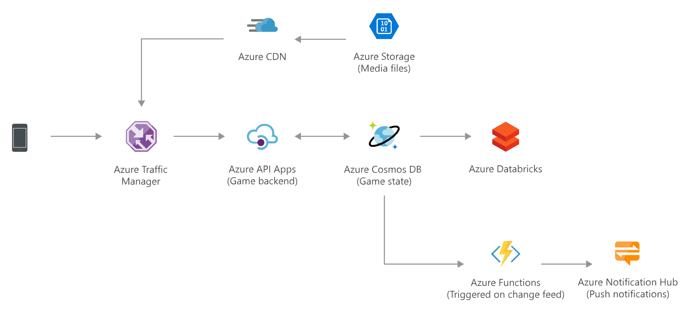

[!INCLUDE [header_file](../../../includes/sol-idea-header.md)]

This gaming solution idea elastically scales your database to accommodate unpredictable bursts of traffic and deliver low-latency multi-player experiences on a global scale. This specific scenario is based on a gaming scenario, but the design patterns are relevant for many industries that are required to process high-traffic web calls and API requests, such as e-commerce and retail applications.

## Architecture

*Download an [SVG](../media/gaming-using-cosmos-db.svg) of this architecture.*

### Data flow
1. Azure Traffic Manager routes a user's game traffic to the apps hosted in Azure App Service, Functions, or Containers, and to APIs that are published via Azure API Gateway.
2. Azure CDN serves static images and game content to the user that are stored in Azure Blob Storage.
3. Azure Cosmos DB stores user's game state data.
4. Azure Databricks correlates, cleanses, and transforms game state data.
5. Azure Functions processes the insights derived from Azure Databricks and pushes notifications to mobile devices, by using Azure Notification Hubs.

### Components

This architecture includes the following components:

- [Azure Traffic Manager](/azure/traffic-manager/) is a DNS-based load balancer that controls the distribution of user traffic for service endpoints in different Azure regions. During normal operations, it routes requests to the primary region. If that region becomes unavailable, Traffic Manager can fail over to secondary region as needed.

- [Azure API Management](https://azure.microsoft.com/services/api-management/) provides an API gateway that sits in front of the Gaming APIs. API Management also can be used to implement concerns, such as:
    - Enforcing usage quotas and rate limits
    - Validating OAuth tokens for authentication
    - Enabling cross-origin requests (CORS)
    - Caching responses
    - Monitoring and logging requests

- [Azure App Service](/azure/app-service-web/app-service-web-overview) hosts API applications allowing autoscale and high availability without having to manage infrastructure.

- [Azure CDN](https://azure.microsoft.com/services/cdn/) delivers static, cached content from locations close to users to reduce latency.

- [Azure Blob Storage](https://azure.microsoft.com/services/storage/) are optimized to store large amounts of unstructured data, such as static gaming media.

- [Azure Cosmos DB](https://azure.microsoft.com/services/cosmos-db/) is a fully managed NoSQL database service for building and modernizing scalable, high-performance applications.

- [Azure Databricks](https://azure.microsoft.com/services/databricks/) is an Apache Spark-based analytics platform optimized for the Microsoft Azure cloud services platform.

- [Azure Functions](https://azure.microsoft.com/services/functions/) are serverless compute options that allow applications to run on-demand without having to manage infrastructure.

- [Azure Notification Hubs](https://azure.microsoft.com/services/notification-hubs/#overview) is a massively scalable push notification engine for quickly sending notifications to variety of mobile devices and platforms.

## Next steps

Review the following articles on Cosmos DB:

- [Common Azure Cosmos DB Use Cases](/azure/cosmos-db/use-cases)
- [Change feed in Azure Cosmos DB](/azure/cosmos-db/change-feed)
- [Time to Live (TTL) in Azure Cosmos DB](/azure/cosmos-db/time-to-live)
- [Consistency levels in Azure Cosmos DB](/azure/cosmos-db/consistency-levels)
- [Request Units in Azure Cosmos DB](/azure/cosmos-db/request-units)
- [Partitioning and horizontal scaling in Azure Cosmos DB](/azure/cosmos-db/partition-data)

## Related resources

The following solution ideas feature Azure Cosmos DB:

* [Globally distributed applications using Cosmos DB](./globally-distributed-mission-critical-applications-using-cosmos-db.yml)
* [Retail and e-commerce using Cosmos DB](./retail-and-e-commerce-using-cosmos-db.yml)
* [Serverless apps using Cosmos DB](./serverless-apps-using-cosmos-db.yml)
