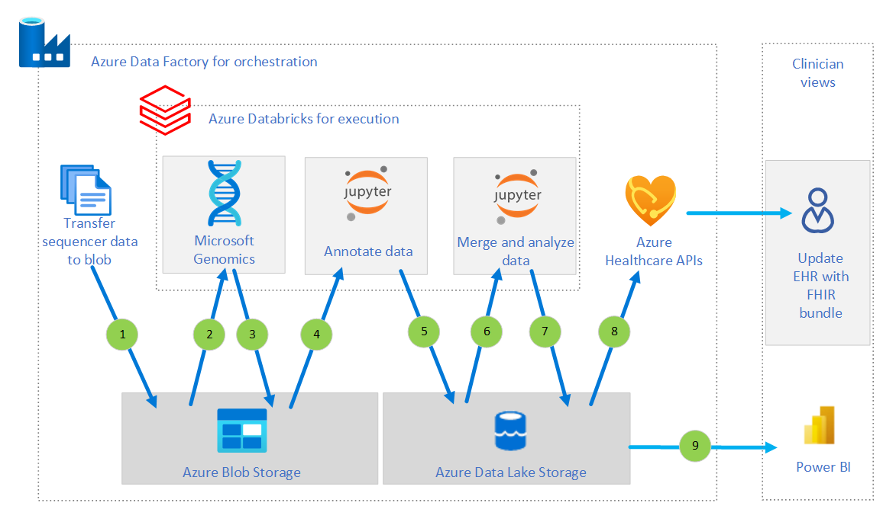

[!INCLUDE [header_file](../../../includes/sol-idea-header.md)]

# Precision Medicine Pipeline with Genomics

This document presents a solution for genomic analysis and reporting. The solution provides a clinical genomics workflow that automates these tasks:

- Take data from a sequencer.
- Move the data through secondary and tertiary analysis.
- Provide results that clinicians can consume.

The growing scale, complexity, and security requirements of genomics make it an ideal candidate for moving to the cloud. Consequently, the solution uses Azure cloud services in addition to open-source tools. It takes advantage of the security features, performance, and scalability of the Azure global cloud infrastructure:

- Scientists plan on sequencing hundreds of thousands of genomes in coming years. The task of storing and analyzing this data requires significant computing power and storage capacity. With data centers around the world, Azure can meet these demands.
- Azure is certified for major global security and privacy standards, such as ISO 27001.
- Azure complies with the security and provenance standards that HIPAA establishes for personal health information.

A key component of the solution is [Microsoft Genomics](https://azure.microsoft.com/services/genomics/). This service offers an optimized secondary analysis implementation that can process a 30x genome in a few hours. Standard technologies can take days.

## Potential use cases

This solution applies to many areas:

- Risk scoring patients for cancer
- Identifying patients with genetic markers that predispose them to disease
- Generating patient cohorts for studies

## Architecture

Azure Data Factory orchestrates the workflow:

1. Azure Data Factory transfers the initial sample file to Azure Blob Storage. The file is in FASTQ format.
1. Microsoft Genomics runs secondary analysis on the file.
1. Microsoft Genomics stores the output in Azure Blob Storage in one of these formats:

   - Variant call format (VCF)
   - Genomic VCF (GVCF)

1. Jupyter Notebook annotates the output file. The notebook runs on Azure Databricks.
1. Azure Data Lake Storage stores the annotated file.
1. Another Jupyter notebook merges the file with additional datasets and analyzes the data.
1. Azure Data Lake Storage stores the processed data.
1. Clinicians view the findings:

   - Power BI dashboards display the data.
   - Azure Healthcare APIs adds the clinical data to patient electronic health records (EHRs) as part of Fast Healthcare Interoperability Resources (FHIR) bundles.

## Components

The solution uses the following components:

### Microsoft Genomics

[Microsoft Genomics](https://docs.microsoft.com/azure/genomics/) offers an efficient and accurate genomics pipeline that implements the industry's best practices. Its high-performance engine is optimized for these tasks:

- Reading large files of genomic data
- Processing them efficiently across many cores
- Sorting and filtering the results
- Writing the results to output files

To maximize throughput, this engine operates a Burrows-Wheeler Aligner (BWA) and a Genome Analysis Toolkit (GATK) HaplotypeCaller variant caller. It also uses several other components that make up standard genomics pipelines. Examples include duplicate marking, base quality score recalibration, and indexing. In a few hours, the engine can process a single genomic sample on a single multi-core server. The processing starts with raw reads and produces aligned reads and variant calls.

Internally, the Microsoft Genomics controller manages manages these aspects of the process:

- Distributing batches of genomes across pools of machines in the cloud
- Maintaining a queue of incoming requests
- Distributing the requests to servers that run the genomics engine
- Monitoring the servers' performance and progress
- Evaluating the results
- Ensuring that processing runs reliably and securely at scale, behind a secure web service API

You can easily use Microsoft Genomics results in tertiary analysis and machine learning services. And you don't need to manage or update hardware or software.

### Other components

- [Azure Data Factory](https://docs.microsoft.com/azure/data-factory/introduction) is an integration service that works with data from disparate data stores. You can use this fully managed, serverless platform to orchestrate and automate workflows. Specifically, [pipelines](https://docs.microsoft.com/azure/data-factory/concepts-pipelines-activities) transfer data to Azure in this solution. A sequence of pipelines then triggers each step of the workflow.

- [Blob Storage](https://docs.microsoft.com/azure/storage/blobs/) offers optimized cloud object storage for large amounts of unstructured data. In this scenario, Blob Storage provides the initial landing zone for the FASTQ file in this scenario. This service also functions as the output target for the VCF and GVCF files that Microsoft Genomics generates. [Tiering functionality](https://docs.microsoft.com/azure/storage/blobs/storage-blob-storage-tiers) in Blob Storage provides a way to archive FASTQ files in inexpensive long-term storage after processing.

- [Azure Databricks](https://docs.microsoft.com/azure/databricks/) is a data analytics platform. Its fully managed Spark clusters process large streams of data from multiple sources. In this solution, Azure Databricks provides the computational resources that Jupyter Notebook needs to annotate, merge, and analyze the data.

- [Data Lake Storage](https://docs.microsoft.com/azure/storage/blobs/data-lake-storage-introduction) is a scalable and secure data lake for high-performance analytics workloads. This service can manage multiple petabytes of information while sustaining hundreds of gigabits of throughput. The data may be structured, semi-structured, or unstructured. It typically comes from multiple, heterogeneous sources. In this architecture, Data Lake Storage provides the final landing zone for the annotated files and the merged datasets. It also gives downstream systems access to the final output.

- [Power BI](https://docs.microsoft.com/power-bi/fundamentals/) is a collection of software services and apps. You can use Power BI to connect and display unrelated sources of data. In this solution, you can populate Power BI dashboards with the results. Clinicians can then create visuals from the final dataset.

- [Azure Healthcare APIs](https://docs.microsoft.com/azure/healthcare-apis/fhir/) is a managed, standards-based, compliant API for clinical health data. You can use the reference architectures and implementations in [Health Architectures](https://github.com/microsoft/health-architectures) when you use Azure Healthcare APIs. In this scenario, Azure Healthcare APIs passes a FHIR bundle to the EHR with the clinical data.

## Considerations

The following considerations align with the Microsoft Azure Well-Architected Framework and apply to this solution:

### Availability considerations

- Azure Blob Storage and Data Lake Storage are part of Azure Storage, which offers [availability through redundancy][Introduction to the core Azure Storage services].
- [At least 99.9 percent of Data Factory pipelines run successfully][SLA for Azure Data Factory].
- The [Azure Databricks SLA guarantees 99.95 percent availability][Azure Databricks service page].

### Scalability considerations

- [Data Factory transforms data at scale][Azure Data Factory FAQ].
- Azure Databricks automatically scales up and down as needed.
- For information on optimizing scalability in Blob Storage, see [Performance and scalability checklist for Blob storage].
- Data Lake Storage is scalable by design. It can [manage exabytes of data][Introduction to Azure Data Lake Storage Gen2].

### Security considerations

The technologies in this solution meet most companies' requirements for security.

#### Guidelines

Because of the sensitive nature of medical data, establish governance and security by following the guidelines in these documents:

- [Cloud Adoption Framework](https://docs.microsoft.com/azure/cloud-adoption-framework/)
- [Enterprise Scale Landing Zones](https://docs.microsoft.comazure/cloud-adoption-framework/ready/enterprise-scale/)

#### Regulation compliance

Concerning compliance with the Health Insurance Portability and Accountability Act (HIPAA) and Health Information Technology for Economic and Clinical Health (HITECH) Act:

- See these documents for information on adopting a cloud platform in a secure manner and maintaining compliance while using Azure:

  - [Microsoft Azure HIPAA/HITECH Act Implementation Guidance](https://aka.ms/azurehipaaguidance)
  - The white paper [Practical guide to designing secure health solutions using Microsoft Azure](https://aka.ms/azureindustrysecurity)

- Components of this solution presented are in scope for HIPAA according to [Microsoft Azure Compliance Offerings](https://azure.microsoft.com/mediahandler/files/resourcefiles/microsoft-azure-compliance-offerings/Microsoft%20Azure%20Compliance%20Offerings.pdf). If you substitute any other components, validate them first against the list in that document's appendix.

#### General security features

Several components play additional roles in securing data:

- [Data Factory encrypts data that it transfers. It also uses Azure Key Vault or certificates to encrypt credentials.][Security considerations for data movement in Azure Data Factory]
- [Azure Databricks provides many tools for securing network infrastructure and data][Azure Databricks security guide]. Examples include [access control lists][Access control in Azure Databricks], [secrets][Secret management in Azure Databricks], and [no public IP (NPIP)][Secure cluster connectivity (No Public IP / NPIP)].

- [Azure Blob storage supports Storage Service Encryption (SSE)][Azure Storage encryption for data at rest], which automatically encrypts data before storing it. It also provides [many other ways to project data and networks][Security recommendations for Blob storage].
- [Data Lake Storage provides access control][Access control lists (ACLs) in Azure Data Lake Storage Gen2]. Its model supports these types of controls:

  - Azure role-based access control (RBAC)
  - Portable Operating System Interface (POSIX) access control lists (ACLs)

## Related resources

- Link to publication around new MS Gen testing and pricing info
- [Genomics Quickstart Starter Kit](https://github.com/microsoft/Genomics-Quickstart)
- [Burrows-Wheeler Aligner](http://bio-bwa.sourceforge.net/)
- [Genome Analysis Toolkit](https://gatk.broadinstitute.org/hc/en-us)

[Access control lists (ACLs) in Azure Data Lake Storage Gen2]: /azure/storage/blobs/data-lake-storage-access-control
[Access control in Azure Databricks]: /azure/databricks/security/access-control/
[Azure Data Factory FAQ]: /azure/data-factory/frequently-asked-questions#data-flows
[Azure Databricks security guide]: /azure/databricks/security/
[Azure Databricks service page]: https://azure.microsoft.com/services/databricks/
[Azure Storage encryption for data at rest]: /azure/storage/common/storage-service-encryption
[Introduction to Azure Data Lake Storage Gen2]: /azure/storage/blobs/data-lake-storage-introduction#scalability
[Introduction to the core Azure Storage services]: /azure/storage/common/storage-introduction
[Performance and scalability checklist for Blob storage]: /azure/storage/blobs/storage-performance-checklist
[Secure cluster connectivity (No Public IP / NPIP)]: /azure/databricks/security/secure-cluster-connectivity
[Secret management in Azure Databricks]: /azure/databricks/security/secrets/
[Security considerations for data movement in Azure Data Factory]: /azure/data-factory/data-movement-security-considerations
[Security recommendations for Blob storage]: /azure/storage/blobs/security-recommendations
[SLA for Azure Data Factory]: https://azure.microsoft.com/en-us/support/legal/sla/data-factory/v1_2/
