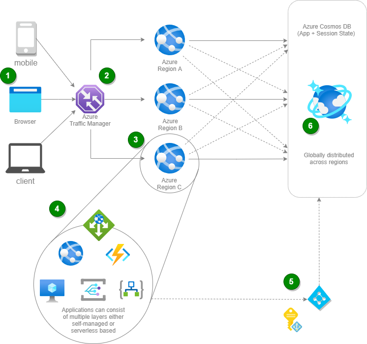

Guarantee access to users around the world with the high-availability and low-latency capabilities built into Microsoft's global datacenters.

## Architecture

  *Download an [SVG](../media/globally-distributed-mission-critical-applications-using-cosmos-db.svg) version of this architecture.*

### Data flow

1. User accesses the application through the dedicated client.
1. Azure Traffic Manager will route the user's connection to the best location for accessing the application, based upon a single or nested routing profiles.
1. In the landed region where the application is hosted the application will handle the session and the connection towards the database.
1. This application can range from a simple static page up until a microservices-oriented application hosted in Kubernetes for instance.
1. The connection between the application landscape and the Cosmos DB is handled through an Azure Active Directory User who can pick up the Cosmos DB keys in Key Vault.
1. By using the Azure Cosmos DB multi-homing APIs, your application is aware of the nearest region and can send requests to that region. The nearest region is identified without any configuration changes. As you add and remove regions to and from your Azure Cosmos account, your application doesn't need to be redeployed or paused, it continues to be highly available at all times. Underneath the covers, Cosmos DB will handle the global distribution and replication of the data based upon the number of defined regions. As an addition one should also benefit from the Automatic Failover option to fail over to the region with the highest failover priority with no user action should a region become unavailable. When automatic failover is enabled, region priority can be modified.

### Components

* [Azure Traffic Manager](https://azure.microsoft.com/services/traffic-manager): create DNS-based load balancing / routing options for your applications with of six types of DNS-based traffic routing options, which can be nested.
* [Azure Active Directory](https://azure.microsoft.com/services/active-directory): Synchronize on-premises directories and enable single sign-on.
* [Azure Cosmos DB](https://azure.microsoft.com/services/cosmos-db): Globally distributed, multi-model database for any scale.

### Alternatives

You can extend this scenario with several compute and serverless options.

#### Compute options

* [Azure Virtual Machines](https://azure.microsoft.com/services/virtual-machines): Create Linux and Windows virtual machines (VMs) in seconds and reduce costs.
* [Azure Kubernetes Services](https://azure.microsoft.com/services/kubernetes-service): Highly available, secure, and fully managed Kubernetes service for all your application and microservice base workloads.
* [App Service](https://azure.microsoft.com/services/app-service): Quickly create powerful cloud apps for web and mobile.

#### Serverless options

* [Azure Functions](https://azure.microsoft.com/services/functions): More than just event-driven serverless compute.
* [Azure Logic Apps](https://azure.microsoft.com/services/logic-apps): Quickly build powerful integration solutions.

## Considerations

### Availability

The availability of the Cosmos DB instance depends on a number of factors. The greater the number of regions that Cosmos is replicated to, the greater the availability of the application. Each region contains all the data partitions of an Azure Cosmos DB container and can serve reads, by default. To increase the availability of the data layer, you can enable multi-region write. Doing this increases the availability of the data layer. You can also increase availability by employing weaker consistency levels and availability zones.

When considering the above approach, if you achieve high availability on Azure Cosmos DB Automatic Failover, you are configuring your solution to keep the running application at it's highest possible provided SLA.

For the application layer, Traffic Manager should be configured with nested profiles. When pushing this design to the highest level, you can scale the different application choices, per region. The per-region deployment also takes a high-availability approach.

### Performance

System performance is affected by a number of factors at the compute and database level. The SKU for an App Service plan or other compute option affects the memory and cores that are available in each region. Additionally, the number of regions the compute layer is deployed to dictates the scale that it is capable of handling. Deployment of additional locations takes pressure off existing regions and should cause linear increases in the maximum throughput that the application can fulfill.

Cosmos DB should be configured so that it does not cause a bottleneck for the compute tier resources. Each database and container in Cosmos DB should be configured to auto-scale and should be supplied with a maximum request unit value that ensures Cosmos DB does not throttle requests. To determine appropriate max request unit values for the Cosmos DB entities, you can run load tests near approximate maximum throughput for the application. When compared with their stronger counterparts, weaker consistency levels offer higher throughput and performance benefits.

Crucially, when implementing the logic in code that reads from and writes to Cosmos DB, whether it be through the SDK, Azure Functions bindings, and so on, `PreferredLocations` should be used so that each regional API routes requests to the closest Cosmos DB region. Based on the Azure Cosmos DB account configuration, current regional availability, and the preference list specified, the SDK chooses the most optimal endpoint to perform the read and write operations. This process results in significant performance boosts.

### Resiliency

For higher resiliency, you can use availability zones for Azure Cosmos DB deployments. Resiliency also depends on the consistency level choices that you make on your Cosmos DB deployment. Depending on this consistency level, you will achieve a different level of resiliency (see [Consistency, availability, and performance tradeoffs](/azure/cosmos-db/consistency-levels) for more info).

### Scalability

Scaling is based upon many levels in this diagram. Azure Cosmos DB is purpose-built for elastic scale and predictable performance. On the level of the application, you need to look at the compute model used. Azure Functions and App Service can autoscale. For Azure Virtual Machines, you can use Azure Virtual Machine Scale Sets. When you are aware of this need, you should always consider a serverless option, when possible.

### Security

From a security perspective, drive towards an identity-based system, where Azure Active Directory can be used to secure access to the environment. In the backend, the application is (by best design) accessed through Managed Identities, although one could also consider the approach of using Azure Active Directory Users and Azure Key Vault for securing access. Additionally, the Cosmos DB instance should be further secured, such that the only entities capable of reading and writing to it are the various backends that are deployed to different regions. IP restriction can be applied to the account by using the built-in [firewall](/azure/cosmos-db/how-to-configure-firewall).

We also support [Azure Active Directory RBAC directly on the Cosmos DB SQL API](/azure/cosmos-db/how-to-setup-rbac).

## Next steps

More about Azure Cosmos DB:

* [Manage an Azure Cosmos DB account](/azure/cosmos-db/how-to-manage-database-account)
* [Configure multi-region writes in your applications that use Azure Cosmos DB](/azure/cosmos-db/how-to-multi-master)
* [Distribute your data globally with Azure Cosmos DB](/azure/cosmos-db/distribute-data-globally)
* [Consistency levels in Azure Cosmos DB](/azure/cosmos-db/consistency-levels)
* [Manage consistency levels in Azure Cosmos DB](/azure/cosmos-db/how-to-manage-consistency)
* [Build a .NET web app with Azure Cosmos DB using the SQL API and the Azure portal](/azure/cosmos-db/create-sql-api-dotnet)
* [Use system-assigned managed identities to access Azure Cosmos DB data](/azure/cosmos-db/managed-identity-based-authentication)
* [How does Azure Cosmos DB provide high availability](/azure/cosmos-db/high-availability)
* [Enable automatic failover for your Azure Cosmos account](/azure/cosmos-db/how-to-manage-database-account#automatic-failover)

More about Azure Traffic Manager:

* [What is Traffic Manager?](/azure/traffic-manager/traffic-manager-overview)
* [Traffic Manager routing methods](/azure/traffic-manager/traffic-manager-routing-methods)
* [Tutorial: Configure the geographic traffic routing method using Traffic Manager](/azure/traffic-manager/traffic-manager-configure-geographic-routing-method)

## Related resources

Related solution ideas:

* [Build cloud native applications](./cloud-native-apps.yml)
* [Deliver highly scalable customer service and ERP applications](./erp-customer-service.yml)
* [Gaming using Cosmos DB](./gaming-using-cosmos-db.yml)
* [IoT using Cosmos DB](./iot-using-cosmos-db.yml)
* [Personalization using Cosmos DB](./personalization-using-cosmos-db.yml)
* [Retail and e-commerce using Cosmos DB](./retail-and-e-commerce-using-cosmos-db.yml)
* [Serverless apps using Cosmos DB](./serverless-apps-using-cosmos-db.yml)

Related full architectures:

* [CI/CD pipeline for container-based workloads](../../example-scenario/apps/devops-with-aks.yml)
* [Mass ingestion and analysis of news feeds on Azure](../../example-scenario/ai/news-feed-ingestion-and-near-real-time-analysis.yml)
* [Scalable order processing](../../example-scenario/data/ecommerce-order-processing.yml)

Related architecture guidance:
* [Deploying multi-region APIs that write to Cosmos DB](../../patterns/geodes.md)
* [Choosing an analytical data store in Azure](../../data-guide/technology-choices/analytical-data-stores.md)
* [Choosing a big data storage technology in Azure](../../data-guide/technology-choices/data-storage.md)
