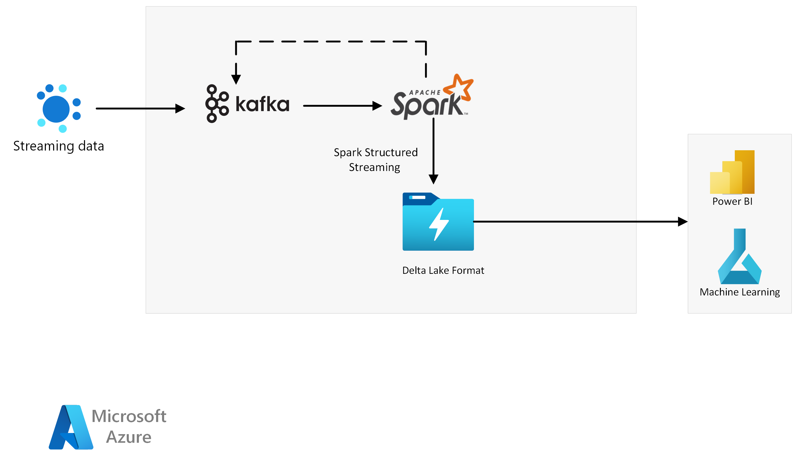

[!INCLUDE [header_file](../../../includes/sol-idea-header.md)]

This article outlines a solution for ingesting and processing millions of streaming events per second and writing them to a Delta Lake table. Core components include Azure HDInsight Spark and Kafka clusters.

*Apache®, [Apache Kafka](https://kafka.apache.org), [Apache Spark](https://spark.apache.org), [Delta Lake](https://learn.microsoft.com/en-us/azure/databricks/delta/), and the flame logo are either registered trademarks or trademarks of the Apache Software Foundation in the United States and/or other countries. No endorsement by The Apache Software Foundation is implied by the use of these marks.*

## Architecture

### Dataflow

- Real time event data (like IoT, etc.) ingested to Kafka using [Kafka Producer](https://kafka.apache.org/documentation/#producerapi).
- [Spark Structured Streaming](https://spark.apache.org/docs/latest/structured-streaming-programming-guide.html) to process the data.
- Store Processed data into [Delta Lake Table Format](https://techcommunity.microsoft.com/t5/analytics-on-azure-blog/delta-lake-on-hdinsight/ba-p/3678186).
- HDInsight stores data in Delta Lake Table format for secure and scalable processing in the cloud.
- Visualize in Power BI and consumed for ML needs from Delta Lake Format

### Components

- [HDInsight](https://azure.microsoft.com/services/hdinsight)
- [Delta Lake Format](https://techcommunity.microsoft.com/t5/analytics-on-azure-blog/delta-lake-on-hdinsight/ba-p/3678186)
- [Power BI](https://powerbi.microsoft.com)
- [Machine Learning](https://learn.microsoft.com/en-us/azure/hdinsight/hadoop/apache-hadoop-deep-dive-advanced-analytics#machine-learning-and-apache-spark)

## Scenario details

There are multiple Apache components (Apache Spark, [Apache Flink](https://flink.apache.org/), [Apache Beam](https://beam.apache.org/), etc.), they are a good fit for the streaming need for a large volume of data. Event streaming is a continuous unbounded sequence of immutable events; where events flow from event publisher to subscribers. Business use case(s) may require storing these events in raw format and cleaning, transformation, and aggregation for various analytics needs.

- Apache Kafka provides a high-performance, durable, distributed event-streaming platform. It multiplex streams of events from producers to consumers using Topics, Partitions, and Consumer Groups.
- Apache Spark Structured Streaming is a scalable, exactly-once fault-tolerance stream processing engine built on the Spark SQL Engine. Structured Streaming queries are near real-time and have low latency. It provides a large set of connectors for data sources and sinks. In addition, Spark Structured streaming allows joining multiple streams from similar or different source types.
- Apache Spark Structured Streaming integration with Kafka allows to batch and stream queries and sink to the storage layer, database, Kafka, etc.
- Delta Lake Table format is a storage layer that extends Apache Parquet data files with file-based transaction logs. Storing data in Delta Lake format has several benefits, including ACID transactions, Schema evolution, history versions, and many more.

The Azure HDInsight offers these [open source frameworks](https://learn.microsoft.com/en-us/azure/hdinsight/hdinsight-5x-component-versioning) part of HDInsight managed service for the enterprise analytics need. Moreover, you can run these Apache components in an Azure environment with (Enterprise-grade security)[https://learn.microsoft.com/en-us/azure/hdinsight/domain-joined/hdinsight-security-overview]. Azure HDInsight also offers [other benefits](/azure/hdinsight/hdinsight-overview#why-should-i-use-azure-hdinsight), including scalability, security, centralized monitoring, global availability, and extensibility.

Using [PowerBI Delta Lake Table connector](https://github.com/delta-io/connectors/tree/master/powerbi), you can read Delta Lake Table from PowerBI.

### Potential use cases

This solution provides an exponential opportunity for businesses to process immutable exactly-once fault-tolerant event streams in near real-time by using Kafka as an input source for Spark Structured Streaming and Delta Lake as a storage layer.

A Few business scenarios are:

- Smart manufacturing and IIoT (Industrial IoT)
- Middleware for enterprise big data solutions
- Credit card fraud detection 
- Short-Sale Risk Calculation
- Digital Image and Video Processing
- Account login fraud detection
- Analysis of real-time stock market data.
- Analysis of current market conditions.
- Drug Research and discovery

The solution applies to the following few industries:

- Retail
- Finance
- Insurance
- Health Care
- Agriculture
- CPG (Consumer packaged goods)
- Logistic

## Contributors

*This article is maintained by Microsoft. It was originally written by the following contributors.*

Principal authors:

- [Arun Sethia](https://www.linkedin.com/in/arun-sethia-0a91aa5/) | Principal Program Manager 
- [Sairam Yeturi](https://www.linkedin.com/in/sairam-yeturi-8761aa1b3/) | Senior Product Manager

## Next steps

- [What is Azure HDInsight?](/azure/hdinsight/hdinsight-overview)
- [Streaming at scale in HDInsight](https://learn.microsoft.com/en-us/azure/hdinsight/hdinsight-streaming-at-scale-overview)
- [Quickstart: Create Apache Spark cluster in Azure HDInsight](https://learn.microsoft.com/en-us/azure/hdinsight/spark/apache-spark-jupyter-spark-sql-use-portal)
- [Quickstart: Create Apache Kafka cluster in Azure HDInsight](https://learn.microsoft.com/en-us/azure/hdinsight/kafka/apache-kafka-get-started)
- [Overview of enterprise security in Azure HDInsight](https://learn.microsoft.com/en-us/azure/hdinsight/domain-joined/hdinsight-security-overview)

## Related resources

- [HDInsight 5.0 with Spark 3.x – Part 1](https://techcommunity.microsoft.com/t5/analytics-on-azure-blog/hdinsight-5-0-with-spark-3-x-part-1/ba-p/3777416)
- [HDInsight - Iceberg Open-Source Table Format](https://techcommunity.microsoft.com/t5/analytics-on-azure-blog/hdinsight-iceberg-open-source-table-format/ba-p/3754126)	
- [Building a Data Lakehouse Using Azure HDInsight](https://murggu.medium.com/building-a-data-lakehouse-using-azure-hdinsight-d41f7c3547d8)
- [Using a Shared Hive Metastore Across Azure Synapse, HDInsight, and Databricks](https://murggu.medium.com/using-a-shared-hive-metastore-across-azure-synapse-hdinsight-and-databricks-72c53acda778)
