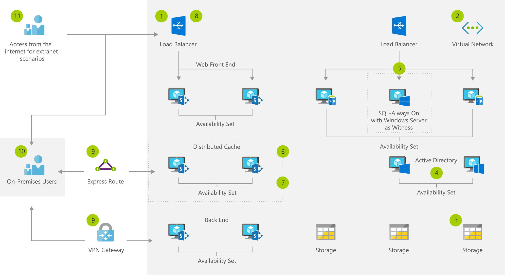

[!INCLUDE [header_file](../../../includes/sol-idea-header.md)]

This solution provides a highly available deployment of SharePoint using a load balanced Azure Active Directory (Azure AD), highly available SQL always on instance, and highly available SharePoint resources. It addresses the requirement to deliver highly available intranet capability using the latest and greatest supported platforms.

## Architecture

*Download an [SVG](../media/highly-available-sharepoint-farm.svg) of this architecture.*

Use ExpressRoute or VPN Gateway for management access to resource group.

### Data flow

1. Create resource group for the storage, network, and virtual machine, plus other dependent elements.
1. Create virtual network to host the virtual machines and load balancers for the deployment. Ensure the network has appropriate network security groups implemented to protect network traffic flow.
1. Create the storage accounts that will host the virtual hard disks (VHDs) for the machine images.
1. Create the Active Directory installation using either a new virtual machine or Azure AD domain services. If using Azure AD domain services,  consider synchronizing identities to Azure AD with Azure AD Connect.
1. Create a Windows failover cluster and install a supported version of SQL Server on an Azure virtual machine (VM) or deploy pay-as-you-go instances of SQL Server.
1. Deploy SharePoint onto multiple Azure VMs, or, use trial images from the gallery that already have SharePoint Server installed.
1. Create the SharePoint farm.
1. Set up an Azure external load balancer to direct incoming HTTPS traffic to the SharePoint server.
1. Use ExpressRoute or VPN Gateway for management access to resource group.
1. On-premises users can access the SharePoint sites via the internet, ExpressRoute, or VPN Gateway.
1. External users can be granted access as required to the SharePoint sites for testing.

### Components

* [Azure Resource Group](https://azure.microsoft.com/features/resource-manager): Container that holds related resources for an Azure solution
* [Virtual Network](https://azure.microsoft.com/services/virtual-network): Provision private networks, optionally connect to on-premises datacenters
* [Storage Accounts](https://azure.microsoft.com/services/storage): Durable, highly available, and massively scalable cloud storage
* [Azure Active Directory](https://azure.microsoft.com/services/active-directory): Synchronize on-premises directories and enable single sign-on
* SharePoint Server: Microsoft's collaboration server product
* Host enterprise [SQL Server](https://azure.microsoft.com/services/virtual-machines/sql-server) apps in the cloud
* [Load Balancer](https://azure.microsoft.com/services/load-balancer): Deliver high availability and network performance to your applications
* [Azure ExpressRoute](https://azure.microsoft.com/services/expressroute): Dedicated private network fiber connections to Azure

## Next steps

* [Azure Resource Group documentation](/azure/azure-resource-manager/resource-group-overview)
* [Virtual Network documentation](/azure/virtual-network/virtual-networks-overview)
* [Storage Documentation](/azure/storage/blobs/storage-blobs-introduction)
* [Microsoft server software support for VMs](https://support.microsoft.com/help/2721672/microsoft-server-software-support-for-microsoft-azure-virtual-machines)
* [SharePoint Server 2016 in Azure DevTest environment](/sharepoint/administration/intranet-sharepoint-server-2016-in-azure-dev-test-environment)
* [Deploy a SQL Server database to an Azure VM](/sql/relational-databases/databases/deploy-a-sql-server-database-to-a-microsoft-azure-virtual-machine?view=sql-server-2017)
* [Load Balancer documentation](/azure/load-balancer/load-balancer-standard-overview)
* [ExpressRoute documentation](/azure/expressroute)
