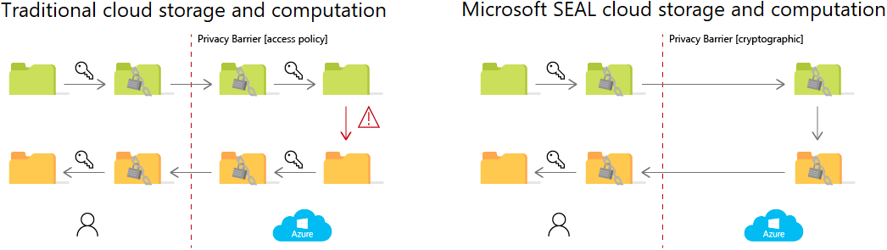

This article discusses how and when to use homomorphic encryption and how to implement homomorphic encryption with the open-source [Microsoft Simple Encrypted Arithmetic Library (SEAL)](https://github.com/microsoft/SEAL#introduction).

## Architecture

### Workflow

Traditional encryption schemes consist of three functionalities: key generation, encryption, and decryption. *Symmetric-key* encryption schemes use the same secret key for both encryption and decryption. It enables efficient encryption of large amounts of data for secure, outsourced cloud storage. *Public-key* encryption schemes use a public key for encryption and a separate, secret key for decryption. Anyone who knows the public key can encrypt data, but only someone who knows the secret key can decrypt and read the data. Public-key encryption enables secure online communication, but is typically less efficient than symmetric-key encryption.

You can use traditional encryption for secure storage and communication, but outsourced computation has required the removal of encryption layers. Cloud services that provide outsourced computation must implement access policies to prevent unauthorized access to the data and keys. Data privacy relies on the access control policies that are imposed by the cloud provider and trusted by the customer.

With [Microsoft SEAL](https://www.microsoft.com/research/project/microsoft-seal) homomorphic encryption, cloud providers never have unencrypted access to the data they store and compute on. Computations can be performed directly on encrypted data. The results of such encrypted computations remain encrypted, and can be decrypted only by the data owner by using the secret key. Most homomorphic encryption uses public-key encryption schemes, although the public-key functionality may not always be needed.

## Scenario details

Companies often send, receive, and store their cloud data in encrypted form. But to take advantage of cloud computing, companies must provide either unencrypted data or the keys to decrypt it. This practice puts company data at increased risk. *Homomorphic encryption* allows computation directly on encrypted data, making it easier to apply the potential of the cloud for privacy-critical data.

### Potential use cases

- Lightweight computations like addition and multiplication on privacy-critical data and parts of programs.
- Outsourced cloud computing, where a single owner owns all the data and has sole access to the decryption keys.

## Considerations

- Only some computations are possible on encrypted data. Microsoft SEAL homomorphic encryption library allows additions and multiplications on encrypted integers or real numbers. Encrypted comparison, sorting, or regular expressions aren't often feasible to evaluate on encrypted data using this technology. So only specific privacy-critical cloud computations on parts of programs can be implemented using Microsoft SEAL.

- Microsoft SEAL comes with two homomorphic encryption schemes with different properties. The *BFV scheme* allows modular arithmetic to be done on encrypted integers. The *CKKS scheme* allows additions and multiplications on encrypted real or complex numbers, but yields only approximate results. CKKS is the best choice when summing up encrypted real numbers, evaluating machine learning models on encrypted data, or computing distances of encrypted locations. For applications where exact values are necessary, the BFV scheme is the only choice.

- Homomorphic encryption isn't efficient. Because homomorphic encryption comes with a large performance overhead, computations that are already costly to do on unencrypted data probably aren't feasible on encrypted data.

- Data encrypted with homomorphic encryption is many times larger than unencrypted data, so it may not make sense to encrypt entire large databases, for example, with this technology. Instead, scenarios where strict privacy requirements prohibit unencrypted cloud computation, but the computations themselves are fairly lightweight, are meaningful use cases.

- Typically, homomorphic encryption schemes have a single secret key, which is held by the data owner. Homomorphic encryption isn't reasonable for scenarios where multiple different private data owners want to engage in collaborative computation.

- It isn't always easy or straightforward to translate an unencrypted computation into a computation on encrypted data. Even if new users can program and run a computation using Microsoft SEAL, there can be a great difference between efficient and inefficient implementation. It can be hard to know how to improve performance.

- While the homomorphic encryption primitive itself is secure, it doesn't guarantee that the apps and protocols that use it are secure.

## Contributors

*This article is maintained by Microsoft. It was originally written by the following contributors.*

Principal author:

 * [Jose Contreras](https://www.linkedin.com/in/josedanielcontreras) | Principal Software Engineering Manager

## Next steps

To learn more about homomorphic encryption and the Microsoft SEAL library, see [Microsoft SEAL](https://www.microsoft.com/research/project/microsoft-seal) from Microsoft Research, and the [SEAL code project](https://github.com/microsoft/SEAL) on GitHub.

See the following resources about security in Azure:

- [Introduction to Azure security](/azure/security/fundamentals/overview)
- [Azure security best practices](/azure/cloud-adoption-framework/secure/security-top-10)
- [Microsoft cloud security benchmark](/security/benchmark/azure)
- [Overview of the security pillar](/azure/architecture/framework/security/overview)
- [Security in the Microsoft Cloud Adoption Framework](/azure/cloud-adoption-framework/secure)

## Related resources

- [Centralized app configuration and security](appconfig-key-vault.yml)
- [Confidential computing on a healthcare platform](../../example-scenario/confidential/healthcare-inference.yml)
- [Secure research environment for regulated data](../../example-scenario/ai/secure-compute-for-research.yml)
