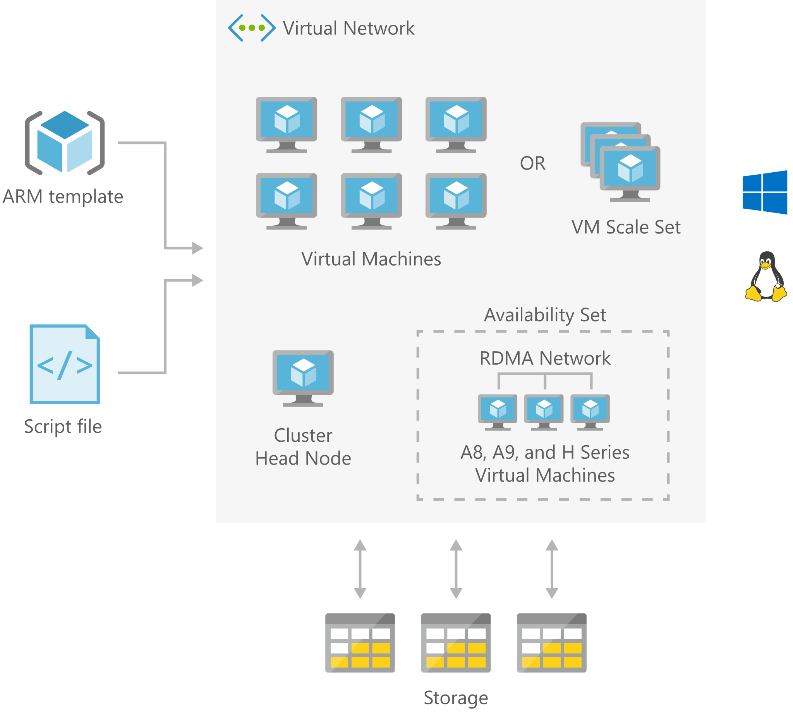

High performance computing (HPC) applications can scale to thousands of compute cores, extend on-premises big compute, or run as a 100% cloud native solution. This HPC solution is built on the Azure managed service: [Azure Batch](https://azure.microsoft.com/services/batch), and initiated by an [Azure Pipelines](https://azure.microsoft.com/services/devops/pipelines) job. These services run in a high-availability environment, patched and supported, allowing you to focus on your solution instead of the environment they run in.

## Architecture

*Download an [SVG](../media/hpc-cluster.svg) of this architecture.*

The solution involves the following steps:
1. Azure Pipelines starts a pipeline that compiles the team's code project and stores it as an executable in Azure Storage
1. The pipeline job continues by loading some processing data into the storage account.
1. Finally, Azure Pipelines requests that the Azure Batch service initiate its processing job, completing the pipeline.
1. The Azure Batch service will copy the program executables and input data from storage, and assign it to a pool of compute nodes
1. The Batch service performs job and task management for the pool, retrying or reassigning tasks as nodes complete their work.
1. As the compute nodes work, Azure Monitor collects performance data from the pool (CPU, Memory, Disk I/O) and log files. The team can study this telemetry to build better jobs in the future.
1.  When the compute nodes complete tasks, they output their program data back to Azure Storage for the team's review.

### Components

* [Azure Pipelines](https://azure.microsoft.com/services/devops/pipelines/) builds and tests code projects, and initiates the HPC jobs on the Azure Batch service.
* [Azure Storage](https://azure.microsoft.com/services/storage/) houses HPC data and executable files used in a job.
* [Azure Batch](https://azure.microsoft.com/services/batch) schedules the jobs and tasks across a massive number of nodes, and manages all of the compute resources.
* [Azure Virtual Machines](https://azure.microsoft.com/services/virtual-machines/) run as workers, performing the compute tasks.
* [Virtual Network](https://azure.microsoft.com/services/virtual-network) provides IP connectivity between the compute resources and the other cloud services, above and beyond any native Infiniband or RDMA communication.
* [Azure Monitor](https://azure.microsoft.com/services/monitor) collects performance metrics and logs from the cloud resources for reports, alerting, and automated response.

## Considerations

Batch compute pools need not contain commodity hardware. Specialized virtual machines with GPU processors and advanced networking exist to be used by Azure Batch. [GPU-optimized virtual machines](/azure/virtual-machines/sizes-gpu) with NVIDIA Tesla GPUs and [high-throughput Infiniband networking](/azure/virtual-machines/workloads/hpc/enable-infiniband) are available.

Batch compute pools can [autoscale](/azure/batch/batch-automatic-scaling), which grows and shrinks the number of nodes in the pool as the amount of work changes. Rather than paying for unused pool members, autoscaling can reduce the compute costs of a job to only the resources that are performing tasks.

## Pricing
To explore the cost of running this scenario, use the [Azure pricing calculator](https://azure.microsoft.com/pricing/calculator), which preconfigures all Azure services.

Azure Batch is a free service, and customers pay only for the underlying virtual machine, storage, and networking costs. In this solution, there are additional costs for the Azure Pipelines and Azure Monitor services. Specifically for Azure Batch, however, is an option to buy graphics rendering software (like Autodesk Maya and Chaos Group V-Ray) at a per-minute rate. See [Azure Batch Pricing](https://azure.microsoft.com/pricing/details/batch/) for details.

## Next steps

* Learn more about [Azure Batch](/azure/batch/batch-technical-overview)
* [Complete a tutorial](/azure/batch/tutorial-rendering-batchexplorer-blender) to render multiple frames of a Blender demo scene using Azure Batch.

## Related resources

* [High Performance Computing (HPC) on Azure](../../topics/high-performance-computing.md)
* [3D video rendering](../../example-scenario/infrastructure/video-rendering.yml)
* [Digital image-based modeling on Azure](../../example-scenario/infrastructure/image-modeling.yml)
* [Run reservoir simulation software on Azure](../../example-scenario/infrastructure/reservoir-simulation.yml)
