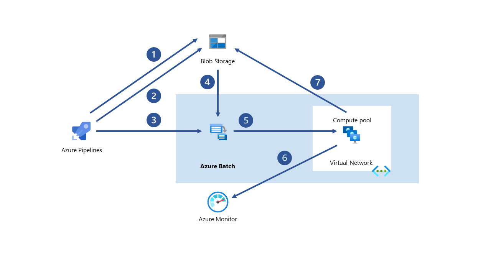

[!INCLUDE [header_file](../../../includes/sol-idea-header.md)]

High performance computing (HPC) applications can scale to thousands of compute cores, extend on-premises big compute, or run as a 100% cloud native solution. This HPC solution including the head node, compute nodes, and storage nodes, runs in Azure with no hardware infrastructure to maintain.

This solution is built on the Azure managed services: [Virtual Machine Scale Sets](https://azure.microsoft.com/services/virtual-machine-scale-sets), [Virtual Network](https://azure.microsoft.com/services/virtual-network) and [Storage Accounts](https://azure.microsoft.com/services/storage). These services run in a high-availability environment, patched and supported, allowing you to focus on your solution instead of the environment they run in.

## Architecture

*Download an [SVG](../media/hpc-cluster.svg) of this architecture.*

## Components

* [HPC head node](https://azure.microsoft.com/services/virtual-machines)
* [Virtual Machine Scale Sets](https://azure.microsoft.com/services/virtual-machine-scale-sets)
* [Virtual Network](https://azure.microsoft.com/services/virtual-network) provides IP connectivity between the head node, compute nodes, and storage nodes.
* [Storage Accounts](https://azure.microsoft.com/services/storage): Azure Storage blobs store the disks backing the virtual machines and provides long-term storage of unstructured data and executable files used by the HPC application.
* [Azure Resource Manager templates](/azure/azure-resource-manager/templates/): Resource Manager templates or script files are used to deploy your application to the HPC environment.