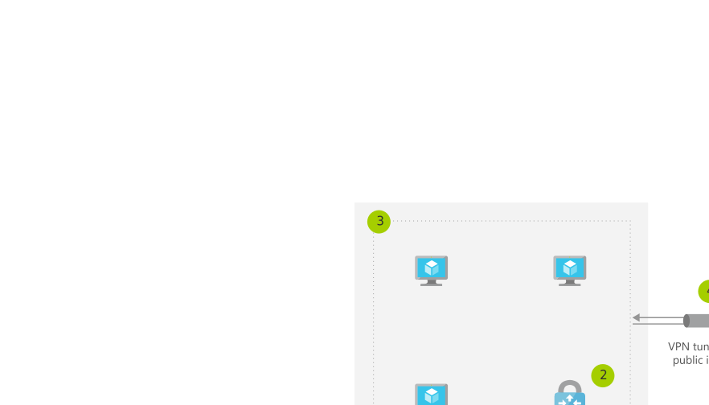

[!INCLUDE [header_file](../../../includes/sol-idea-header.md)]

In this solution idea, use a hybrid connection for Azure Stack Hub solutions with applications that communicate with the Azure public cloud and on-premises Azure Stack Hub components.

## Architecture

*Download a [Visio file](https://arch-center.azureedge.net/hybrid-connectivity.vsdx) of this architecture.*

### Dataflow

1. Deploy a virtual network in Azure and Azure Stack Hub.
1. Deploy a virtual network gateway in Azure and Azure Stack Hub.
1. Deploy virtual machines in each virtual network.
1. Establish a VPN connection over the public internet between the network gateways.

### Components

* [Virtual Network](https://azure.microsoft.com/services/virtual-network): Provision private networks, optionally connect to on-premises datacenters.
* [Virtual Network Gateway](https://azure.microsoft.com/services/vpn-gateway): Learn how to configure VPN Gateway, a virtual private network gateway.
* [Virtual Machines](https://azure.microsoft.com/services/virtual-machines): Provision Windows and Linux virtual machines in seconds.
* [Azure Stack Hub](https://azure.microsoft.com/overview/azure-stack) is a hybrid cloud platform that lets you use Azure services on-premises.

## Scenario details

Azure Stack Hub enables you to deploy Azure services on-premises or in the cloud with a consistent application logic, development paradigm, and operations methodology.

Hybrid cloud applications are a single system that has components running in both Azure and Azure Stack Hub. 

> [!NOTE]
> This doesn't apply to Azure Stack Hub deployments that are disconnected from the public internet.

### Potential use cases

This solution blueprint is relevant to establishing connectivity for any application that involves communications between the Azure public cloud and on-premises Azure Stack Hub components. Hybrid connectivity is a foundational blueprint that will be applicable to most Azure Stack Hub solutions.

## Next steps

* [Virtual Network](/azure/virtual-network)
* [VPN Gateway Documentation](/azure/vpn-gateway)
* [Virtual Machines Overview](https://azure.microsoft.com/services/virtual-machines)
* [Azure Stack Hub User Documentation](/azure/azure-stack/user)

## Related resources

* [Azure hybrid options](../../guide/technology-choices/hybrid-considerations.yml)
* [Back up files and applications on Azure Stack Hub](../../hybrid/azure-stack-backup.yml)
* [Connect an on-premises network to Azure](../../reference-architectures/hybrid-networking/index.yml)
* [Hybrid availability and performance monitoring](../../hybrid/hybrid-perf-monitoring.yml)
* [Troubleshoot a hybrid VPN connection](../../reference-architectures/hybrid-networking/troubleshoot-vpn.yml)
