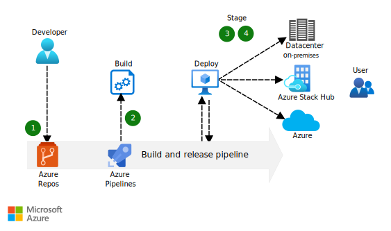

This solution shows you how to build, test, and deploy an app that runs on multiple clouds.

## Architecture

*Download a [Visio file](https://arch-center.azureedge.net/hybrid-continuous-integration.vsdx) of this architecture.*

### Dataflow

1. Changes to the application code are committed to the git repository that's in Azure Repos.
1. The code commit automatically triggers a new build that's done by the build and release pipeline that's in Azure Pipelines.
1. The build and release pipeline automatically deploys the newly built code to on-premises, private cloud, and public cloud environments for user acceptance testing.
1. After it passes testing, the code is automatically deployed to on-premises, private cloud, and public cloud production environments.

### Components

- [Azure Stack Hub](https://azure.microsoft.com/products/azure-stack/hub) extends Azure services and capabilities to your environment of choice. The environment can be a datacenter, edge location, or remote office. You can build, deploy, and run hybrid and edge computing apps consistently across your IT ecosystem, with flexibility for diverse workloads.
- [Azure Repos](https://azure.microsoft.com/products/devops/repos) is a set of version control tools that you can use to manage your code.
- [Azure Pipelines](https://azure.microsoft.com/products/devops/pipelines) automatically builds and tests code projects to make them available to others. It implements continuous integration and continuous delivery (CI/CD) to test and build your code and ship it to any target.

### Alternatives

[GitHub](https://github.com) can be used as the source control repository, and [GitHub Actions](https://github.com/features/actions) can be used to automate builds and deployments.

## Scenario details

Application deployment continuity, security, and reliability are essential to organizations and critical to development teams.

Traditional apps often require refactored code to run in each target environment. For example, code that's written for a development environment must be rewritten for the test environment and then rewritten again for the production environment. The app must be updated, tested, and validated as it moves through each environment, which increases the cost and complexity of maintaining the app. The increased complexity and duplication also increase the risk of security issues and poor code quality.

This DevOps solution is intended to ensure consistency across deployments, regardless of the target environment. It shows you how to build, test, and deploy an app that runs on multiple clouds. The code for the app comes from a single location and deploys to multiple targets in development, test, and production environments in your local datacenter, private clouds, or the public cloud. Differences in environment are handled by changes to a configuration file, not by changes to the code.

Capabilities vary across cloud and on-premises environments. Consider the following questions:

- Are the functions, endpoints, services, and other resources in your deployment available in the target deployment locations?
- Are the configuration artifacts stored in locations that are accessible across the clouds?
- Will deployment parameters work in all the target environments?
- Are resource-specific properties available in all the target clouds?

### Potential use cases

This solution shows how to deploy your application consistently across on-premises, private cloud, and public cloud environments by practicing CI/CD. Apps and services that are deployed by using this solution are interchangeable and can run in any of these locations, making it possible for you to take advantage of on-premises and public cloud features and capabilities.

Use this solution if:

- You can develop code in one environment that meets the needs of your developers, and deploy to an environment that's specific to your solution, where it's difficult to develop new code.
- You can use the code and tools that your developers like, as long as they're able to follow the CI/CD process in this solution.

This solution isn't recommended:

- If you're unable to automate infrastructure, provisioning resources, configuration, identity, and security tasks.
- If teams don't have access to hybrid cloud resources to implement a CI/CD approach.

## Considerations

These considerations implement the pillars of the Azure Well-Architected Framework, which is a set of guiding tenets that can be used to improve the quality of a workload. For more information, see [Microsoft Azure Well-Architected Framework](/azure/architecture/framework).

### Reliability

Reliability ensures that your application can meet the commitments that you make to your customers. For more information, see [Overview of the reliability pillar](/azure/architecture/framework/resiliency/overview).

Availability in the context of the DevOps solution means being able to recover any state information that's associated with your workflow, such as test results, code dependencies, and other artifacts. To assess your availability requirements, consider two common metrics:

- Recovery Time Objective (RTO) specifies how long you can go without a system.
- Recovery Point Objective (RPO) indicates how much data you can afford to lose if a disruption in service affects the system.

In practice, RTO, and RPO imply redundancy and backup. On the global Azure cloud, availability isn't a question of hardware recovery—that's part of Azure—but rather of ensuring that you maintain the state of your DevOps systems. On Azure Stack Hub, hardware recovery is also a consideration. For more information about reliability guidance, see [Principles of reliability](/azure/architecture/framework/resiliency/principles).

### Security

Security provides assurances against deliberate attacks and the abuse of your valuable data and systems. For more information, see [Overview of the security pillar](/azure/architecture/framework/security/overview).

A major consideration when designing the system to be used for deployment automation is access control and management of the rights that are needed to deploy services to cloud environments. What rights are needed to create, delete, and modify deployments? For example, one set of rights is typically required to create a resource group in Azure, and another set is required to deploy services in the resource group. The pipeline should have access to resources on-premises and in a private or public cloud. Ensure that it has the required access levels to each kind of environment. For more information on securing the solution by using identity management, see [Identity and access management checklist](/azure/architecture/framework/security/design-identity).

### Operational excellence

Operational excellence covers the operations processes that deploy an application and keep it running in production. For more information, see [Overview of the operational excellence pillar](/azure/architecture/framework/devops/overview).

Automated deployments reduce the chance of human error. Fast and routine deployment processes expedite the release of new features or bug fixes. The design of any system that's based on the DevOps solution idea must consider automation, logging, and alerting for each service across the portfolio.

### Performance efficiency

Performance efficiency is the ability of your workload to scale to meet the demands that are placed on it by users in an efficient manner. For more information, see [Performance efficiency pillar overview](/azure/architecture/framework/scalability/overview).

Deployment automation systems are the key control point in a DevOps solution. Implementations can vary. The selection of the correct server size depends on the size of the expected workload. VMs cost more to scale than containers. To use containers for scaling, however, your build process must run with containers. For more information on scaling guidance, see [Design for scaling](/azure/architecture/framework/scalability/design-scale).

## Contributors

*This article is maintained by Microsoft. It was originally written by the following contributors.*

Principal author:

- [Bryan Lamos](https://www.linkedin.com/in/bryanlamos) | Senior Content Developer

*To see non-public LinkedIn profiles, sign in to LinkedIn.*

## Next steps

- See the [Azure DevOps documentation](/azure/devops) to learn more about Azure DevOps and related tools, including Azure Repos and Azure Pipelines.
- See the [Azure Stack family of products and solutions](/azure-stack) to learn more about the entire portfolio of Azure Stack products and solutions.
- Learn how to [create your first Azure pipeline](/azure/devops/pipelines/create-first-pipeline). This is a step-by-step guide to using Azure Pipelines to build a sample application.
- When you're ready to test the solution example, continue with the [DevOps hybrid CI/CD solution deployment guide](https://aka.ms/hybriddevopsdeploy). The deployment guide provides step-by-step instructions for deploying and testing its components. You'll learn how to deploy an app to Azure and Azure Stack Hub, by using a hybrid CI/CD pipeline.
- See [Release Engineering](/azure/architecture/framework/devops/release-engineering-app-dev) in the Microsoft Azure Well-Architected Framework.

## Related resources

- [Design a CI/CD pipeline using Azure DevOps](../../example-scenario/apps/devops-dotnet-baseline.yml)
- [CI/CD pipeline for container-based workloads](../../example-scenario/apps/devops-with-aks.yml)
- [DevOps Checklist](../../checklist/dev-ops.md)
