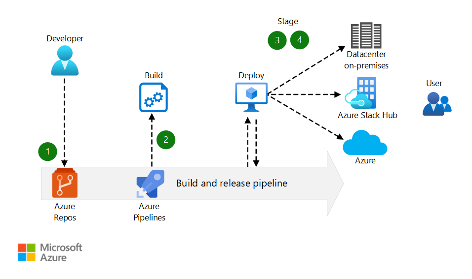

[!INCLUDE [header_file](../../../includes/sol-idea-header.md)]

Application deployment continuity, security, and reliability are essential to organizations and critical to development teams.

Traditional apps often require refactored code to run in each target environment. For example, code written in a development environment must then be rewritten to work in a test environment and then rewritten again, before it lands in a production environment. The app must be updated, tested, and validated as it moves through each environment, which increases the cost and complexity of maintaining the app. The increased complexity and duplication also increase the risk of security issues and poor code quality.

This solution enables you to build, test, and deploy an app that runs on multiple clouds. Code comes from a single location and deploys to multiple targets in development, test, and production environments in your local datacenter, private clouds, or the public cloud. Differences in environment require a change to a configuration file, rather than changes to the code.

This DevOps solution is intended to ensure consistency across deployments, regardless of the target environment. However, capabilities vary across cloud and on-premises environments. Consider the following questions:

- Are the functions, endpoints, services, and other resources in your deployment available in the target deployment locations?
- Are the configuration artifacts stored in locations that are accessible across the clouds?
- Will deployment parameters work in all the target environments?
- Are resource-specific properties available in all the target clouds?

## Potential use cases

This solution shows how to deploy your application consistently across on-premises, private cloud, and public cloud environments, through the practice of continuous integration and continuous delivery. Apps and services deployed using this solution are interchangeable and can run in any of these locations, which takes advantage of on-premises and public cloud features and capabilities.

Use this solution if:

- You can develop code in one environment that meets the needs of your developers, and deploy to an environment specific to your solution, where it's difficult to develop new code.
- You can use the code and tools your developers would like, as long as they're able to follow the continuous integration and continuous delivery process in this solution.

This solution isn't recommended:

- If you can't automate infrastructure, provisioning resources, configuration, identity, and security tasks.
- If teams don't have access to hybrid cloud resources to implement a Continuous Integration/Continuous Development (CI/CD) approach.

## Architecture

  
_Download a [Visio file](https://arch-center.azureedge.net/hybrid-continuous-integration.vsdx) of this architecture._

### Dataflow

1. Changes to the application code are committed to the git repository in Azure Repos.
1. The code commit automatically triggers a new build by the build and release pipeline in Azure Pipelines.
1. The build and release pipeline automatically deploys the newly built code to on-premises, private cloud, and public cloud environments for user acceptance testing.
1. The code is automatically deployed to on-premises, private cloud, and public cloud production environments, once it has passed testing.

### Components

- [Azure Stack Hub](https://azure.microsoft.com/products/azure-stack/hub) extends Azure services and capabilities to your environment of choice—from the datacenter to edge locations and remote offices. Build, deploy, and run hybrid and edge computing apps consistently across your IT ecosystem, with flexibility for diverse workloads.
- [Azure Repos](https://azure.microsoft.com/services/devops/repos) is a set of version control tools that you can use to manage your code.
- [Azure Pipelines](https://azure.microsoft.com/services/devops/pipelines) automatically builds and tests code projects to make them available to others. Azure Pipelines combines continuous integration (CI) and continuous delivery (CD) to test and build your code and ship it to any target.

### Alternatives

[GitHub](https://github.com) can be used as source control repository, and [GitHub Actions](https://github.com/features/actions) can be used to automate builds and deployments.

## Considerations

### Reliability

Availability in the context of the DevOps solution means being able to recover any state information that's associated with your workflow, such as test results, code dependencies, or other artifacts. To assess your availability requirements, consider two common metrics:

- Recovery Time Objective (RTO) specifies how long you can go without a system.

- Recovery Point Objective (RPO) indicates how much data you can afford to lose, if a disruption in service affects the system.

In practice, RTO, and RPO imply redundancy and backup. On the global Azure cloud, availability isn't a question of hardware recovery—that's part of Azure—but rather ensuring you maintain the state of your DevOps systems. On Azure Stack Hub, hardware recovery is also a consideration. See [Principles of reliability](/azure/architecture/framework/resiliency/principles) for additional reliability guidance.

### Security

Another major consideration when designing the system used for deployment automation is the access control and the proper management of the rights that are needed to deploy services to cloud environments. What rights are needed to create, delete, or modify deployments? For example, one set of rights is typically required to create a resource group in Azure, and another set is required to deploy services in the resource group. The pipeline should have access to resources on-premises and in a private or public cloud. Ensure it has the required access levels to each kind of environment. See [Identity and access management checklist](/azure/architecture/framework/security/design-identity), for help securing the solution through identity management.

### Operational excellence

Automated deployments reduce the chance of human error. Fast and routine deployment processes won't slow down the release of new features or bug fixes. The design of any system that's based on the DevOps solution idea must consider automation, logging, and alerting for each service across the portfolio.

### Performance efficiency

Deployment automation systems are the key control point in a DevOps solution. Implementations can vary. The selection of the correct server size depends on the size of the expected workload. VMs cost more to scale than containers. To use containers for scaling, however, your build process must run with containers. See [Design for scaling](/azure/architecture/framework/scalability/design-scale) for additional scaling guidance.

## Next steps

- See the [Azure DevOps documentation](/azure/devops) to learn more about Azure DevOps and related tools, including Azure Repos and Azure Pipelines.
- See the [Azure Stack family of products and solutions](/azure-stack) to learn more about the entire portfolio of Azure Stack products and solutions.
- Learn how to [create your first Azure pipeline](/azure/devops/pipelines/create-first-pipeline). This is a step-by-step guide to using Azure Pipelines to build a sample application.
- When you're ready to test the solution example, continue with the [DevOps hybrid CI/CD solution deployment guide](https://aka.ms/hybriddevopsdeploy). The deployment guide provides step-by-step instructions for deploying and testing its components. You will learn how to deploy an app to Azure and Azure Stack Hub, by using a hybrid continuous integration/continuous delivery (CI/CD) pipeline.
- See [Release Engineering](/azure/architecture/framework/devops/release-engineering-app-dev) in the Microsoft Azure Well-Architected Framework.

## Related resources

- [Design a CI/CD pipeline using Azure DevOps](../../example-scenario/apps/devops-dotnet-webapp.yml)
- [CI/CD pipeline for container-based workloads](../../example-scenario/apps/devops-with-aks.yml)
- [DevOps Checklist](../../checklist/dev-ops.md)
