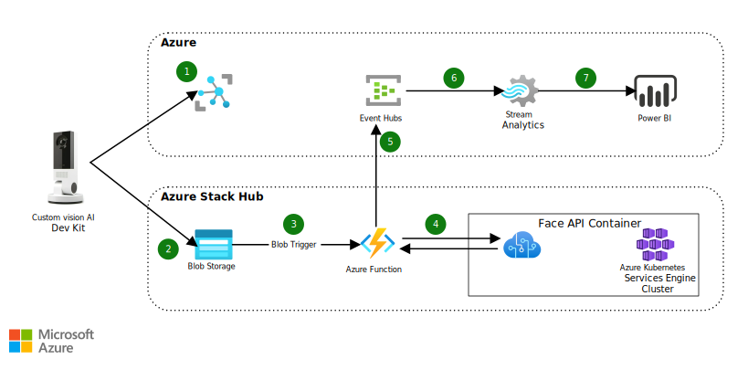

Gain insights on how customers receive their current products, in relation to store layout. 

## Architecture

_Download a [Visio file](https://arch-center.azureedge.net/hybrid-footfall-detection.vsdx) of this architecture._

### Dataflow

1. The Custom Vision AI Dev Kit gets a configuration from IoT Hub, which installs the IoT Edge Runtime and an ML model.
1. If the model sees a person, it takes a picture and uploads it to Azure Stack Hub blob storage.
1. The blob service triggers an Azure Function on Azure Stack Hub.
1. The Azure Function calls a container with the Face API, to get demographic and emotion data from the image.
1. The data is anonymized and sent to an Azure Event Hubs cluster.
1. The Event Hubs cluster pushes the data to Stream Analytics.
1. Stream Analytics aggregates the data and pushes it to Power BI. Power BI provides an easy-to-use dashboard interface for viewing the output from Azure Stream Analytics.

### Components

#### In-store hardware

* [Custom Vision AI Dev Kit](https://azure.github.io/Vision-AI-DevKit-Pages) provides in-store filtering, by using a local ML model that only captures images of people for analysis. It's securely provisioned and updated through IoT Hub.

#### Azure

* [Azure Event Hubs](https://azure.microsoft.com/services/event-hubs) is a fully managed, real-time data ingestion service that's simple, trusted, and scalable. Stream millions of events per second, from any source, to build dynamic data pipelines and to immediately respond to business challenges.
* [Azure Stream Analytics](https://azure.microsoft.com/services/stream-analytics) is an easy-to-use, real-time analytics service that is designed for mission-critical workloads. Go from zero to production in minutes. It's SQL—easily extensible, with custom code and built-in machine-learning capabilities, for more advanced scenarios.
* [Microsoft Power BI](https://powerbi.microsoft.com) is a suite of business analytics tools that deliver insights throughout your organization. Connect to hundreds of data sources, simplify data prep, and drive improvised analysis. Produce beautiful reports, and then publish them for your organization, to consume on the web and across mobile devices.

#### Azure Stack Hub

* [Azure Stack Hub](https://azure.microsoft.com/products/azure-stack/hub) broadens Azure, to let you run apps in an on-premises environment and to deliver Azure services in your datacenter.
* The [App Service](https://azure.microsoft.com/services/app-service) resource provider (RP) provides a base for edge components, including hosting and management features for web apps, APIs, and Functions.
* The [Azure Kubernetes Service](https://azure.microsoft.com/services/kubernetes-service) (AKS) engine. The AKS RP with an AKS-engine cluster is deployed into Azure Stack Hub, to provide a scalable, resilient engine that runs the Face API container.
* [Face API containers](https://github.com/cmcclister/architecture-center-pr/tree/Broken-link-fix-ronmiab). The Azure Cognitive Services RP, with Face API containers, provides demographic, emotion, and unique visitor detection.
* [Blob storage](https://azure.microsoft.com/services/storage/blobs). Images captured from the AI Dev Kit are uploaded to Azure Stack Hub's Blob storage.
* [Azure Functions](https://azure.microsoft.com/services/functions). An Azure Function running on Azure Stack Hub receives input from Blob storage and manages the interactions with the Face API. It emits anonymized data to an Event Hubs cluster that's located in Azure.

### Alternatives

An [Azure Function that's running on Azure Stack Hub](/azure-stack/operator/azure-stack-app-service-overview) is a great compute option. However, there are other compute options, such as a custom app that runs on [Azure App Service](/azure-stack/operator/azure-stack-app-service-deploy) or [Azure Kubernetes Service (AKS) Engine](https://github.com/Azure/aks-engine).

## Scenario details

### Potential use cases

This solution outlines an AI-based footfall detection architecture for analyzing visitor traffic in retail stores. The solution generates insights from real world actions, by using Azure, Azure Stack Hub, and the Custom Vision AI Dev Kit.

With this scenario, you don't have to place staff in every section, and you don't need a team of analysts to review all of a store's camera footage. The solution also doesn't require stores to have enough bandwidth to stream video from all their cameras, to the cloud for analysis. The solution provides an unobtrusive, privacy-friendly way to determine customer demographics, loyalty, and reactions to store displays and products.

## Considerations

These considerations implement the pillars of the Azure Well-Architected Framework, which is a set of guiding tenets that can be used to improve the quality of a workload. For more information, see [Microsoft Azure Well-Architected Framework](/azure/architecture/framework).

### Reliability

Since this solution is tiered, it's important to think about how to deal with networking or power failures. Refer to [Resiliency and dependencies](/azure/architecture/framework/resiliency/design-resiliency), [Best practices for designing reliability in Azure applications](/azure/architecture/framework/resiliency/design-best-practices), and [Azure Stack Hub reliability](/azure/architecture/framework/services/hybrid/azure-stack-hub/reliability), from the Microsoft Azure Well Architected Framework (WAF), to improve the solution's resiliency.

Depending on your business needs, you might want to implement a mechanism to cache images locally, and then forward them to Azure Stack Hub when connectivity returns. If the location is large enough, deploy a Data Box Edge with the Face API container to that location.

### Security

Security provides assurances against deliberate attacks and the abuse of your valuable data and systems. For more information, see [Overview of the security pillar](/azure/architecture/framework/security/overview).

This solution captures customer images, which make security a paramount consideration. Refer to the WAF [Data protection](/azure/architecture/framework/security/design-storage) guidance to secure the storage accounts, including configuring proper access policies and rotating keys regularly. Ensure storage accounts and Event Hubs have retention policies that meet your corporate and government privacy regulations.

Provide security through [identity and access management](/azure/architecture/framework/security/design-identity), making sure to tier the user access levels. Tiering ensures that users only have access to the data that they need for their roles.

### Operational excellence

Operational excellence covers the operations processes that deploy an application and keep it running in production. For more information, see [Overview of the operational excellence pillar](/azure/architecture/framework/devops/overview).

Monitoring and diagnostics are crucial. Cloud applications run in a remote datacenter, where you don't have full control of the infrastructure or, in some cases, the operating system. Use [Azure Monitor on Azure Stack Hub](/azure-stack/user/azure-stack-metrics-azure-data) to visualize, query, route, archive, and take other actions on metrics and logs. Follow the [Monitoring operations of cloud applications](/azure/architecture/framework/devops/checklist) checklist to implement a comprehensive monitoring strategy for the solution.

This solution can span many devices and locations, which could get unwieldy. [Azure's IoT services](/azure/iot-fundamentals) can automatically bring new locations and devices online and keep them up to date.

### Performance efficiency

Performance efficiency is the ability of your workload to scale to meet the demands placed on it by users in an efficient manner. For more information, see [Performance efficiency pillar overview](/azure/architecture/framework/scalability/overview).

To enable this solution to scale across multiple cameras and locations, you'll need to make sure that all of the components can handle the increased load. You might need to take the following actions:

* Increase the number of Stream Analytics streaming units.
* Scale out the Face API deployment.
* Increase the Event Hubs cluster throughput.
* In extreme cases, you might need to migrate from Azure Functions to a virtual machine.

Use the [Performance efficiency checklist](/azure/architecture/framework/scalability/performance-efficiency) to review your design from a scalability standpoint.

## Deploy this scenario

Deploy an AI-based footfall-detection solution that generates insights from real-world actions by using Azure, Azure Stack Hub, and the Custom Vision AI Dev Kit. This solution analyzes visitor traffic in retail stores. See [Deploy an AI-based footfall detection solution using Azure and Azure Stack Hub](/azure/architecture/hybrid/deployments/solution-deployment-guide-retail-footfall-detection).

## Contributors

_This article is maintained by Microsoft. It was originally written by the following contributors._

Principal author:

* [Bryan Lamos](https://www.linkedin.com/in/bryanlamos) | Senior Content Developer

_To see non-public LinkedIn profiles, sign in to LinkedIn._

## Next steps

See the following articles, to learn more about the topics introduced in this architecture:

* See the [Deploy a Staged Data Analytics Solution](https://aka.ms/tiereddatadeploy) sample, which is implemented by the footfall detection solution.
* See the [Custom Vision AI Dev Kit](https://azure.github.io/Vision-AI-DevKit-Pages) to learn more about using custom vision.
* [Azure Stack Hub Operator Documentation](/azure-stack/operator)
* [Azure App Service on Azure Stack Hub](/azure-stack/operator/azure-stack-app-service-overview)
* [Azure Kubernetes Service on Azure Stack Hub](/azure-stack/operator/aks-add-on)
* [Azure hybrid and multicloud documentation](/hybrid)

## Related resources

* See the [Analytics end-to-end with Azure Synapse](/azure/architecture/example-scenario/dataplate2e/data-platform-end-to-end) architecture for a more comprehensive scenario that illustrates other mechanisms to enrich and serve data.
* [AI at the edge with Azure Stack Hub](./ai-at-the-edge.yml)
* [Deploy AI and ML computing on-premises and to the edge](../../hybrid/deploy-ai-ml-azure-stack-edge.yml)
