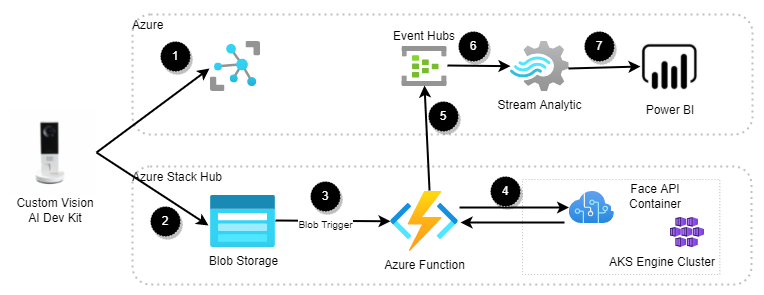

[!INCLUDE [header_file](../../../includes/sol-idea-header.md)]

This solution outlines an AI-based footfall detection architecture for analyzing visitor traffic in retail stores. The solution generates insights from real world actions, using Azure, Azure Stack Hub, and the Custom Vision AI Dev Kit.

## Potential use cases

Gain insights on how customers are receiving their current products in relation to store layout, without having to place staff in every section or having a team of analysts review an entire store's camera footage. And without requiring stores to have enough bandwidth to stream video from all their cameras to the cloud for analysis. The solution provides an unobtrusive, privacy-friendly way to determine customer demographics, loyalty, and reactions to store displays and products.

## Architecture

  
_Download an [Visio](https://arch-center.azureedge.net/hybrid-footfall-detection.vsdx) of this architecture._

### Data flow

1. The Custom Vision AI Dev Kit gets a configuration from IoT Hub, which installs the IoT Edge Runtime and an ML model.
2. If the model sees a person, it takes a picture and uploads it to Azure Stack Hub blob storage.
3. The blob service triggers an Azure Function on Azure Stack Hub.
4. The Azure Function calls a container with the Face API to get demographic and emotion data from the image.
5. The data is anonymized and sent to an Azure Event Hubs cluster.
6. The Event Hubs cluster pushes the data to Stream Analytics.
7. Stream Analytics aggregates the data and pushes it to Power BI. Power BI provides an easy-to-use dashboard interface for viewing the output from Azure Stream Analytics

### Components

#### In-store hardware

* [Custom Vision AI Dev Kit](https://azure.github.io/Vision-AI-DevKit-Pages/) Provides in-store filtering using a local ML model that only captures images of people for analysis. Securely provisioned and updated through IoT Hub.

#### Azure

* [Azure Event Hubs](https://azure.microsoft.com/services/event-hubs) is a fully managed, real-time data ingestion service that’s simple, trusted, and scalable. Stream millions of events per second from any source to build dynamic data pipelines and immediately respond to business challenges.
* [Azure Stream Analytics](https://azure.microsoft.com/services/stream-analytics) is an easy-to-use, real-time analytics service that is designed for mission-critical workloads. Go from zero to production in minutes using SQL—easily extensible with custom code and built-in machine learning capabilities for more advanced scenarios.
* [Microsoft Power BI](https://powerbi.microsoft.com/) is a suite of business analytics tools that deliver insights throughout your organization. Connect to hundreds of data sources, simplify data prep, and drive improvised analysis. Produce beautiful reports, then publish them for your organization to consume on the web and across mobile devices.

#### [Azure Stack Hub](https://azure.microsoft.com/products/azure-stack/hub/)

* [App Service](https://azure.microsoft.com/services/app-service/). The App Service resource provider (RP) provides a base for edge components, including hosting and management features for web apps/APIs and Functions.
* Azure Kubernetes Service  [(AKS) Engine](https://azure.microsoft.com/services/kubernetes-service/). The AKS RP with AKS-Engine cluster deployed into Azure Stack Hub provides a scalable, resilient engine to run the Face API container.
* [Face API containers](https://azure.microsoft.com/services/cognitive-services/face/). The Azure Cognitive Services RP with Face API containers provides demographic, emotion, and unique visitor detection.
* [Blob Storage](https://azure.microsoft.com/services/storage/blobs/). Images captured from the AI Dev Kit are uploaded to Azure Stack Hub's blob storage.
* [Azure Functions](https://azure.microsoft.com/services/functions/). An Azure Function running on Azure Stack Hub receives input from blob storage and manages the interactions with the Face API. It emits anonymized data to an Event Hubs cluster located in Azure.

### Considerations

#### Reliability

Since this solution is tiered, it's important to think about how to deal with networking or power failures. Refer to the [Resiliency and Dependencies](https://docs.microsoft.com/azure/architecture/framework/resiliency/design-resiliency), [Resiliency Best Practices](https://docs.microsoft.com/azure/architecture/framework/resiliency/design-best-practices), and [Azure Stack Hub reliability](https://docs.microsoft.com/azure/architecture/framework/services/hybrid/azure-stack-hub/reliability) guidance from the Microsoft Azure Well Architected Framework (WAF) to improve the solution resiliency.

Depending on business needs, you might want to implement a mechanism to cache images locally, then forward to Azure Stack Hub when connectivity returns. If the location is large enough, deploying a Data Box Edge with the Face API container to that location might be a better option.

#### Security

This solution captures customer images, making security a paramount consideration. Refer to the WAF [Data Protection](https://docs.microsoft.com/azure/architecture/framework/security/design-storage) guidance to secure the storage accounts, including configuring proper access policies and rotating keys regularly. Ensure storage accounts and Event Hubs have retention policies that meet corporate and government privacy regulations.

Provide security through [identity and access management](https://docs.microsoft.com/azure/architecture/framework/security/design-identity), making sure to tier the user access levels. Tiering ensures that users only have access to the data they need for their role.

#### Operational excellence

Monitoring and diagnostics are crucial. Cloud applications run in a remote data-center where you don't have full control of the infrastructure or, in some cases, the operating system. Use [Azure Monitor on Azure Stack Hub](https://docs.microsoft.com/azure-stack/user/azure-stack-metrics-azure-data) lets you visualize, query, route, archive, and take other actions on metrics and logs. Follow the [Monitoring operations of cloud applications] checklist to implement a comprehensive monitoring strategy for the solution.

This solution can span many devices and locations, which could get unwieldy. [Azure's IoT services](https://docs.microsoft.com/azure/iot-fundamentals/) can be used to automatically bring new locations and devices online and keep them up to date.

#### Performance efficiency

To enable this solution to scale across multiple cameras and locations, you'll need to make sure that all of the components can handle the increased load. You may need to take actions like:

* Increase the number of Stream Analytics streaming units.
* Scale out the Face API deployment.
* Increase the Event Hubs cluster throughput.
* For extreme cases, migrate from Azure Functions to a virtual machine may be necessary.

Use the [Performance efficiency checklist](https://docs.microsoft.com/azure/architecture/framework/scalability/performance-efficiency) to review your design from a scalability standpoint.

### Alternatives

  An [Azure Functions](https://docs.microsoft.com/azure-stack/operator/azure-stack-app-service-overview)  running on Azure Stack Hub is a great compute option. However, there are others compute options like a custom app running on [Azure App Service](https://docs.microsoft.com/azure-stack/operator/azure-stack-app-service-deploy) or [Azure Kubernetes Service (AKS) Engine](https://github.com/Azure/aks-engine)

### Next steps

To learn more about the topics introduced in this article:

* See the [Tiered Data pattern](https://aka.ms/tiereddatadeploy), which is implemented by the footfall detection pattern.
* See the [Custom Vision AI Dev Kit](https://azure.github.io/Vision-AI-DevKit-Pages/) to learn more about using custom vision.
* [Analytics end-to-end with Azure Synapse](https://docs.microsoft.com/azure/architecture/example-scenario/dataplate2e/data-platform-end-to-end) architecture for a more comprehensive scenario that illustrates additional mechanisms to enrich and serve data.
* [Azure Stack Hub Operator Documentation](https://docs.microsoft.com/azure-stack/operator)
* [Azure App Service on Azure Stack Hub](https://docs.microsoft.com/azure-stack/operator/azure-stack-app-service-overview)
* [Azure Kubernetes Service on Azure Stack Hub](https://docs.microsoft.com/azure-stack/operator/aks-add-on)

### Related resources

* [AI at the edge with Azure Stack Hub](./ai-at-the-edge.yml)
* [Deploy AI and ML computing on-premises and to the edge](../../hybrid/deploy-ai-ml-azure-stack-edge.yml)
* [Azure hybrid and multicloud documentation](https://docs.microsoft.com/hybrid)
