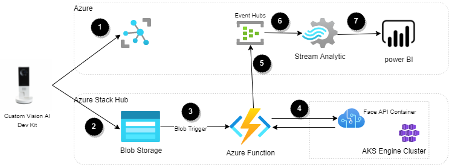

[!INCLUDE [header_file](../../../includes/sol-idea-header.md)]

The article provides an overview for implementing an AI-based footfall detection solution for analyzing visitor traffic in retail stores.

This retail analytics solution uses a [tiered](https://docs.microsoft.com/hybrid/app-solutions/pattern-tiered-data-analytics) approach to inferencing at the edge. By using the Custom Vision AI Dev Kit, only images with human faces are sent for analysis to a private Azure Stack Hub that runs Azure Cognitive Services. Anonymized, aggregated data is sent to Azure for aggregation across all stores and visualization in Power BI. Combining the edge and public cloud lets Contoso take advantage of modern AI technology while also remaining in compliance with their corporate policies and respecting their customers' privacy.

## Potential use cases

Contoso Stores would like to gain insights on how customers are receiving their current products in relation to store layout. They're unable to place staff in every section and it's inefficient to have a team of analysts review an entire store's camera footage. In addition, none of their stores have enough bandwidth to stream video from all their cameras to the cloud for analysis.

Contoso would like to find an unobtrusive, privacy-friendly way to determine their customers' demographics, loyalty, and reactions to store displays and products.

## Architecture

  
_Download an [Visio](../media/hybrid-footfall-detection-pattern.vsdx) of this architecture._

### Data flow

1. The Custom Vision AI Dev Kit gets a configuration from IoT Hub, which installs the IoT Edge Runtime and an ML model.
2. If the model sees a person, it takes a picture and uploads it to Azure Stack Hub blob storage.
3. The blob service triggers an Azure Function on Azure Stack Hub.
4. The Azure Function calls a container with the Face API to get demographic and emotion data from the image.
5. The data is anonymized and sent to an Azure Event Hubs cluster.
6. The Event Hubs cluster pushes the data to Stream Analytics.
7. Stream Analytics aggregates the data and pushes it to Power BI.

### Components

#### In-store hardware
* [Custom Vision AI Dev Kit](https://azure.github.io/Vision-AI-DevKit-Pages/) Provides in-store filtering using a local ML model that only captures images of people for analysis. Securely provisioned and updated through IoT Hub.
#### Azure
* [Azure Event Hubs](https://docs.microsoft.com/azure/event-hubs/) provides a scalable platform for ingesting anonymized data that integrates neatly with Azure Stream .
* [Azure Stream Analytics](https://docs.microsoft.com/azure/stream-analytics/). An Azure Stream Analytics job aggregates the anonymized data and groups it into 15-second windows for visualization.
*  [Microsoft Power BI](https://powerbi.microsoft.com/). Power BI provides an easy-to-use dashboard interface for viewing the output from Azure Stream Analytics.
#### [Azure Stack Hub](https://docs.microsoft.com/azure-stack/operator/azure-stack-overview)
* [App Service](/azure-stack/operator/azure-stack-app-service-overview).  The App Service resource provider (RP) provides a base for edge components, including hosting and management features for web apps/APIs and Functions. 
* Azure Kubernetes Service  [(AKS) Engine](https://github.com/Azure/aks-engine) cluster. The AKS RP with AKS-Engine cluster deployed into Azure Stack Hub provides a scalable, resilient engine to run the Face API container.  
* [Face API containers](https://docs.microsoft.com/azure/cognitive-services/face/face-how-to-install-containers). The Azure Cognitive Services RP with Face API containers provides demographic, emotion, and unique visitor detection on Contoso's private network.
* [Blob Storage](https://docs.microsoft.com/azure-stack/user/azure-stack-storage-overview). Images captured from the AI Dev Kit are uploaded to Azure Stack Hub's blob storage
*  [Azure Functions](https://docs.microsoft.com/azure-stack/operator/azure-stack-app-service-overview). An Azure Function running on Azure Stack Hub receives input from blob storage and manages the interactions with the Face API. It emits anonymized data to an Event Hubs cluster located in Azure.

### Considerations

#### Reliability 
Since this solution is tiered, it's important to think about how to deal with networking or power failures. Leverage the [Resiliency and Dependencies](https://docs.microsoft.com/en-us/azure/architecture/framework/resiliency/design-resiliency), general [Best Practices](https://docs.microsoft.com/en-us/azure/architecture/framework/resiliency/design-best-practices), and other [Azure Stack Hub reliability](https://docs.microsoft.com/en-us/azure/architecture/framework/services/hybrid/azure-stack-hub/reliability) guidance from the Microsoft Azure Well Architected Framework (WAF) to improve the solution resiliency.

Depending on business needs, you might want to implement a mechanism to cache images locally, then forward to Azure Stack Hub when connectivity returns. If the location is large enough, deploying a Data Box Edge with the Face API container to that location might be a better option.

#### Security

This solution captures customer images, making security a paramount consideration. Leverage the WAF [Data Protection](https://docs.microsoft.com/en-us/azure/architecture/framework/security/design-storage) guidance to secure the storage accounts, including configuring proper access policies and rotating keys regularly. Ensure storage accounts and Event Hubs have retention policies that meet corporate and government privacy regulations. 

Provide security through [identity and access management](https://docs.microsoft.com/en-us/azure/architecture/framework/security/design-identity), making sure to tier the user access levels. Tiering ensures that users only have access to the data they need for their role.

#### Operational excellence
Monitoring and diagnostics are crucial. Cloud applications run in a remote data-center where you don't have full control of the infrastructure or, in some cases, the operating system. Use [Azure Monitor on Azure Stack Hub](https://docs.microsoft.com/azure-stack/user/azure-stack-metrics-azure-data) lets you visualize, query, route, archive, and take other actions on metrics and logs. Follow the [Monitoring operations of cloud applications] checklist to implement a comprehensive monitoring strategy for the solution.

This solution can span many devices and locations, which could get unwieldy. [Azure's IoT services](https://docs.microsoft.com/azure/iot-fundamentals/) can be used to automatically bring new locations and devices online and keep them up to date.

#### Performance efficiency
To enable this solution to scale across multiple cameras and locations, you'll need to make sure that all of the components can handle the increased load. You may need to take actions like:

Increase the number of Stream Analytics streaming units.
* Scale out the Face API deployment.
* Increase the Event Hubs cluster throughput.
* For extreme cases, migrate from Azure Functions to a virtual machine may be necessary.

Use the [Performance efficiency checklist](https://docs.microsoft.com/en-us/azure/architecture/framework/scalability/performance-efficiency) to review your design from a scalability standpoint.

### Alternatives
  An [Azure Functions](https://docs.microsoft.com/azure-stack/operator/azure-stack-app-service-overview)  running on Azure Stack Hub is a great compute option. However, there are others compute options which are possible, for example, an custom app on [Azure App Service](https://docs.microsoft.com/azure-stack/operator/azure-stack-app-service-deploy) or on top of Azure Kubernetes Service [(AKS) Engine](https://github.com/Azure/aks-engine)

### Next Steps

To learn more about the topics introduced in this article:

- See the [Tiered Data pattern](https://aka.ms/tiereddatadeploy), which is leveraged by the footfall detection pattern.
- See the [Custom Vision AI Dev Kit](https://azure.github.io/Vision-AI-DevKit-Pages/) to learn more about using custom vision. 
- See the [Analytics end-to-end with Azure Synapse](https://docs.microsoft.com/en-us/azure/architecture/example-scenario/dataplate2e/data-platform-end-to-end) architecture for a more comprehensive scenario that illustrates other additional mechanisms to enrich and serve data. 
