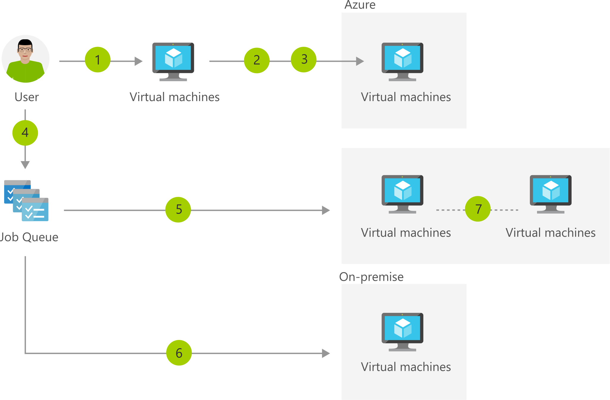

[!INCLUDE [header_file](../../../includes/sol-idea-header.md)]

Microsoft HPC Pack is a free high-performance computing (HPC) solution built on Microsoft Azure and Windows Server technologies. HPC Pack combines a comprehensive set of deployment, administration, job scheduling, and monitoring tools for your Windows and Linux HPC cluster environment, providing a flexible platform for developing and running HPC applications on premises and in Azure.

This solution shows the process for using HPC Pack to create a hybrid (on-premises and Azure) HPC environment.

The links below provide documentation on deploying and managing the Azure products that are included in this solution idea:

* [Documentation Home Page](https://technet.microsoft.com/library/cc514029\(v=ws.11\).aspx)
* [HPC Pack Azure Deployment Options](/azure/virtual-machines/windows/hpcpack-cluster-options)

## Architecture

*Download an [SVG](../media/hybrid-hpc-in-azure-with-hpc-pack.svg) of this architecture.*

### Data flow

1. Log into an on-premises head node.
1. Add Azure compute nodes to the cluster.
1. Start the compute nodes.
1. Submit jobs to the cluster.
1. HPC Pack sends jobs to on-premises and Azure nodes, based upon the node group selected.
1. Monitor the job progress.
1. Stop the compute nodes or configure autoscaling.

### Components

* [Virtual Machines](https://azure.microsoft.com/services/virtual-machines): Create Linux and Windows virtual machines in seconds.
* [Microsoft HPC Pack](https://www.visualstudio.com/vs): Free high-performance computing (HPC) solution built on Microsoft Azure and Windows Server technologies.

## Next steps

* [Create a Windows virtual machine with the Azure portal](/azure/virtual-machines/windows/quick-create-portal)
* [Set up a hybrid high-performance computing (HPC) cluster with Microsoft HPC Pack and on-demand Azure compute nodes](/azure/cloud-services/cloud-services-setup-hybrid-hpcpack-cluster)
