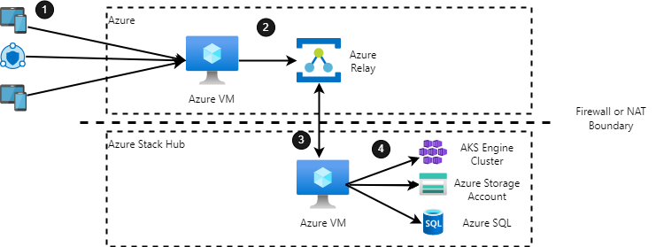

[!INCLUDE [header_file](../../../includes/sol-idea-header.md)]

This architecture demonstrates how to connect from Azure to edge resources or devices protected by firewalls using Azure Relay Hybrid Connections.

## Potential use cases

Edge devices are often behind a corporate firewall or NAT device, unable to communicate with the public cloud or edge devices on other corporate networks. It could be necessary to expose certain ports and functionality to users in the public cloud in a secure manner. This architecture uses Azure Relay to establish a WebSockets tunnel between two endpoints that can't directly communicate. Devices that aren't on-premises but need to connect to an on-premises endpoint will connect to an endpoint in the public cloud. This endpoint will redirect the traffic on predefined routes over a secure channel. An endpoint inside the on-premises environment receives the traffic and routes it to the correct destination.

## Architecture

  
_Download a [Visio file](https://arch-center.azureedge.net/hybrid-relay-connection.vsdx) of this architecture._

### Data flow

1. A device connects to the virtual machine (VM) in Azure, on a predefined port. The VM provides a publicly accessible endpoint for the on-premises resource.
2. Traffic is forwarded to the Azure Relay in Azure. An Azure Relay provides the infrastructure for maintaining the tunnel and connection between the Azure VM and Azure Stack Hub VM.
3. The VM on Azure Stack Hub, which has already established a long-lived connection to the Azure Relay, receives the traffic and forwards it to the destination. The VM provides the server-side of the Hybrid Relay tunnel.
4. The on-premises service or endpoint processes the request.

### Components

* [Azure Stack Hub](https://azure.microsoft.com/products/azure-stack/hub/) Azure Stack Hub broadens Azure to let you run apps in an on-premises environment and deliver Azure services in your datacenter.
* [Azure Virtual Machines](https://azure.microsoft.com/services/virtual-machines/).
* [Azure Relay](https://docs.microsoft.com/azure/azure-relay) The Azure Relay service enables you to securely expose services that run in your corporate network to the public cloud without opening a port on your firewall, or making intrusive changes to your corporate network infrastructure.
* [Azure Stack Hub Storage](https://docs.microsoft.com/azure-stack/user/azure-stack-storage-overview) is a set of cloud storage services consistent with the services provided by Azure Storage. These services include blobs, tables, and queues. This is one example about on-premise resource.
* [SQL databases on Azure Stack Hub](https://docs.microsoft.com/azure-stack/operator/azure-stack-sql-resource-provider) Use the SQL resource provider to offer SQL databases on Azure Stack Hub. After you install the resource provider and connect it to one or more SQL Server instances

### Alternatives

The secure integration between solution components in Azure and components hosted in Azure Stack Hub could be implemented using network-level integration technologies like VPN (Virtual Private Network) and Azure ExpressRoute. Azure Relay is less intrusive and can be scoped to a single application endpoint on a single machine.

* [Azure ExpressRoute](https://azure.microsoft.com/services/expressroute/)
* [VPN Gateway](https://azure.microsoft.com/services/vpn-gateway)

## Considerations

### Reliability

Azure Relay connections aren't redundant. To ensure high-availability, you need want to implement error checking code or have a pool of Azure Relay-connected VMs behind a load balancer.

### Security

This pattern as shown allows for unfettered access to a port on an internal device from the edge. Consider adding an authentication mechanism to the service on the internal device, or in front of the hybrid relay endpoint. See [Azure Relay authentication and authorization](https://docs.microsoft.com/azure/azure-relay/relay-authentication-and-authorization) and [Network security for Azure Relay](https://docs.microsoft.com/azure/azure-relay/network-security) for additional network security guidance.

### Operational excellence

This solution can span many devices and locations, which could get unwieldy. Azure's IoT services can automatically bring new locations and devices online and keep them up to date.

Monitoring and diagnostics are crucial. Cloud applications run in a remote data-center where you don't have full control of the infrastructure or, in some cases, the operating system. In a large application, it's not practical to log into virtual machines (VMs) to troubleshoot an issue or sift through log files. Use [Azure Monitor on Azure Stack Hub](https://docs.microsoft.com/azure-stack/user/azure-stack-metrics-azure-data) lets you visualize, query, route, archive, and take other actions on metrics and logs.

### Performance efficiency

This solution only allows for 1:1 port mappings on the client and server. For example, if port 80 is tunneled for one service on the Azure endpoint, it can't be used for another service. Port mappings should be planned accordingly. The Azure Relay and VMs should be appropriately scaled to handle traffic.

## Next steps

* See [Azure Relay](https://docs.microsoft.com/azure/azure-relay) to learn more about the Azure Relay service.
* See [Azure App Service Hybrid Connections](https://docs.microsoft.com/azure/app-service/app-service-hybrid-connections) documentation to learn more about Azure App Service Hybrid Connections.
* See [Hybrid application design considerations](https://docs.microsoft.com/hybrid/app-solutions/overview-app-design-considerations) to learn more about best practices.
* See the [Azure Stack family of products and solutions](https://docs.microsoft.com/azure-stack) to learn more about the entire portfolio of products and solutions.
* See the [Azure Stack Development Kit](https://azure.microsoft.com/overview/azure-stack/development-kit/). The ASDK is a single-node deployment of Azure Stack Hub that you can download and use for free. All ASDK components are installed in virtual machines (VMs) running on a single host computer that must meet or exceed the minimum hardware requirements. The ASDK is meant to provide an environment in which you can evaluate Azure Stack Hub and develop modern apps using APIs and tooling consistent with Azure in a non-production environment. When you're ready to test the solution example, continue with the [Hybrid relay solution deployment guide](https://aka.ms/hybridrelaydeployment). The deployment guide provides step-by-step instructions for deploying and testing its components.

## Related resources

* [Security in a hybrid workload](https://docs.microsoft.com/azure/architecture/framework/hybrid/hybrid-security)
* [Hybrid Security Monitoring using Microsoft Defender for Cloud and Microsoft Sentinel](../../hybrid/hybrid-security-monitoring.yml)
* [Hybrid connections](./hybrid-connectivity-content.md)
* [Network topology and connectivity overview in Azure](https://docs.microsoft.com/azure/cloud-adoption-framework/ready/enterprise-scale/network-topology-and-connectivity)
