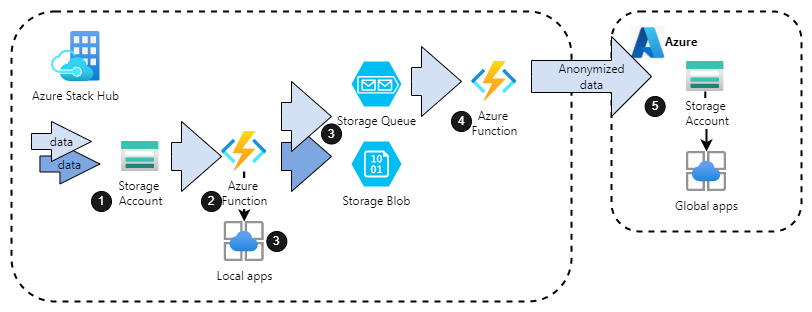

This solution illustrates how to use Azure Stack Hub and Azure to stage, analyze, process, sanitize, and store data across multiple on-premises and cloud locations.

One of the problems organizations face concerns secure data storage, processing, and analysis. Considerations include:

- Data content
- Location
- Security and privacy requirements
- Access permissions
- Maintenance
- Storage warehousing

Azure, together with Azure Stack Hub, addresses data concerns and provides low-cost solutions. 

The architecture described here is best exemplified by a distributed manufacturing or logistics company. Using both on-premises and public cloud environments meets the demands of multi-facility enterprises. Azure Stack Hub offers a rapid, secure, and flexible solution for collecting, processing, storing, and distributing local and remote data. 

This solution is especially useful when security, confidentiality, corporate policy, and regulatory requirements differ among locations and users.

## Potential use cases

The solution is applicable to large multi-branch manufacturing organizations require:

- Rapid and secure data storage, processing, and distribution between global remote locations and central headquarters.
- Security of employee and machinery activity, facility information, and business reporting data. The data must be distributed appropriately and meet regional compliance policies and industry regulations.

## Architecture

  
_Download a [Visio file](https://arch-center.azureedge.net/hybrid-tiered-data-analytics.vsdx) of this architecture._

### Dataflow

1. Blob storage in the on-premises Azure Stack Hub environment is used for raw data storage. Blob storage can hold any type of text or binary data, such as a document, media file, or app installer. Every blob is organized under a container. Containers provide a useful way to assign security policies to groups of objects. A storage account could have any number of containers, and a container can contain any number of blobs, up to the 500-TB capacity limit of the storage account.
1. As raw data arrives in the storage account, functions hosted on-premises using the Azure App Service resource provider on Azure Stack Hub are triggered to support the data intake. The intake functions can communicate with local apps and services to help process the data.
1. The output generated by the intake functions is saved back to the on-premises storage account:

   - **Blob storage** for data archive. There are benefits to low-cost storage for cool data archiving. Examples of cool data include backups, media content, scientific data, compliance, and archival data. In general, any data that's accessed infrequently is considered cool storage. Tiering data based on attributes like frequency of access and retention period. Customer data is infrequently accessed but requires similar latency and performance to hot data.
   - **Queue storage** for processed data storage. Queue storage provides cloud messaging between app components. In designing apps for scale, app components are often decoupled so they can scale independently. Queue storage delivers asynchronous.

1. Data saved to queue storage trigger invocation of functions used for data sterilization. Automatically and manually triggered functions can perform scheduled data processing, clean up, and archiving. Examples include nightly customer list scrubs and monthly report processing.

1. An Azure Storage account provides a sterile data consumption endpoint on the cloud. For example, the anonymized data is used to generate reports.

### Components

- [Azure Storage](https://docs.microsoft.com/azure/storage/) is Microsoft's cloud storage solution for modern data storage scenarios. Offers a massively scalable object store for data objects and a file system service for the cloud. It also provides a messaging store for reliable messaging and a NoSQL data store.  
- [Azure Stack Hub](https://azure.microsoft.com/products/azure-stack/hub) extends Azure services and capabilities to your environment of choice—from the datacenter to edge locations and remote offices. Build, deploy, and run hybrid and edge computing apps consistently across your IT ecosystem, with flexibility for diverse workloads.

  - [Azure Stack Hub Storage](https://docs.microsoft.com/azure-stack/user/azure-stack-storage-overview) is a set of cloud storage services consistent with the services provided by Azure Storage. These services include blobs, tables, and queues.
  - [Azure Functions](https://azure.microsoft.com/services/functions/) service is provided by the [Azure App Service on Azure Stack Hub](https://docs.microsoft.com/azure-stack/operator/azure-stack-app-service-overview) resource provider. Azure Functions lets you execute your code in a simple, serverless environment in response to a variety of events. Azure Functions scale to meet demand without having to create a VM or publish a web app, using the programming language of your choice.

### Alternatives

- It is possible to use other storage options, for example, [Azure SQL Database](https://azure.microsoft.com/products/azure-sql/database/) is an intelligent, scalable, relational database service built for the cloud. It is possible to [use SQL databases on Azure Stack Hub](https://docs.microsoft.com/azure-stack/operator/azure-stack-sql-resource-provider)
- [Event Hubs on Azure Stack Hub](https://docs.microsoft.com/azure-stack/operator/event-hubs-rp-overview) can be used for cloud messaging instead of Queue Storage. Streaming and event-based solutions are supported, for both on-premises and Azure cloud processing.

## Considerations

### Reliability

Storage is the primary availability consideration for this solution. Connection via fast links is required for large data volume processing and distribution. Azure Storage always stores multiple copies of your data so that it is protected from planned and unplanned events, including transient hardware failures, network or power outages, and massive natural disasters. Redundancy ensures that your storage account meets its availability and durability targets even in the face of failures. See more about [Azure Storage redundancy](https://docs.microsoft.com/azure/storage/common/storage-redundancy).

### Security

This solution captures customer data, making security a paramount consideration. Leverage the WAF [Data Protection](https://docs.microsoft.com/azure/architecture/framework/security/design-storage) guidance to secure the storage accounts, including configuring proper access policies and rotating keys regularly. Ensure storage accounts and Event Hubs have retention policies that meet corporate and government privacy regulations.

Provide security through [identity and access management](https://docs.microsoft.com/azure/architecture/framework/security/design-identity), making sure to tier the user access levels. Tiering ensures that users only have access to the data they need for their role.

For security guidance for serverless applications with functions, see [Serverless Functions security](/azure/architecture/serverless-quest/functions-app-security).

### Operational excellence

Manageability of this solution depends on authoring tools in use and engagement of source control.
[Azure Arc](https://docs.microsoft.com/azure/azure-arc/overview) simplifies governance and management by delivering a consistent multi-cloud and on-premises management platform. Manage your entire environment, with a single pane of glass, by projecting your existing non-Azure, on-premises, or other-cloud resources into Azure Resource Manager

### Performance efficiency

Azure Functions and storage solutions scale to meet data volume and processing demands. For Azure storage scalability information and targets, see [Azure Storage scalability documentation](https://docs.microsoft.com/azure/storage/common/scalability-targets-standard-account).

## Next steps

To learn more about the topics introduced in this article:

- See the [Azure Storage documentation](https://docs.microsoft.com/azure/storage/) and [Azure Functions](https://docs.microsoft.com/azure/azure-functions/) documentation. This solution makes heavy use of Azure Storage accounts and Azure Functions on both Azure and Azure Stack Hub.
- See [Hybrid application design considerations](https://docs.microsoft.com/hybrid/app-solutions/overview-app-design-considerations) to learn more about best practices and to get answers to additional questions.
- See the [Azure Stack family of products and solutions](https://docs.microsoft.com/azure-stack) to learn more about the entire portfolio of products and solutions.
- See the [Azure Stack Development Kit](https://docs.microsoft.com/azure-stack/asdk). The ASDK is a single-node deployment of Azure Stack Hub that you can download and use for free. All ASDK components are installed in virtual machines (VMs) running on a single host computer that must meet or exceed the minimum hardware requirements. The ASDK is meant to provide an environment in which you can evaluate Azure Stack Hub and develop modern apps using APIs and tooling consistent with Azure in a non-production environment.
- When you're ready to test the solution example, continue with the [Tiered data for analytics solution deployment guide](https://aka.ms/tiereddatadeploy). The deployment guide provides step-by-step instructions for deploying and testing its components.

## Related resources

- [Extend on-premises data solutions to the cloud](../../data-guide/scenarios/hybrid-on-premises-and-cloud.md)
- [Serverless web application](../../reference-architectures/serverless/web-app.yml)
- [Azure Data Architecture Guide](../../data-guide/index.md)
- [Overview of a hybrid workload](/azure/architecture/framework/hybrid/hybrid-overview.md)
- [hybrid-security-monitoring](../../hybrid/hybrid-security-monitoring.yml)
- [Hybrid Security Monitoring using Microsoft Defender for Cloud and Microsoft Sentinel](hybrid-identity.yml)
