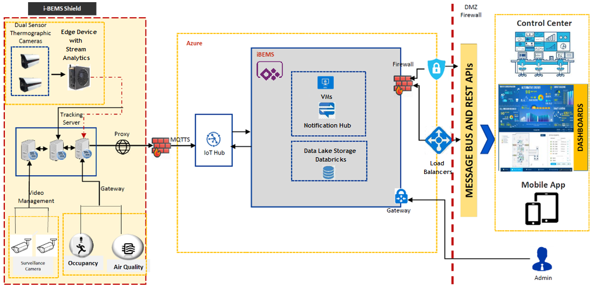

# Smart buildings for COVID-19 preparedness

As people return to group spaces after COVID-19 shutdowns, building management systems (BMSs) must track and enforce COVID-19 protections like occupancy limits, social distancing, and body temperature screening and tracking.

L&T Technology Services' [Intelligent Building Experience Management System (iBEMS)](https://www.ltts.com/solutions/i-bems) is a modular "system-of-systems" BMS that:
- Looks at building infrastructure as a whole, not as siloed systems.
- Uses device- and protocol-agnostic design to get diverse building infrastructures to talk to a single unified interface.
- Employs predictive analytics and machine learning at the Internet of Things (IoT) Edge level for agile, lightweight, rapid responses.
- Takes advantage of Azure cloud hosting for security, scalability, and rapid global deployment.
- Provides a unified end-user interface through web app, mobile app, or video wall displays.
- Allows deployment and management of safety and energy technologies for entire buildings, facilities, campuses, and global organizations.

**iBEMS Shield** is a core iBEMS module that provides key COVID-19 prevention health and safety features, letting organizations transform their former public spaces into "new normal-ready" spaces. iBEMS Shield offers body temperature monitoring and detection, face detection and tracking, occupancy and safe distance monitoring, and air quality detection. iBEMS Shield has all the core functionality of iBEMS, including alarms and notifications, and can quickly expand, scale, and integrate with other iBEMs features.

- **Fever detection:** Automated dual-function thermographic sensors and closed-circuit TV (CCTV) cameras at entrances detect people with high body temperature.
- **Facial recognition and tracking:** The system identifies and tracks symptomatic individuals on-premises until medical personnel can contact them. iBEMS Shield facial recognition can detect mask use and identify masked building personnel.
- **Occupancy management:** High-accuracy, real-time people locators and counters give complete visibility into historical and current occupancy levels and locations for any room, area, or zone.

## Potential use cases

- Spaces with existing CCTV infrastructure.
- BMS users from individual offices, restaurants, and retail spaces to large institutions and globally distributed organizations.

## Architecture

1. Thermographic cameras and CCTV provide temperature and visual data to IoT Edge devices and servers.
2. Stream analytics on the edge apply cognitive and machine learning models to quickly identify, quantify, track, and alert personnel.
3. Azure IoT Hub communicates with and controls the edge devices, and streams preprocessed data to the Azure cloud.
4. In the cloud, data streams to Azure Data Lake Storage for long term persisted storage. Azure Databricks reads and analyzes the stored data.
5. The Power Apps dashboard app applies business logic, machine learning (ML) model training, and automated workflows.
6. Azure deploys the customized dashboard app via firewall, message bus, and load balancers to iBEMS on-premises Control Centers, browsers, and mobile devices.

## Components

- [Azure IoT Edge](https://azure.microsoft.com/services/iot-edge/) intelligent devices can recognize and respond to sensor input by using onboard processing. These devices respond quickly or even offline, and limit costs by preprocessing and sending only necessary data to the cloud.
- [Azure Stream Analytics (ASA)](https://azure.microsoft.com/services/stream-analytics) provides real-time serverless stream processing that can run the same queries on the edge and in the cloud. ASA on IoT Edge can filter or aggregate data to send to the cloud for further processing or storage.
- [Azure Digital Twins](https://azure.microsoft.com/services/digital-twins/) IoT service creates comprehensive models of physical environments in a spatial intelligence graph. Rather than simply tracking individual devices, Digital Twins can virtually replicate the physical world by modeling the relationships between people, places, and devices.
- [Azure IoT Hub](https://azure.microsoft.com/services/iot-hub/) connects virtually any IoT device with Azure cloud services. IoT Hub enables highly secure and reliable bi-directional communication, management, and provisioning for IoT Edge devices.
- [Azure Data Lake Storage](https://azure.microsoft.com/services/storage/data-lake-storage/) is a data lake storage solution for big data analytics. Data Lake Storage combines [Azure Blob Storage](https://azure.microsoft.com/services/storage/blobs/) capabilities with a high-performance file system.
- [Azure Databricks](https://azure.microsoft.com/services/databricks/) is a fast, easy, and collaborative Apache Spark-based analytics service that can read and analyze data lake data.
- [Azure Cognitive Services](https://azure.microsoft.com/services/cognitive-services/) is a family of AI services and cognitive APIs that help build intelligent apps. For example, [Computer Vision](https://azure.microsoft.com/services/cognitive-services/computer-vision/), [Custom Vision](https://azure.microsoft.com/services/cognitive-services/custom-vision-service/), and [Face](https://azure.microsoft.com/services/cognitive-services/face/) can help identify and track personnel on-premises.
- [Azure Machine Learning](https://azure.microsoft.com/services/machine-learning/) lets you build, train, deploy, track, and manage ML models at cloud scale. Machine learning continually retrains and updates models to improve accuracy and performance.
- [Power Apps](https://azure.microsoft.com/products/powerapps/) is a suite of apps, services, connectors, and data platform that build custom apps for business needs. Power Apps provides responsive design that can run seamlessly in browsers, mobile devices, or large video displays. Power Apps portal apps create external-facing websites that allow secure access for various identities.

## Next steps

- For more information, please contact [iotcovid@microsoft.com](mailto:iotcovid@microsoft.com).
- For information about iBEMS, see [Intelligent Building Experience Management System (iBEMS)](https://www.ltts.com/solutions/i-bems).
