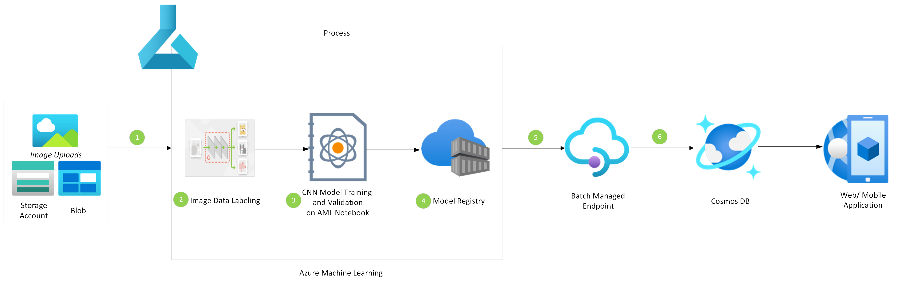

[!INCLUDE [header_file](../../../includes/sol-idea-header.md)]

Use convolutional neural networks (CNNs) to classify large volumes of images efficiently to identify elements in images.

## Architecture

*Download a [Visio file](https://arch-center.azureedge.net/image-classification-with-convolutional-neural-networks.vsdx) of this architecture.*

### Dataflow

1. Image uploads to Azure Blob Storage are ingested by Azure Machine Learning.
2. Because the solution follows a supervised learning approach and needs data labeling to train the model, the ingested images are labeled in Machine Learning.
3. The CNN model is trained and validated in the Machine Learning notebook. Several pre-trained image classification models are available. You can use them by using a transfer learning approach. For information about some variants of pre-trained CNNs, see [Advancements in image classification using convolutional neural networks](https://arxiv.org/pdf/1905.03288.pdf). You can download these image classification models and customize them with your labeled data.
4. After training, the model is stored in a model registry in Machine Learning.
5. The model is deployed through batch managed endpoints.
6. The model results are written to Azure Cosmos DB and consumed through the front-end application.

### Components

- [Blob Storage](https://azure.microsoft.com/services/storage/blobs) is a service that's part of [Azure Storage](https://azure.microsoft.com/products/category/storage). Blob Storage offers optimized cloud object storage for large amounts of unstructured data.
- [Machine Learning](https://azure.microsoft.com/services/machine-learning) is a cloud-based environment that you can use to train, deploy, automate, manage, and track machine learning models. You can use the models to forecast future behavior, outcomes, and trends.
- [Azure Cosmos DB](https://azure.microsoft.com/services/cosmos-db) is a globally distributed, multi-model database. With Azure Cosmos DB, your solutions can elastically scale throughput and storage across any number of geographic regions.
- [Azure Container Registry](https://azure.microsoft.com/services/container-registry) builds, stores, and manages container images and can store containerized machine learning models.

## Scenario details

With the rise of technologies such as the Internet of Things (IoT) and AI, the world is generating large amounts of data. Extracting relevant information from the data has become a major challenge. Image classification is a relevant solution to identifying what an image represents. Image classification can help you categorize high volumes of images. Convolutional neural networks (CNNs) render good performance on image datasets. CNNs have played a major role in the development of state-of-the-art image classification solutions.

There are three main types of layers in CNNs:

- Convolutional layers
- Pooling layers
- Fully connected layers

The convolutional layer is the first layer of a convolutional network. This layer can follow another convolutional layer or pooling layers. In general, the fully connected layer is the final layer in the network.

As the number of layers increases, the complexity of the model increases, and the model can identify greater portions of the image. The beginning layers focus on simple features, such as edges. As the image data advances through the layers of the CNN, the network starts recognizing more sophisticated elements or shapes in the object. Finally, it identifies the expected object.

### Potential use cases

- This solution can help automate failure detection, which is preferable to relying solely on human operators. For instance, this solution can boost productivity by identifying faulty electronic components. This capability is important for lean manufacturing, cost control, and waste reduction in manufacturing. In circuit-board manufacturing, faulty boards can cost manufacturers money and productivity. Assembly lines rely on human operators to quickly review and validate boards that are flagged as potentially faulty by assembly-line test machines.
- Image classification is ideal for the healthcare industry. Image classification helps detect bone cracks, various types of cancer, and anomalies in tissues. You can also use image classification to flag irregularities that can indicate the presence of disease. An image classification model can improve the accuracy of MRIs.
- In the agriculture domain, image classification solutions help identify plant diseases and plants that require water. As a result, image classification helps to reduce the need for human intervention.

## Contributors

*This article is maintained by Microsoft. It was originally written by the following contributor.*

Principal author:

- [Ashish Chauhan](https://www.linkedin.com/in/a69171115/) | Senior Solution Architect

*To see non-public LinkedIn profiles, sign in to LinkedIn.*

## Next steps

- To learn more about Blob Storage, see [Introduction to Azure Blob Storage](/azure/storage/blobs/storage-blobs-introduction).
- To learn more about Container Registry, see [Introduction to Container registries in Azure](/azure/container-registry/container-registry-intro).
- To learn more about model management (MLOps), see [MLOps: Model management, deployment, lineage, and monitoring with Azure Machine Learning](/azure/machine-learning/concept-model-management-and-deployment).
- To browse an implementation of this solution idea on GitHub, see [Synapse Machine Learning](https://github.com/azure/mmlspark).
- To explore a Microsoft Learn module that includes a section on CNNs, see [Train and evaluate deep learning models](/training/modules/train-evaluate-deep-learn-models).

## Related resources

- [Real-time scoring of machine learning models in Python](../../reference-architectures/ai/real-time-scoring-machine-learning-models.yml)
- [Visual search in retail with Azure Cosmos DB](../../industries/retail/visual-search-use-case-overview.yml)
- [Distributed training of deep learning models on Azure](../../reference-architectures/ai/training-deep-learning.yml)
