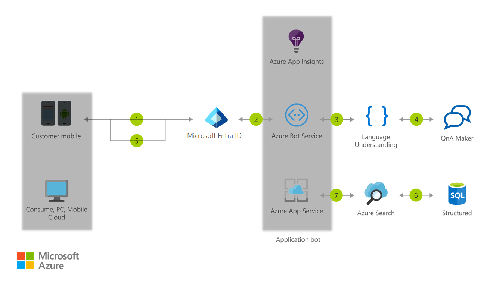

# Information Chatbot

[!INCLUDE [header_file](../../../includes/sol-idea-header.md)]

This Informational Bot can answer questions defined in a knowledge set or FAQ using Cognitive Services QnA Maker and answer more open-ended questions using Azure Cognitive Search.

## Architecture

*Download an [SVG](../media/information-chatbot.svg) of this architecture.*

## Data Flow

1. Employee starts the Application Bot
1. Azure Active Directory validates the employee's identity
1. The employee can ask the bot what type of queries are supported
1. Cognitive Services returns a FAQ built with the QnA Maker
1. The employee defines a valid query
1. The Bot submits the query to Azure Cognitive Search which returns information about the application data
1. Application insights gathers runtime telemetry to help development with Bot performance and usage
