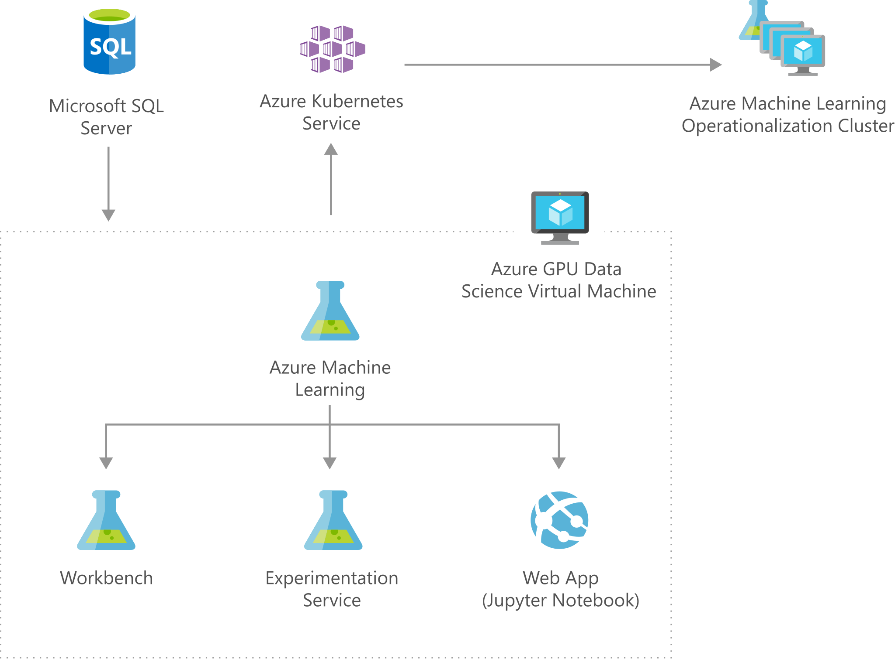

[!INCLUDE [header_file](../../../includes/sol-idea-header.md)]

Social sites, forums, and other text-heavy Q&A services rely heavily on tagging, which enables indexing and user search. Without appropriate tagging, these sites are far less effective. Often, however, tagging is left to the users' discretion. And since users don't have lists of commonly searched terms or a deep understanding of the categorization or information architecture of a site, posts are frequently mislabeled. This makes it difficult or impossible to find that content when it's needed later.

By combining deep learning and natural language processing (NLP) with data on site-specific search terms, this solution helps greatly improve tagging accuracy on your site. As your user types their post, it offers highly used terms as suggested tags, making it easier for others to find the information they're providing.

## Architecture

*Download an [SVG](../media/information-discovery-with-deep-learning-and-nlp.svg) of this architecture.*

## Components

* [Microsoft SQL Server](/sql/): Data is stored, structured, and indexed using Microsoft SQL Server.
* [GPU based Azure Data Science Virtual Machine](/azure/machine-learning/data-science-virtual-machine/): The core development environment is the Microsoft Windows Server 2016 GPU DSVM NC24.
* [Azure Machine Learning Workbench](/azure/machine-learning/): The Workbench is used for data cleaning and transformation, and it serves as the primary interface to the Experimentation and Model Management services.
* [Azure Machine Learning Experimentation Service](/azure/machine-learning/): The Experimentation Service is used for model training, including hyperparameter tuning.
* [Azure Machine Learning Model Management Service](/azure/machine-learning/): The Model Management service is used for deployment of the final model, including scaling out to a Kubernetes-managed Azure cluster.
* [Jupyter Notebooks on Azure Data Science VM](/azure/machine-learning/data-science-virtual-machine/reference-ubuntu-vm): Jupyter Notebooks is used as the base IDE for the model, which was developed in Python.
* [Azure Container Registry](/azure/container-registry/): The Model Management Service creates and packages real-time web services as Docker containers. These containers are uploaded and registered via Azure Container Registry.
* [Azure Kubernetes Service (AKS)](https://azure.microsoft.com/services/kubernetes-service): Deployment for this solution uses Azure Kubernetes Service running a Kubernetes-managed cluster. The containers are deployed from images stored in Azure Container Registry.

## Next steps

* [Learn more about Microsoft SQL Server](https://www.microsoft.com/sql-server/sql-server-2017)
* [Learn more about Azure Machine Learning Workbench](/azure/machine-learning/overview-what-happened-to-workbench)
* [Learn more about Azure Machine Learning sample experiments](/azure/machine-learning/classic/sample-experiments)
* [Learn More about Azure Machine Learning Model Management](/azure/machine-learning/concept-model-management-and-deployment)
* [Learn more about Jupyter Notebooks](https://jupyter.org)
* [Learn more about Azure Container Registry](https://azure.microsoft.com/services/container-registry)
* [Learn more about Azure Kubernetes Service](https://azure.microsoft.com/services/hdinsight)
