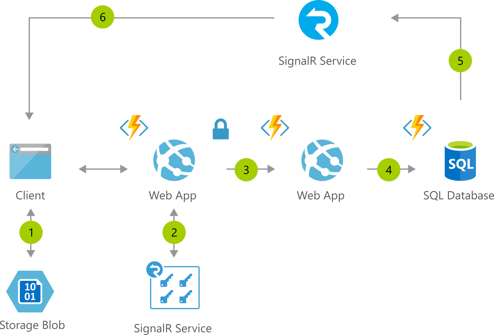

# Instant Broadcasting on Serverless Architecture

[!INCLUDE [header_file](../header.md)]

Simplify one-to-many real-time communication and updates using serverless code.

## Architecture

*Download an [SVG](../media/instant-broadcasting-on-serverless-architecture.svg) of this architecture.*

## Data Flow

1. Client pulls web app content from blob storage
1. Web app receives SignalR token and endpoint
1. User connects to web app
1. Connection triggers database event via Functions
1. Functions pushes data to SignalR Service
1. …which in turn pushes data to client
