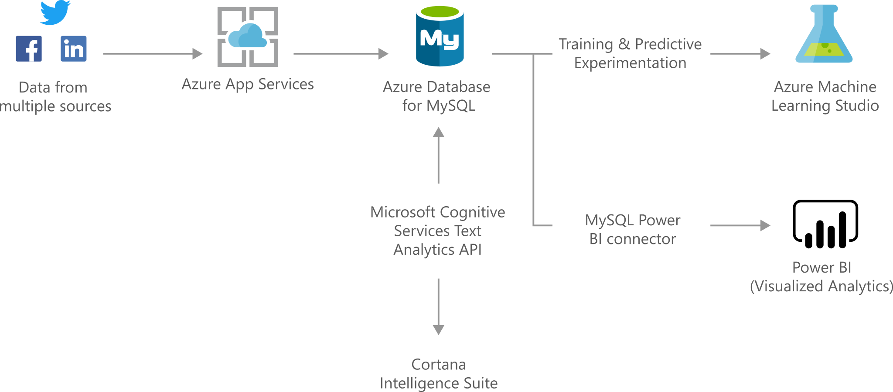

[!INCLUDE [header_file](../../../includes/sol-idea-header.md)]

Develop sophisticated, transformational apps using state of the art machine learning algorithms and integrated visualization tools to get actionable insights and analytics.

## Architecture

*Download an [PNG](../media/intelligent-apps-using-azure-database-for-mysql.png) of this architecture.*

The data flows through the solution as follows:

1. Azure function app could be triggered as a part of Azure data factory pipeline by creating an Azure Function Activity. 
2. Data could come from various sources, such as Event Hubs for high volumes of data ingestion, or data that's uploaded to Blob Storage. The Azure Function App is triggered as new data is received as part of the pipeline
3. The Azure Function App calls the Azure Cognitive Services API to analyze the data (for example, for Sentiment Analysis). 
4. The results of the analysis are returned in JSON format from Cognitive Services API(Text Analytics in this example)
5. The Azure Function App stores the data and results from Cognitive Services API(Text Analytics in this example) in Azure Database for MySQL.
6. Azure Machine Learning Studio can be used to further analyze the data, using custom Machine Learning algorithms to gain further insights.
7. The MySQL Power BI Connector provides options for data visualization and analysis in Power BI or a custom web application

### Components
- [Azure Data Factory](https://docs.microsoft.com/en-us/azure/data-factory/control-flow-azure-function-activity)
- [Azure Functions](/azure/azure-functions/functions-overview)
- [Event Hubs](/azure/event-hubs/)
- [Blob storage](/azure/storage/blobs/storage-blobs-introduction)
- [Text Analytics Api](/azure/cognitive-services/text-analytics/)
- [Azure Database for MySQL](/azure/mysql/)
- [Azure Machine Learning Studio](/azure/machine-learning/)
- [Power BI](/power-bi/fundamentals/power-bi-overview)

### Alternatives

- The use of Azure Functions to process data as it is received is just one approach for how data could be processed. For scenarios where a large amount of data already exists in the data source, then other forms of batch processing should be considered.
- [Azure Stream Analytics](/azure/stream-analytics/stream-analytics-introduction) provides event-processing for high volumes of fast streaming data from multiple sources simultaneously and includes integration options with Power BI.
- For comparisons of other alternatives, see:

  - [Choosing a batch processing technology in Azure](../../data-guide/technology-choices/batch-processing.md)
  - [Choosing an analytical data store in Azure](../../data-guide/technology-choices/analytical-data-stores.md)
  - [Choosing a data analytics technology in Azure](../../data-guide/technology-choices/analysis-visualizations-reporting.md)

## Considerations

Azure Cognitive Services Text Analytics API has a maximum size of 5120 characters for a single document and a maximum request size of 1 MB. [View the data and rate limits](/azure/cognitive-services/text-analytics/concepts/data-limits).

## Next steps

- [Understand data store models](../../guide/technology-choices/data-store-overview.md)

The following solution ideas feature Azure Database for MySQL:

- [Gaming using Azure Database for MySQL](./gaming-using-azure-database-for-mysql.yml)
- [Retail and e-commerce using Azure Database for MySQL](./retail-and-ecommerce-using-azure-database-for-mysql.yml)
- [Digital marketing using Azure Database for MySQL](./digital-marketing-using-azure-database-for-mysql.yml)
- [Finance management apps using Azure Database for MySQL](./finance-management-apps-using-azure-database-for-mysql.yml)
- [Scalable web and mobile applications using Azure Database for MySQL](./scalable-web-and-mobile-applications-using-azure-database-for-mysql.yml)
