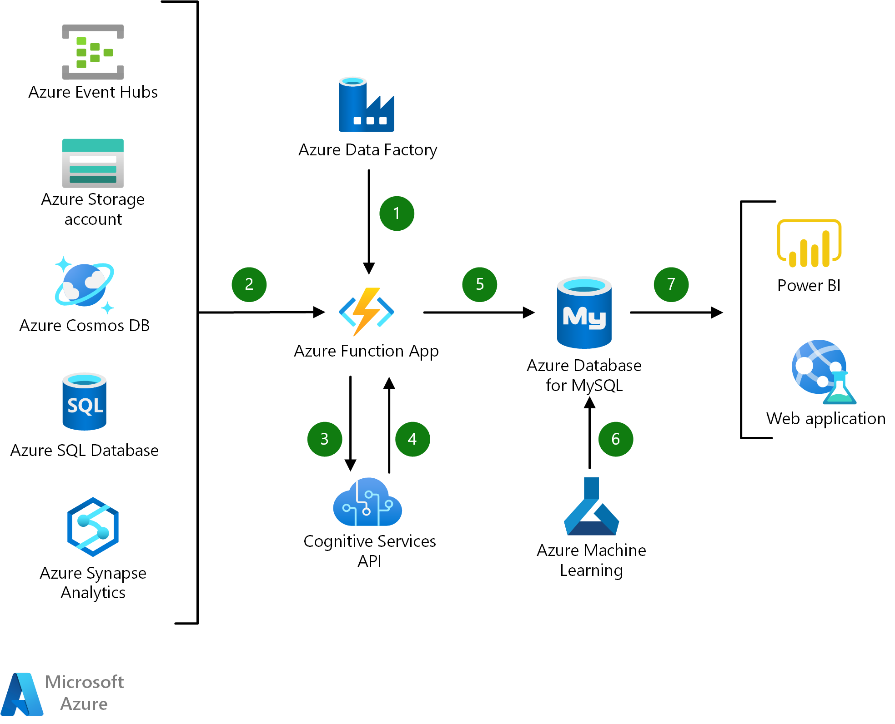

[!INCLUDE [header_file](../../../includes/sol-idea-header.md)]

This article presents a solution for automating the process of using AI to analyze data from various sources. Core components in the automation are Azure Functions, Azure Cognitive Services, and Azure Database for MySQL. By integrating visualization tools, the solution presents results to users.

## Architecture

*Download a [Visio file](https://arch-center.azureedge.net/intelligent-apps-using-azure-database-for-mysql.vsdx) of this architecture.*

### Dataflow

1. A function that's hosted by Functions is triggered as part of an Azure Data Factory pipeline. A Functions *activity* uses a linked service connection to run the function in the Data Factory pipeline.
1. Data comes from various sources, such as Azure Blob Storage and Azure Event Hubs. Data is uploaded to Blob Storage, while Event Hubs ingests a high volume of data. When the system receives new data, the function in the pipeline is triggered.
1. The function calls the Cognitive Services API to analyze the data. For example, for sentiment analysis, the function uses an Azure Cognitive Service for Language text analytics API.
1. The results of the analysis are returned in JSON format from the Cognitive Services API.
1. The function stores the data and results from the Cognitive Services API in Azure Database for MySQL.
1. Azure Machine Learning studio is used to further analyze the data. Custom machine learning algorithms provide other insights into the data.
1. The MySQL database connector for Power BI provides options for data visualization and analysis in Power BI or a custom web application.

### Components

- [Data Factory](https://azure.microsoft.com/products/data-factory)
- [Functions](https://azure.microsoft.com/products/functions)
- [Event Hubs](https://azure.microsoft.com/products/event-hubs)
- [Blob Storage](https://azure.microsoft.com/products/storage/blobs)
- [Cognitive Services](https://azure.microsoft.com/products/cognitive-services)
- [Cognitive Service for Language](https://azure.microsoft.com/products/cognitive-services/language-service/)
- [Azure Database for MySQL](https://azure.microsoft.com/products/mysql)
- [Machine Learning studio](https://azure.microsoft.com/products/machine-learning/#faq)
- [Power BI](https://powerbi.microsoft.com)

### Alternatives

- This solution uses Functions to process data as it's received. If a large amount of data already exists in the data source, consider forms of batch processing.
- [Azure Stream Analytics](/azure/stream-analytics/stream-analytics-introduction) provides event processing for high volumes of fast-streaming data that arrives simultaneously from multiple sources. Stream Analytics also supports integration with Power BI.
- To compare this solution with alternatives, see the following resources:
  - [Choose a batch processing technology in Azure](../../data-guide/technology-choices/batch-processing.md)
  - [Choose an analytical data store in Azure](../../data-guide/technology-choices/analytical-data-stores.md)
  - [Choose a data analytics technology in Azure](../../data-guide/technology-choices/analysis-visualizations-reporting.md)

## Scenario details

The automated pipelines in this solution use state-of-the-art machine learning algorithms to analyze data from disparate sources. The analysis uses:

- AI capabilities that Cognitive Services offers, such as question answering, sentiment analysis, and text translation.
- Services that Machine Learning studio offers for managing predictive analytics.

The solution also automates the delivery of results from the analysis. A connector links Azure Database for MySQL, where the solution stores results, with visualization tools like Power BI. These tools display insights from the data in meaningful ways.

For automation, this architecture uses Functions. This serverless solution offers many benefits:

- Infrastructure maintenance. As an Azure managed service, Functions provides the cloud environment and resources that keep the apps running. Instead of managing infrastructure requirements, developers can focus on innovative work that delivers value to the business.
- Scalability. Functions provides compute resources on demand, so function instances scale as needed. As requests fall, resources and application instances drop off automatically.

### Potential use cases

This solution is ideal for organizations that run predictive analytics on data from various sources. Examples include organizations in the following industries:

- Finance
- Education
- Telecommunications

## Considerations

- For most features, the Cognitive Service for Language API has a maximum size of 5120 characters for a single document. For all features, the maximum request size is 1 MB. For data and rate limits, see [Service limits for Azure Cognitive Service for Language](/azure/cognitive-services/language-service/concepts/data-limits#maximum-characters-per-document).

- Previous versions of this solution used the Cognitive Services Text Analytics API. Azure Cognitive Service for Language now unifies three individual language services in Cognitive Services: Text Analytics, QnA Maker, and Language Understanding (LUIS). You can easily migrate from the Text Analytics API to the Cognitive Service for Language API. For instructions, see [Migrate to the latest version of Azure Cognitive Service for Language](/azure/cognitive-services/language-service/concepts/migrate-language-service-latest).

## Contributors

*This article is maintained by Microsoft. It was originally written by the following contributor.*

Principal author:

- [Matt Cowen](https://www.linkedin.com/in/matthew-cowen-4815235) | Senior Cloud Solution Architect

*To see non-public LinkedIn profiles, sign in to LinkedIn.*

## Next steps

- [Functions](/azure/azure-functions/functions-overview)
- [Azure Function activity in Azure Data Factory](/azure/data-factory/control-flow-azure-function-activity)
- [Data Factory](/azure/data-factory/control-flow-azure-function-activity)
- [Event Hubs](/azure/event-hubs)
- [Blob Storage](/azure/storage/blobs/storage-blobs-introduction)
- [Cognitive Services](/azure/cognitive-services/what-are-cognitive-services)
- [Azure Cognitive Service for Language](/azure/cognitive-services/language-service/overview)
- [Azure Database for MySQL](/azure/mysql)
- [Machine Learning studio](/azure/machine-learning)
- [Power BI](/power-bi/fundamentals/power-bi-overview)

## Related resources

- [Understand data store models](../../guide/technology-choices/data-store-overview.md)

The following solution ideas feature Azure Database for MySQL:

- [Gaming using Azure Database for MySQL](./gaming-using-azure-database-for-mysql.yml)
- [Retail and e-commerce using Azure Database for MySQL](./retail-and-ecommerce-using-azure-database-for-mysql.yml)
- [Finance management apps using Azure Database for MySQL](./finance-management-apps-using-azure-database-for-mysql.yml)
- [Scalable web and mobile applications using Azure Database for MySQL](./scalable-web-and-mobile-applications-using-azure-database-for-mysql.yml)
