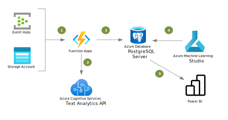

[!INCLUDE [header_file](../../../includes/sol-idea-header.md)]

This article presents a solution for automating data analysis and visualization using artificial intelligence (AI). Core components in the solution are Azure Functions, Azure Cognitive Services, and Azure Database for PostgreSQL.

## Architecture

*Download a [Visio file](https://arch-center.azureedge.net/intelligent-apps-azure-database-for-postgresql.vsdx) of this architecture.*

### Dataflow

1. An Azure Function activity allows you to trigger an Azure Functions App in the Azure Data Factory pipeline. You create a linked service connection and use the linked service with an activity to specify the Azure Function you want to execute.
1. Data comes from multiple sources including Azure Storage and Azure Event Hubs for high-volume data. When the pipeline receives new data, it triggers the Azure Functions App.
1. The Azure Functions App calls the Cognitive Services API to analyze the data.
1. The Cognitive Services API returns the results of the analysis in JSON format to the Azure Functions App.
1. The Azure Functions App stores the data and results from the Cognitive Services API in Azure Database for PostgreSQL.
1. Azure Machine Learning uses custom machine learning algorithms to provide further insights into the data.
   - If you're approaching the machine learning step with a no-code perspective, you can implement further text analytics operations on the data, like feature hashing, Word2Vector, and n-gram extraction.
   - If you prefer a code-first approach, you can run an open-source natural language processing (NLP) model as an experiment in Machine Learning studio.
1. The PostgreSQL connector for Power BI makes it possible to explore human-interpretable insights in Power BI or a custom web application.

### Components

- [Azure App Service](https://azure.microsoft.com/services/app-service) provides a fully managed platform for quickly building, deploying, and scaling web apps and APIs.
- [Functions](https://azure.microsoft.com/services/functions) is an event-driven serverless compute platform. For information about how to use an activity to run a function as part of a Data Factory pipeline, see [Azure Function activity in Azure Data Factory](/azure/data-factory/control-flow-azure-function-activity).
- [Event Hubs](https://azure.microsoft.com/services/event-hubs) is a fully managed big data streaming platform.
- [Cognitive Services](https://azure.microsoft.com/services/cognitive-services) provides a suite of AI services and APIs that you can use to build cognitive intelligence into apps.
- [Azure Database for PostgreSQL](https://azure.microsoft.com/services/postgresql) is a fully managed relational database service. It provides [high availability](https://azure.microsoft.com/support/legal/sla/postgresql/v1_1), elastic scaling, patching, and other management capabilities for PostgreSQL.
- [Azure Machine Learning](https://azure.microsoft.com/products/machine-learning/#faq) is a cloud service that you can use to train, deploy, and automate machine learning models. The studio supports code-first and no-code approaches.
- [Power BI](https://powerbi.microsoft.com) is a collection of software services and apps that display analytics information and help you derive insights from data.

## Scenario details

The automated pipeline uses the following services to analyze the data:

- Cognitive Services uses AI for question answering, sentiment analysis, and text translation.
- Azure Machine Learning supplies machine-learning tools for predictive analytics.

To store data and results, the solution uses Azure Database for PostgreSQL. The PostgreSQL database supports unstructured data, parallel queries, and declarative partitioning. This support makes Azure Database for PostgreSQL an effective choice for highly data-intensive AI and machine learning tasks.

The solution automates the delivery of the data analysis. A connector links Azure Database for MySQL with visualization tools like Power BI.

The architecture uses an Azure Functions App to ingest data from multiple data sources. It's a serverless solution that offers the following benefits:

- **Infrastructure maintenance**: Azure Functions is a managed service that allows developers to focus on innovative work that delivers value to the business.
- **Scalability**: Azure Functions provides compute resources on demand, so function instances scale as needed. As requests fall, resources and application instances drop off automatically.

### Potential use cases

Azure Database for PostgreSQL is a cloud-based solution. As a result, this solution isn't recommended for mobile applications. It's more appropriate for downstream analysis in the following industries and others:

- Transportation: Maintenance prediction
- Finance: Risk assessment and fraud detection
- E-commerce: Customer churn prediction and recommendation engines
- Telecommunications: Performance optimization
- Utilities: Outage prevention

## Considerations

These considerations implement the pillars of the Azure Well-Architected Framework, which is a set of guiding tenets that can be used to improve the quality of a workload. For more information, see [Microsoft Azure Well-Architected Framework](/azure/architecture/framework).

- For most features, the Cognitive Service for Language API has a maximum size of 5120 characters for a single document. For all features, the maximum request size is 1 MB. For more information about data and rate limits, see [Service limits for Azure Cognitive Service for Language](/azure/cognitive-services/language-service/concepts/data-limits#maximum-characters-per-document).

- In Azure Database for PostgreSQL, your ingress volume and velocity determine your selection of service and deployment mode. Two services are available:
  - Azure Database for PostgreSQL
  - Azure Cosmos DB for PostgreSQL, which was formerly known as Hyperscale (Citus) mode

  If you mine large workloads of customer opinions and reviews, use Azure Cosmos DB for PostgreSQL. Within Azure Database for PostgreSQL, two modes are available: single server and flexible server. To understand when to use each deployment mode, see [What is Azure Database for PostgreSQL?](/training/modules/intro-to-postgres/2-what-is-azure-database-postgresql).

- Previous versions of this solution used the Cognitive Services Text Analytics API. Azure Cognitive Service for Language now unifies three individual language services in Cognitive Services: Text Analytics, QnA Maker, and Language Understanding (LUIS). You can easily migrate from the Text Analytics API to the Cognitive Service for Language API. For instructions, see [Migrate to the latest version of Azure Cognitive Service for Language](/azure/cognitive-services/language-service/concepts/migrate-language-service-latest).

### Security

Security provides assurances against deliberate attacks and the abuse of your valuable data and systems. For more information, see [Overview of the security pillar](/azure/architecture/framework/security/overview).

All data in Azure Database for PostgreSQL is automatically [encrypted](/azure/postgresql/concepts-data-encryption-postgresql) and backed up. You can configure Microsoft Defender for Cloud for further mitigation of threats. For more information, see [Enable Microsoft Defender for open-source relational databases and respond to alerts](/azure/defender-for-cloud/defender-for-databases-usage).

### DevOps

You can configure GitHub Actions to connect to Azure Database for PostgreSQL database by using its connection string and setting up a workflow. For more information, see [Quickstart: Use GitHub Actions to connect to Azure PostgreSQL](/azure/postgresql/how-to-deploy-github-action).

You can also automate your machine learning lifecycle by using [Azure Pipelines](/azure/devops/pipelines/targets/azure-machine-learning). For information about how to implement an MLOps workflow and build a CI/CD pipeline for your project, see the GitHub repo [MLOps with Azure ML](https://github.com/Microsoft/MLOpsPython).

### Cost optimization

Cost optimization is about looking at ways to reduce unnecessary expenses and improve operational efficiencies. For more information, see [Overview of the cost optimization pillar](/azure/architecture/framework/cost/overview).

Cognitive Service for Language offers various pricing tiers. The number of text records that you process affects your cost. For more information, see [Cognitive Service for Language pricing](https://azure.microsoft.com/pricing/details/cognitive-services/language-service).

## Next steps

- [Azure Functions overview](/azure/azure-functions/functions-overview)
- [Azure Function activity in Azure Data Factory](/azure/data-factory/control-flow-azure-function-activity)
- [Azure Event Hubs—A big data streaming platform and event ingestion service](/azure/event-hubs/event-hubs-about)
- [What is Azure Cognitive Services?](/azure/cognitive-services/what-are-cognitive-services)
- [What is Azure Cognitive Service for Language?](/azure/cognitive-services/language-service/overview)
- [How to use Language service features asynchronously](/azure/cognitive-services/language-service/concepts/use-asynchronously)
- [Azure Cognitive Services for Language API testing console](https://westus.dev.cognitive.microsoft.com/docs/services/Language-2022-05-01/operations/ConversationAnalysis_AnalyzeConversations)
- [Use DirectQuery to link PostgreSQL to Power BI](/power-bi/connect-data/desktop-directquery-about)
- [Create an Azure Cosmos DB for PostgreSQL cluster in the Azure portal](/azure/cosmos-db/postgresql/quickstart-create-portal?tabs=direct)
- [Tutorial: Consume Azure Machine Learning models in Power BI](/power-bi/connect-data/service-aml-integrate)
- [Extract insights from text with the Language service](/training/modules/extract-insights-text-with-text-analytics-service)
- [Microsoft Certified: Azure AI Engineer Associate](/certifications/azure-ai-engineer)

## Related resources

- [Intelligent apps using Azure Database for MySQL](./intelligent-apps-using-azure-database-for-mysql.yml)
- [Retail and e-commerce using Azure Database for PostgreSQL](./retail-and-ecommerce-using-azure-database-for-postgresql.yml)
