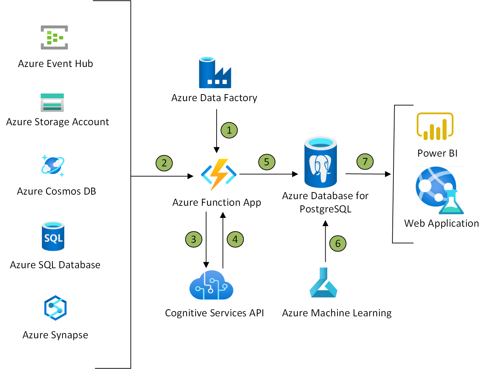

[!INCLUDE [header_file](../../../includes/sol-idea-header.md)]

Develop sophisticated, transformational apps using state-of-the-art machine learning algorithms and integrated visualization tools to get actionable insights and analytics.

In this example of an intelligent app, PostgreSQL is the heart of the architecture as the main database for a common AIML use case of social media text analysis. PostgreSQL's support for unstructured data, ability to execute parallel queries and declarative partitioning makes it an effective database choice for a highly data-intensive AIML task. Since PostgreSQL is a cloud-based solution, this architecture isn't recommended for a mobile application, and is more appropriate for downstream analysis.

## Architecture

*Download an [PNG](../media/intelligent-apps-using-azure-database-for-postgresql.png) of this architecture.*

### Data flow

1. Azure function app could be triggered as a part of Azure data factory pipeline by creating an Azure Function Activity.
2. Data could come from various sources, such as Event Hubs for high volumes of data ingestion, or data that's uploaded to Blob Storage. The Azure Function App is triggered as new data is received as part of the pipeline.
3. The Azure Function App calls the Azure Cognitive Services API to analyze the data (for example, for Sentiment Analysis).
4. The results of the analysis are returned in JSON format from Cognitive Services API(Text Analytics in this example)
5. The Azure Function App stores the data and results from Cognitive Services API(Text Analytics in this example) in Azure Database for PostgreSQL.
6. Azure Machine Learning Studio can be used to further analyze the data, using custom Machine Learning algorithms to gain further insights
    * If you're approaching the machine learning component of this architecture with a no-code perspective, you can implement further text analytics operations on the data, like feature hashing, Word2Vector and n-gram extraction. Instead, you can use your favorite open-source NLP model if you prefer a code-first approach and run your model as an Experiment in Azure Machine Learning.
    * Results from this further ML analysis are saved back to PostgreSQL
7. Finally, human-interpretable insights can be explored in Power BI through the PostgreSQL connector or a custom web application.

### Components
* [Azure Data Factory](https://docs.microsoft.com/en-us/azure/data-factory/control-flow-azure-function-activity)
* [Azure App Services](https://azure.microsoft.com/services/app-service/): A fully managed platform for quickly building, deploying, and scaling web apps and APIs.
* [Azure Functions](/azure/azure-functions/functions-overview)
* [Event Hubs](/azure/event-hubs/)
* [Azure Cognitive Services](https://azure.microsoft.com/services/cognitive-services/): Build intelligent application with a suite of AI services and APIs.
* [Azure Database for PostgreSQL](https://azure.microsoft.com/services/postgresql/): With high availability up to 99.99% SLA and agile scalability, Azure Database for PostgreSQL allows you to focus on innovation.
* [Azure Machine Learning Studio](/azure/machine-learning/overview-what-is-machine-learning-studio): Train, deploy, and automate ML models in this web portal, covering both code-first and no-code perspectives.
* [Power BI](https://powerbi.microsoft.com/): Create beautiful visualizations and discover hidden insights in your data with Power BI.

## Considerations

Azure Cognitive Services Text Analytics API has a maximum size of 5120 characters for a single document and a maximum request size of 1 MB. [View the data and rate limits](/azure/cognitive-services/text-analytics/concepts/data-limits).

Depending on the volume and velocity of data being ingressed, you can select one of three deployment modes: single server, flexible, and Hyperscale (Citus). Assuming that you would be mining large workloads of customer opinions and reviews, Hyperscale is a recommended solution. Explore the [When to use Azure Database for PostgreSQL Learn Module](/learn/modules/intro-to-postgres/5-when-to-use-azure-database-postgres) to understand when to use each deployment mode.

### Security

All data in PostgreSQL is automatically [encrypted](/azure/postgresql/concepts-data-encryption-postgresql) and backed up. You can configure Azure Advanced Threat Protection for further mitigation of threats. Read more at [Advanced Threat Protection in Azure Database for PostgreSQL](/azure/postgresql/concepts-data-access-and-security-threat-protection).

### DevOps

You can configure GitHub Actions to connect to your Azure PostgreSQL database by using its connection string and setting up a workflow. For further information on how to do so, see [Quickstart: Use GitHub Actions to connect to Azure PostgreSQL](/azure/postgresql/how-to-deploy-github-action).

Additionally, you can automate your Azure Machine Learning lifecycle by using [Azure Pipelines](/azure/devops/pipelines/targets/azure-machine-learning). The [MLOps with Azure ML GitHub repo](https://github.com/Microsoft/MLOpsPython) demonstrates how to operationalize an MLOps workflow and build out a CI/CD pipeline for your project.

## Pricing

Azure Cognitive Services Text Analytics API pricing is determined by the instance selected and the number of transactions per month. For further details, explore the [pricing calculator for Text Analytics here](https://azure.microsoft.com/pricing/details/cognitive-services/text-analytics/).

## Next steps

* Call the [Text Analytics REST API using Postman](/azure/cognitive-services/text-analytics/how-tos/text-analytics-how-to-call-api) synchronously and asynchronously
* [Explore and test the Text Analytics API v3.0](https://westus.dev.cognitive.microsoft.com/docs/services/TextAnalytics-v3-0/operations/Languages)
* [Use DirectQuery to link PostgreSQL to Power BI](/power-bi/connect-data/desktop-directquery-about)
* How to create an [Azure Database for PostgreSQL Hyperscale](/azure/postgresql/tutorial-hyperscale-server-group)
* How to link your [Azure Machine Learning Models in Power BI](/power-bi/connect-data/service-aml-integrate)

## Related resources

* Follow along with this Learn Module and apply the [Text Analytics API](/learn/modules/classify-user-feedback-with-the-text-analytics-api/)
* Expand your Azure Cognitive Services knowledge and [become a Microsoft Certified Azure AI Engineer](/learn/certifications/azure-ai-engineer/)
