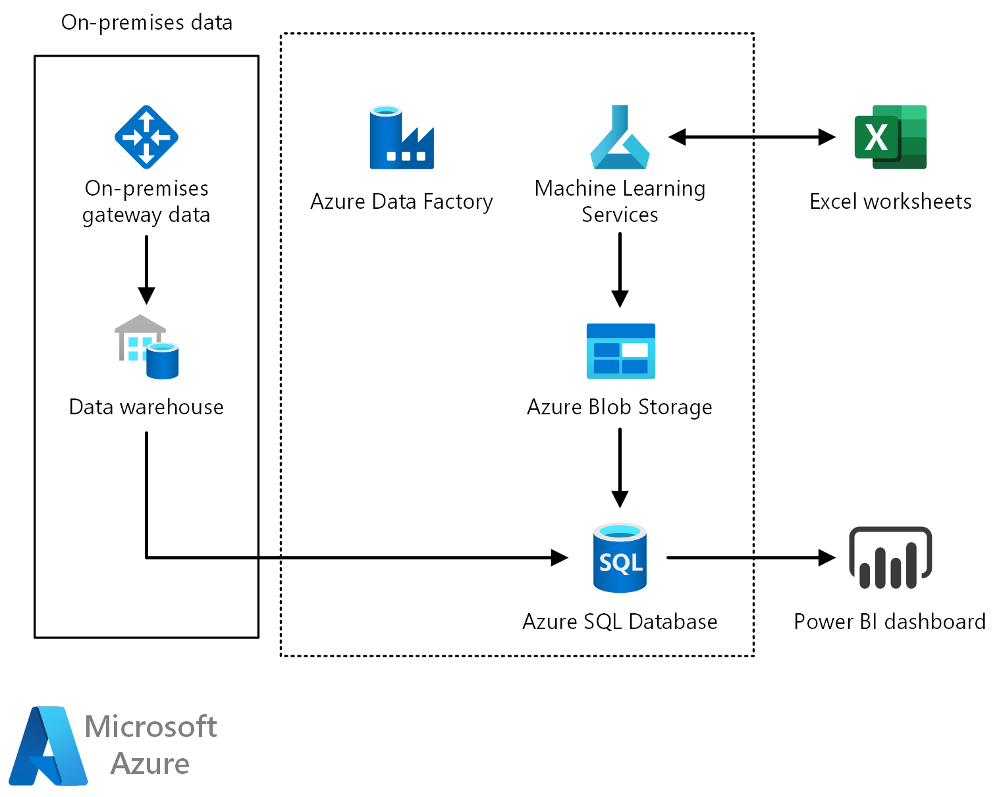

<!-- cSpell:ignore xlink -->

[!INCLUDE [header_file](../../../includes/sol-idea-header.md)]

The Price Analytics solution uses your transactional history data to show you how the demand for your products responds to the prices you offer, to recommend pricing changes, and allow you to simulate how changes in price would affect your demand, at a fine granularity.

The solution provides a dashboard, where you can see optimal pricing recommendations, item elasticities at a item-site-channel-segment level, estimates of related-product effects such "as cannibalization", forecasts given current process, and model performance metrics.

Direct interaction with the pricing model in Excel lets you simply paste your sales data there and analyze your prices without the need to integrate the data into the solution database first, simulate promotions and plot demand curves (showing demand response to price), and access dashboard data in numerical form.

The rich functionality is not confined to Excel. It is driven by web services that you, or your implementation partner, can call directly from your business applications, integrating price analysis into your business applications.

## Architecture

*Download an [SVG](../media/interactive-price-analytics.svg) of this architecture.*

## Description

At the core of a rigorous price analysis workflow is price elasticity modeling and optimal pricing recommendations. The state-of-the-art modeling approach mitigates the two worst pitfalls of modeling price sensitivity from historical data: confounding and data sparsity.

Confounding is the presence of factors other than price which affect demand. We use a "double-ML" approach that subtracts out the predictable components of price and demand variation before estimating the elasticity, immunizing the estimates to most forms of confounding. The solution can also be customized by an implementation partner to use your data capturing potential external demand drivers other than price. Our [blog post](/archive/blogs/intel/building-a-pricing-engine-using-azureml-and-python) gives additional detail on the data science of prices.

Data sparsity occurs because the optimal price varies at a fine grain: businesses can set prices by item, site, sales channel and even customer segment, but pricing solutions often only give estimates at product category level because the transaction history may only contain a few sales for each specific situation. Our pricing solution uses "hierarchical regularization" to produce consistent estimates in such data-poor situations: in absence of evidence, the model borrows information from other items in the same category, same items in other sites, and so on. As the amount of historical data on a given item-site-channel combination increases, its elasticity estimate will be fine-tuned more specifically.

This solution analyzes your historical prices and

* shows you in one glance at the dashboard how elastic your product demand is
* provides pricing recommendations for every product in your item catalog
* discovers related products (substitutes and complements)
* lets you simulate promotional scenarios in Excel.

## Estimated cost

The estimated cost for the solution is approximately $10/day ($300/month)

* $100 for S1 standard ML service plan
* $75 for an S2 SQL database
* $75 for app hosting plan
* $50 in miscellaneous ADF data activities and storage costs

If you are just exploring the solution, you can delete it in a few days or hours. The costs are pro-rated and will cease to be charged when you delete the Azure components.

## Getting started

Deploy the solution with the button on the right. Instructions at the end of the deployment will have important configuration information. Please leave them open.

The solution deploys with the same example data set of orange juice prices that you find behind the Try-It-Now button on the right.

While the solution is deploying, you can get a head start and

* See what is available in the Try-It-Now dashboard
* Peruse the [User Guide](https://github.com/Azure/cortana-intelligence-price-analytics/blob/master/User%20Guide/UserGuide.md) for usage instructions from the perspective of a pricing analyst (MSFT login required)
* Review the [Technical Deployment Guide](https://github.com/Azure/cortana-intelligence-price-analytics/blob/master/Technical%20Deployment%20Guide/TechnicalDeploymentGuide.md) for a technical implementation view (MSFT login required)
* Download the interactive Excel worksheet

After the solution deploys, complete the [first walkthrough](https://github.com/Azure/cortana-intelligence-price-analytics/blob/master/Walkthrough%201%20-%20Promotion%20Simulation/PromoSimulationWalkthrough.md) (MSFT login required).

## Solution Dashboard

The solution dashboard's most actionable part is the Pricing Suggestion tab. It tells you which of your items are underpriced, overpriced, and suggests an optimal price for each item, as well as the predicted impact of adopting the suggestion. The suggestions are prioritized by the largest opportunity to earn incremental gross margin.

Other tabs provide supplemental information illuminating how the system arrived at the suggestions and are discussed in more detail in the [User Guide](https://github.com/Azure/cortana-intelligence-price-analytics/blob/master/User%20Guide/UserGuide.md). (You must be logged into Github with a MSFT Azure account while solution is in private preview.)

## Solution Architecture

The solution uses an Azure SQL server to store your transactional data and the generated model predictions. There are a dozen elasticity modeling core services, which are authored in AzureML using Python core libraries. Azure Data Factory schedules weekly model refreshes. The results display in a PowerBI dashboard. The provided Excel spreadsheet consumes the predictive Web Services.

Please read the [Technical Deployment Guide](https://github.com/Azure/cortana-intelligence-price-analytics/blob/master/Technical%20Deployment%20Guide/TechnicalDeploymentGuide.md) for a more detailed discussion of the architecture, connecting your own data and customization (GitHub login required).
