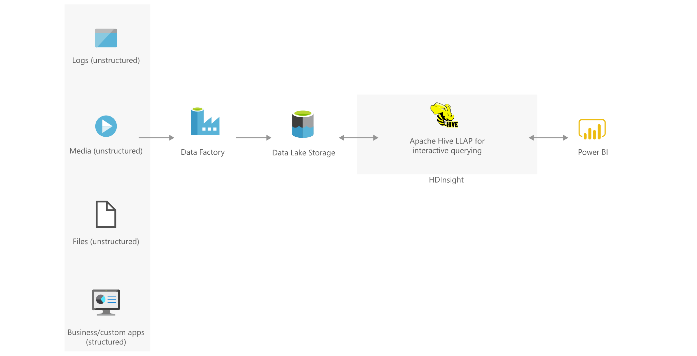

[!INCLUDE [header_file](../../../includes/sol-idea-header.md)]

This article presents a solution for performing fast, interactive, SQL-like queries over a large volume of data. The data comes from disparate sources and includes structured app data but also unstructured logs, files, and media data. Key solution components include Azure HDInsight and Apache Hive low latency analytical processing (LLAP).

*Apache®, [Apache Hive](https://hive.apache.org), and [Apache Hadoop](https://hadoop.apache.org) are either registered trademarks or trademarks of the Apache Software Foundation in the United States and/or other countries. No endorsement by The Apache Software Foundation is implied by the use of these marks.*

## Architecture

*Download an [SVG](../media/interactive-querying-with-hdinsight.svg) of this architecture.*

### Dataflow

1. Azure Data Factory moves data into Azure Data Lake Storage. The data comes from various sources, including Azure and non-Azure sources.
1. Data Lake Storage provides the solution's landing zone. An Apache Hadoop cluster in HDInsight processes the Data Lake Storage data. Data Lake Storage serves as the primary storage account for the cluster.
1. Data Factory and Hive are used to run extract, load, transfer (ELT) procedures on the data. These procedures transform the data as it enters the Hadoop distributed file system (HDFS).
1. External tables that use the HDFS data are created in Hive.
1. Power BI is used to interpret and display the external table data.

### Components

- [Data Factory](https://azure.microsoft.com/products/data-factory) is a hybrid data integration service that provides a way to create, schedule, and orchestrate ELT and extract, transfer, load (ETL) workflows.
- [Data Lake Storage](https://azure.microsoft.com/products/storage/data-lake-storage) holds a large amount of data in its native, raw format. This storage repository, which is built on Azure Blob storage, offers file system semantics and file-level security that's dedicated to big data analytics.
- [HDInsight](https://azure.microsoft.com/products/hdinsight) is a managed, open-source analytics service in the cloud for enterprises. HDInsight makes it easy, fast, and cost-effective to process massive amounts of data. With HDInsight, you can use open-source frameworks such as Hadoop, Apache Spark, Hive, LLAP, and Apache Kafka in your Azure environment.
- [Power BI](https://powerbi.microsoft.com) is a suite of business analytics tools that deliver insights throughout your organization. You can use Power BI to connect to hundreds of data sources, simplify data preparation, and drive ad hoc analysis.

## Scenario details

This solution brings together disparate sources of data that can be structured or unstructured. To integrate the data into a unified platform, this solution uses Data Factory to run ELT pipelines. Data Factory has built-in capabilities for handling a large volume of data.

The pipelines store the data in Data Lake Storage, which is built on Blob Storage. This storage service can handle large volumes of unstructured data.

An HDInsight Hadoop cluster forms a key part of the solution. By using distributed processing, a Hadoop cluster can efficiently process a large volume of data. Hadoop clusters are tuned for batch processing workloads. HDInsight provides a scalable, secure platform for creating optimized Hadoop clusters.

The solution also uses Hive, which provides a way to run fast, interactive queries on the data, so you can gain insights through analytical dashboards and reports. The Hive data warehouse system projects structure on largely unstructured data. The data is then usable from BI tools that expect rows and columns with defined data types. As a result, Hive works well for querying and analyzing large datasets that are stored in Hadoop files. To query the data, you use HiveQL, which is a query language that's similar to SQL. LLAP enhances the performance of the Hive execution engine.

### Potential use cases

Use cases for this solution range from ETL workloads and data warehousing to machine learning and Internet of Things (IoT) scenarios. You can use this architecture in a wide variety of industries:

- Manufacturing
- Retail
- Education
- Nonprofits
- Government
- Healthcare
- Media
- Banking
- Telecommunications
- Insurance
- Finance

## Next steps

- [What is Power BI?](/power-bi/fundamentals/power-bi-overview)
- [What is Azure Data Factory?](/azure/data-factory/introduction)
- [Introduction to Azure Data Lake Storage Gen2](/azure/storage/blobs/data-lake-storage-introduction)
- [What is Azure HDInsight?](/azure/hdinsight/hdinsight-overview)
- [What is Apache Hive and HiveQL on Azure HDInsight?](/azure/hdinsight/hadoop/hdinsight-use-hive)
- [Tutorial: Create an end-to-end data pipeline to derive sales insights in Azure HDInsight](/azure/hdinsight/hdinsight-sales-insights-etl)
- [Visualize Apache Hive data with Microsoft Power BI using ODBC in Azure HDInsight](/azure/hdinsight/hadoop/apache-hadoop-connect-hive-power-bi)

## Related resources

- [Extract, transform, and load (ETL) using HDInsight](./extract-transform-and-load-using-hdinsight.yml)
- [Predictive maintenance](./predictive-maintenance.yml)
- [Batch processing](../../data-guide/big-data/batch-processing.yml)
- [Use a demand forecasting model for price optimization](./demand-forecasting-price-optimization-marketing.yml)
