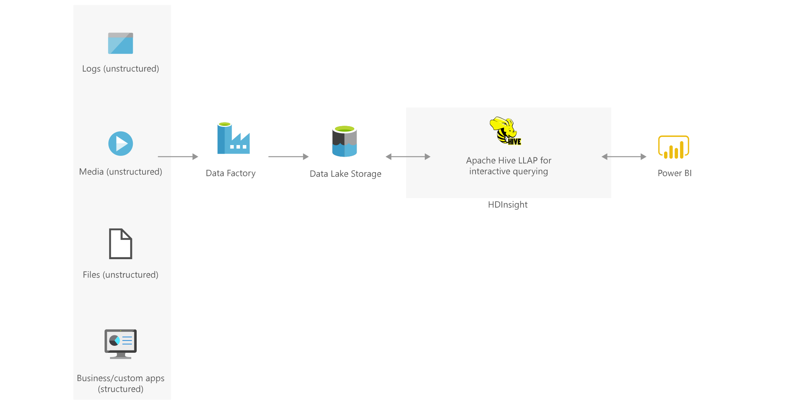

# Interactive querying with HDInsight

[!INCLUDE [header_file](../../../includes/sol-idea-header.md)]

Perform fast, interactive SQL queries at scale over structured or unstructured data with Apache Hive LLAP.

## Architecture

*Download an [SVG](../media/interactive-querying-with-hdinsight.svg) of this architecture.*
