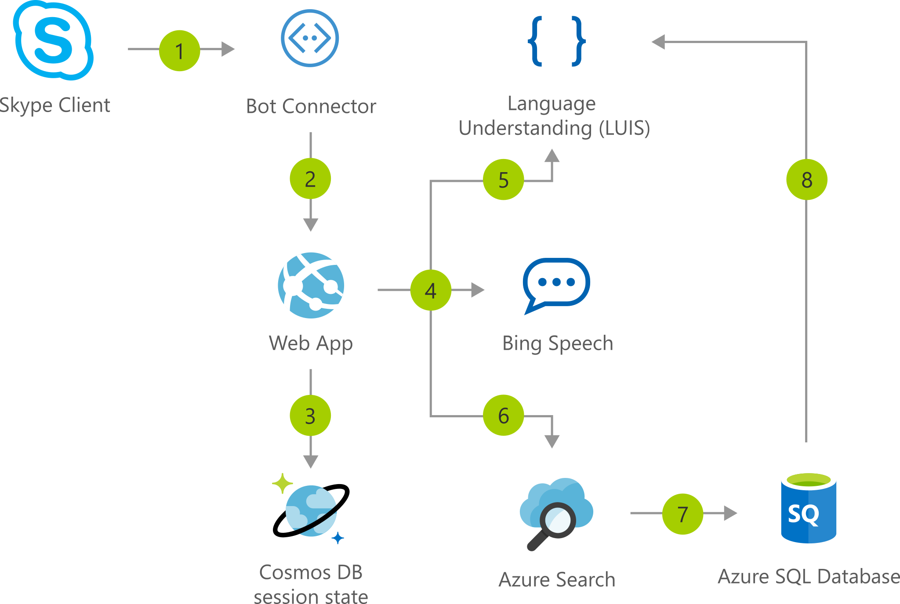

[!INCLUDE [header_file](../../../includes/sol-idea-header.md)]

This solution creates an intelligent interactive voice response (IVR) application that processes customer order requests for bicycles and bicycle accessories. Businesses with no existing IVR solution can easily get started automating requests, or, where existing human-operated systems exist, this solution can be extended to incorporate existing functionality and workflows.

## Architecture

*Download an [SVG](../media/interactive-voice-response-bot.svg) of this architecture.*

## Description

For more details on this solution, including source code and data customization, fork or explore this project on [GitHub](https://github.com/ujjwalmsft/cortana-intelligence-call-center-solution).

Automated customer interaction is essential to a business of any size. In fact, [61%](https://www.talkdesk.com/blog/10-customer-services-statistics-for-call-center-supervisors) of consumers prefer to communicate via speech, and most of them prefer self-service. Because customer satisfaction is a priority for all businesses, self-service is a critical facet of any customer-facing communications strategy.

In an era when mobile phones are dominant and keypads are not always readily accessible, interactive voice response (IVR) systems provide an intuitive, simple, and convenient method for customers to convey their requests. This solution provides an intelligent and natural self-service experience that can be repurposed across all customer channels.

The Azure AI Platform provides advanced analytics tools backed by Microsoft's Azure cloud platforms-data ingestion, data storage, data processing, and advanced analytics components-all of the essential elements for building an automated IVR solution.

This solution deploys a fully integrated service stack that manages speech requests via Skype and the [Microsoft Bot Framework](https://dev.botframework.com).

The target use case of this solution is a fictitious company, Contoso LLC, which sells bicycles and bicycle equipment to its customers. Contoso currently processes new product orders and queries through human operators. This automated solution allows Contoso to seamlessly scale up to handle large call volumes while maintaining zero wait times and freeing up staff to manage other tasks.

## Azure AI and NLP Services

* Speech service (Bing Speech API or Cognitive Services Speech Service) transcribes raw speech data into text form.
* LUIS (Language Understanding Intelligent Service) identifies caller intent (place an order, find an order, etc.) and spoken entities (product categories, dates, times, etc.) from the transcribed text.
* Azure Cognitive Search matches and ranks products from the inventory against the caller's description and applies advanced text analysis for common synonyms.
* Microsoft Bot Framework processes conversation results from the caller and manages the call workflow.

## Supporting Azure Services

* Azure Web App hosts the core logic of the bot as a Node.js web app.
* Cosmos DB stores shared session state for every conversation, allowing the web application to scale out in a stateless architecture.
* Azure SQL stores product inventory and order status.

## Components

* [Azure Bot Service](https://azure.microsoft.com/services/bot-services/)
* [Azure Cognitive Search](/azure/search/)
* [Azure Cognitive Speech Services](https://azure.microsoft.com/services/cognitive-services/speech-services/) (for Bing Speech)
* [Azure Cognitive Services Language Understanding](https://azure.microsoft.com/services/cognitive-services/language-understanding-intelligent-service/) (LUIS)
* [Azure Cosmos DB](/azure/cosmos-db/)
* [Azure SQL Database](https://azure.microsoft.com/services/sql-database/)
* [Azure Web App Service](https://azure.microsoft.com/services/app-service/web/)

## Next steps

* [Artificial intelligence (AI) - Architectural overview](../../data-guide/big-data/ai-overview.md)
* [Build an enterprise-grade conversational bot](../../reference-architectures/ai/conversational-bot.yml)
* [Speech-to-text conversion](../../reference-architectures/ai/speech-ai-ingestion.yml)
* [Speech Services](./speech-services.yml)
* [Migrate from Bing Speech to the Speech Service](/azure/cognitive-services/speech-service/how-to-migrate-from-bing-speech)
* [Microsoft Learn module: How to build a basic chatbot](/learn/modules/how-build-basic-chatbot/)
* [Microsoft Learn module: Transcribe speech input to text](/learn/modules/transcribe-speech-input-text/)
