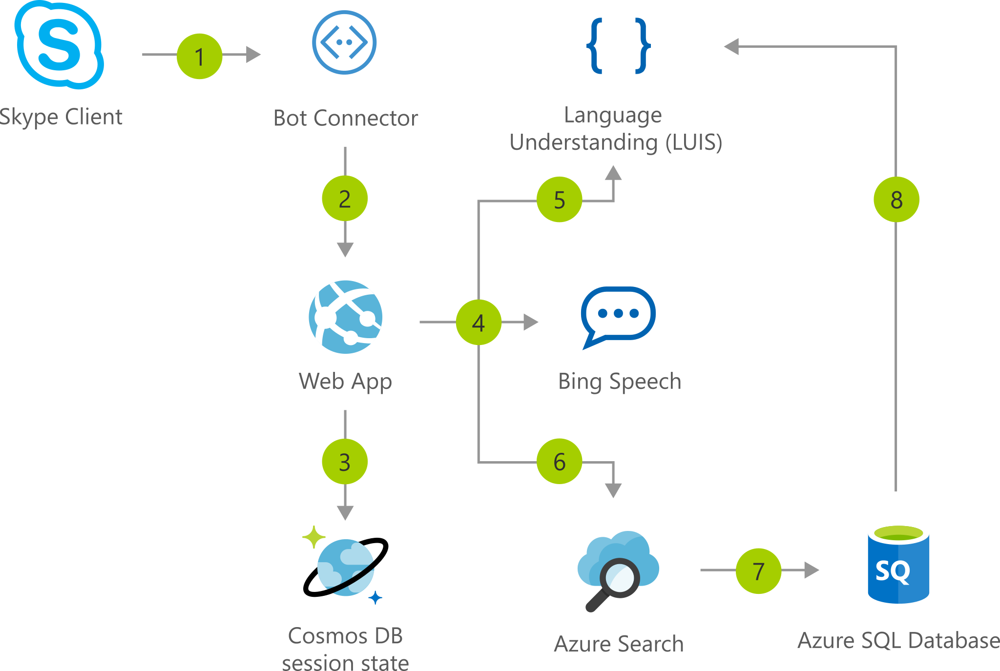

[!INCLUDE [header_file](../../../includes/sol-idea-header.md)]

This solution idea shows how to architect an interactive voice response (IVR) application with a bot and custom machine-learning intelligence.

## Potential use cases

This particular IVR app processes customer order requests for bicycles and bicycle accessories. However, this IVR architecture can be applied to a wide range of scenarios. Businesses with no existing IVR solution can easily get started automating requests. Or, businesses with human-operated systems can use this solution to extend their existing functionality and workflows.

This solution is optimized for the retail industry.

## Architecture

*Download an [SVG file](../media/interactive-voice-response-app-bot.svg) of this architecture.*

### Workflow

#### Core Azure services

* Speech service (Bing Speech API or Cognitive Services Speech Service) transcribes raw speech data into text form.
* Language Understanding (LUIS) identifies caller intent and spoken entities from the transcribed text. Examples of intents include place an order, find an order, and so on. Examples of entities include product categories, dates, times, and so on.
* Azure Cognitive Search matches and ranks products from the inventory against the caller's description. Common synonyms are identified with advanced text analysis.
* Microsoft Bot Framework processes conversation results from the caller and manages the call workflow.

#### Supporting Azure services

* Azure Web App hosts the core logic of the bot as a Node.js web app.
* Cosmos DB stores shared session state for every conversation, allowing the web application to scale out in a stateless architecture.
* Azure SQL stores product inventory and order status.

### Components

* [Azure Bot Service](https://azure.microsoft.com/services/bot-services/)
* [Azure Cognitive Search](/azure/search/)
* [Azure Cognitive Speech Services](https://azure.microsoft.com/services/cognitive-services/speech-services/) (for Bing Speech)
* [Azure Cognitive Services Language Understanding](https://azure.microsoft.com/services/cognitive-services/language-understanding-intelligent-service/) (LUIS)
* [Azure Cosmos DB](/azure/cosmos-db/)
* [Azure SQL Database](https://azure.microsoft.com/services/sql-database/)
* [Azure Web App Service](https://azure.microsoft.com/services/app-service/web/)

## Description of the IVR app

For more details on this solution, including source code and data customization, fork or explore the [Call-Center Solution project](https://github.com/ujjwalmsft/cortana-intelligence-call-center-solution) on GitHub.

Automated customer interaction is essential to a business of any size. In fact, [61%](https://www.talkdesk.com/blog/10-customer-services-statistics-for-call-center-supervisors) of consumers prefer to communicate via speech, and most of them prefer self-service. Because customer satisfaction is a priority for all businesses, self-service is a critical facet of any customer-facing communications strategy.

Today, mobile phones are dominant and keypads aren't always within reach. As such, interactive voice response (IVR) systems are an intuitive and convenient way for customers to convey their requests. This solution idea provides an intelligent and natural self-service experience that can be repurposed across all customer channels.

The Azure AI Platform is backed by Microsoft Azure cloud platform and provides all of the essential elements for building an automated IVR solution. There are tools for data ingestion, data storage, data processing, and advanced analytics components.

This solution deploys a fully integrated service stack that manages speech requests via Skype and the [Microsoft Bot Framework](https://dev.botframework.com).

The target use case of this solution is a fictitious company, Contoso LLC, which sells bicycles and bicycle equipment to its customers. Contoso currently processes new product orders and queries through human operators. This automated solution allows Contoso to seamlessly scale up to handle large call volumes while maintaining zero wait times and freeing up staff to manage other tasks.

## Deploy this scenario

For more details on this solution, including source code and data customization, fork or explore the [Call-Center Solution project](https://github.com/ujjwalmsft/cortana-intelligence-call-center-solution) on GitHub.

## Next steps

Bing Speech and Cognitive Speech services:

* [What is the Speech service?](/azure/cognitive-services/speech-service/overview)
* [Migrate from Bing Speech to the Speech Service](/azure/cognitive-services/speech-service/how-to-migrate-from-bing-speech)

Microsoft Learn modules:

* [How to build a basic chatbot](/learn/modules/how-build-basic-chatbot/)
* [Transcribe speech input to text](/learn/modules/transcribe-speech-input-text/)
* [Add conversational intelligence to your apps by using Language Understanding Intelligent Service (LUIS)](/learn/modules/create-and-publish-a-luis-model/)

## Related resources

Azure Architecture Center articles:

* [Artificial intelligence (AI) - Architectural overview](../../data-guide/big-data/ai-overview.md)
* [Speech Services](./speech-services.yml)
* [Speech-to-text conversion](../../reference-architectures/ai/speech-to-text-transcription-pipeline.yml)
* [Build an enterprise-grade conversational bot](../../reference-architectures/ai/conversational-bot.yml)
* [Commerce chatbot for customer service](./commerce-chatbot.yml)
