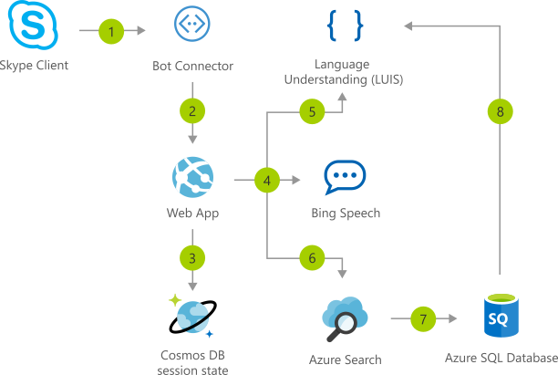

[!INCLUDE [header_file](../../../includes/sol-idea-header.md)]

This solution idea shows how to architect an interactive voice response (IVR) application with a bot and custom machine-learning intelligence.

## Architecture

*Download a [Visio file](https://arch-center.azureedge.net/interactive-voice-response-app-bot.vsdx) of this architecture.*

### Dataflow

#### Core Azure services

- Speech service (Bing Speech API or Azure Cognitive Services Speech service) transcribes raw speech data into text form.
- Language understanding (LUIS) identifies caller intent and spoken entities from the transcribed text. Examples of intents include placing an order, finding an order, and so on. Examples of entities include product categories, dates, times, and so on.
- Azure Cognitive Search matches and ranks products from the inventory against the caller's description. Common synonyms are identified with advanced text analysis.
- Microsoft Bot Framework processes conversation results from the caller and manages the call workflow.

#### Supporting Azure services

- The Web Apps feature of Azure App Service hosts the core logic of the bot as a Node.js web app.
- Azure Cosmos DB stores shared session state for every conversation, allowing the web application to scale out in a stateless architecture.
- Azure SQL Database stores product inventory and order status.

### Components

- [Azure Bot Service](https://azure.microsoft.com/services/bot-services) provides an integrated environment for designing and building enterprise-grade conversational AI bots.
- [Azure Cognitive Search](https://azure.microsoft.com/services/search) is a cloud search service that supplies infrastructure, APIs, and tools for searching. You can use Azure Cognitive Search to build search experiences over private, heterogeneous content in web, mobile, and enterprise applications.
- [Speech](https://azure.microsoft.com/services/cognitive-services/speech-services) is a managed service that offers speech-to-text, text-to-speech, speech translation, speaker recognition, and other speech capabilities. The Speech service is part of [Cognitive Services](https://azure.microsoft.com/services/cognitive-services).
- [Azure Cognitive Service for Language](https://azure.microsoft.com/services/cognitive-services/language-service) is part of [Cognitive Services](https://azure.microsoft.com/services/cognitive-services) that offers many natural language processing services.
- [Conversational language understanding](https://azure.microsoft.com/services/cognitive-services/language-understanding-intelligent-service) is a feature of Cognitive Service for Language. This cloud-based API service offers machine-learning intelligence capabilities for building conversational apps. You can use language understanding (LUIS) to predict the meaning of a conversation and pull out relevant, detailed information.
- [Azure Cosmos DB](https://azure.microsoft.com/services/cosmos-db) is a globally distributed, multi-model database. With Azure Cosmos DB, your solutions can elastically scale throughput and storage across any number of geographic regions.
- [SQL Database](https://azure.microsoft.com/services/sql-database) is a relational database service that's part of the Azure SQL family. As a fully managed service, SQL Database handles database management functions and provides AI-powered, automated features that optimize performance and durability.
- [Azure App Service](https://azure.microsoft.com/services/app-service) provides a framework for building, deploying, and scaling web apps. The [Web Apps](https://azure.microsoft.com/services/app-service/web) feature is a service for hosting web applications, REST APIs, and mobile back ends.

## Scenario details

This solution idea shows how to architect an IVR application with a bot and custom machine-learning intelligence. 

Automated customer interaction is essential to a business of any size. In fact, [61 percent](https://www.talkdesk.com/blog/10-customer-services-statistics-for-call-center-supervisors) of consumers prefer to communicate via speech, and most of them prefer self-service. Because customer satisfaction is a priority for all businesses, self-service is a critical facet of any customer-facing communications strategy.

Today, mobile phones are dominant and keypads aren't always within reach. As a result, IVR systems are an intuitive and convenient way for customers to convey their requests. This solution idea provides an intelligent and natural self-service experience that can be repurposed across all customer channels.

The Azure AI Platform is backed by Microsoft Azure cloud platform and provides all of the essential elements for building an automated IVR solution. There are tools for data ingestion, data storage, data processing, and advanced analytics components.

This solution deploys a fully integrated service stack that manages speech requests via Skype and the [Microsoft Bot Framework](https://dev.botframework.com).

The target use case of this solution is a fictitious company, Contoso LLC, which sells bicycles and bicycle equipment to its customers. Contoso currently processes new product orders and queries through human operators. This automated solution allows Contoso to seamlessly scale up to handle large call volumes while maintaining zero wait times and freeing up staff to manage other tasks.

### Potential use cases

This particular IVR app processes customer order requests for bicycles and bicycle accessories. However, this IVR architecture can be applied to a wide range of scenarios. Businesses with no existing IVR solution can easily get started automating requests. Or, businesses with human-operated systems can use this solution to extend their existing functionality and workflows.

This solution is optimized for the retail industry.

## Deploy this scenario

For more details on this solution, including source code and data customization, fork or explore the [Call-Center Solution project](https://github.com/ujjwalmsft/cortana-intelligence-call-center-solution) on GitHub.

## Next steps

For information on solution components, see these resources:

- [What is the Speech service?](/azure/cognitive-services/speech-service/overview)
- [Migrate from Bing Speech to the Speech Service](/azure/cognitive-services/speech-service/how-to-migrate-from-bing-speech)
- [What is Azure Cognitive Search?](/azure/search/search-what-is-azure-search)
- [Azure Cosmos DB documentation](/azure/cosmos-db)
- [What is Azure SQL Database?](/azure/azure-sql/database/sql-database-paas-overview)
- [App Service overview](/azure/app-service/overview)

To explore related Microsoft Learn modules, see these resources:

- [How to build a basic chatbot](/training/modules/how-build-basic-chatbot)
- [Transcribe speech input to text](/training/modules/transcribe-speech-input-text)
- [Add conversational intelligence to your apps by using Language Understanding Intelligent Service (LUIS)](/training/modules/create-and-publish-a-luis-model)

## Related resources

- [Artificial intelligence (AI) - Architectural overview](../../data-guide/big-data/ai-overview.md)
- [Speech services](./speech-services.yml)
- [Speech-to-text conversion](/azure/architecture/example-scenario/ai/speech-to-text-transcription-analytics)
- [Build an enterprise-grade conversational bot](../../reference-architectures/ai/conversational-bot.yml)
- [Commerce chatbot for customer service](./commerce-chatbot.yml)
