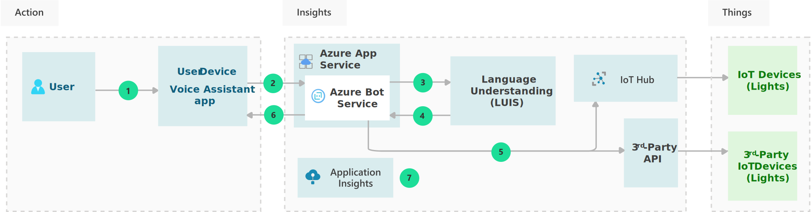

<!-- cSpell:ignore khilscher -->

[!INCLUDE [header_file](../../../includes/sol-idea-header.md)]

This solution idea describes how to create voice conversational interfaces with internet-of-things (IoT) devices. You can combine [Azure Speech Service](/azure/cognitive-services/speech-service/overview), [Language Understanding Service](/azure/cognitive-services/luis) (LUIS), and the [Azure Bot Framework](/azure/bot-service/bot-service-overview) to create natural, human-like interfaces that control IoT devices through Azure IoT Hub.

## Potential use cases

- Control internet-accessible home devices like televisions and refrigerators by voice command.
- Use natural language to control devices in a connected power plant or factory.

## Architecture

### Dataflow

1. Through a voice device, the user asks the voice assistant app to turn on the exterior house lights.
1. The app connects to the [Direct Line Speech](/azure/cognitive-services/speech-service/direct-line-speech) Bot Service channel by using the [Azure Speech SDK](/azure/cognitive-services/speech-service/speech-sdk). When [keyword recognition](/azure/cognitive-services/speech-service/keyword-recognition-overview) confirms certain keywords, Direct Line Speech transcribes the [speech to text](/azure/cognitive-services/speech-service/speech-to-text) and sends the text to the Bot Service app hosted on Azure App Service.
1. The Bot Service connects to the Language Understanding (LUIS) service. LUIS determines the intent of the user's request, *TurnOnLight*, and returns the intent to the Bot Service.
1. Bot Service relays the request to the IoT devices and turns on the exterior lights.

   If the devices are connected to Azure IoT Hub, Bot Service uses the [IoT Hub API](/rest/api/iothub) to send the command to the devices by using [direct methods](/azure/iot-hub/iot-hub-devguide-direct-methods), updating the [device twin's desired property](/azure/iot-hub/iot-hub-csharp-csharp-twin-getstarted), or sending a [cloud to device message](/azure/iot-hub/iot-hub-csharp-csharp-c2d). If the devices are connected to a third-party IoT installation, Bot Service connects to the third-party API to send a command to the devices.

1. The Bot Service returns the results of the command to the user by generating a response.
1. The [text-to-speech](/azure/cognitive-services/speech-service/text-to-speech) service turns the response into audio and passes it back to the voice assistant app with Direct Line Speech.
1. Application Insights gathers runtime telemetry for bot performance and usage development.

### Components

- [Bot Service](https://azure.microsoft.com/services/bot-services) provides an integrated environment for bot development.
- [Speech Service](https://azure.microsoft.com/services/cognitive-services/speech-services) offers industry-leading speech capabilities such as speech-to-text, text-to-speech, speech translation, and speaker recognition.
- [Language Understanding Service (LUIS)](https://azure.microsoft.com/services/cognitive-services/conversational-language-understanding) applies custom machine-learning intelligence to a conversational, natural language text to predict overall meaning, and pull out relevant, detailed information.
- [IoT Hub](https://azure.microsoft.com/services/iot-hub) is a central cloud message hub for bi-directional communications between IoT applications and devices.
- [Application Insights](/azure/azure-monitor/app/app-insights-overview) is a feature of [Azure Monitor](https://azure.microsoft.com/services/monitor) that provides extensible application performance management and monitoring for live web apps. 

## Next steps

- [Voice assistants documentation](/azure/cognitive-services/speech-service/index-voice-assistants)
- [Quickstart: Create a custom keyword](/azure/cognitive-services/speech-service/custom-keyword-basics)
- [Create a bot](/azure/bot-service/abs-quickstart)
- [Tutorial: Voice-enable your bot using the Speech SDK](/azure/cognitive-services/speech-service/tutorial-voice-enable-your-bot-speech-sdk)
- [Add natural language understanding (LUIS) to a bot](/azure/bot-service/bot-builder-howto-v4-luis)
- [Create a LUIS app](/azure/cognitive-services/luis/luis-how-to-start-new-app)
- [Add an intent and train a LUIS app](/azure/cognitive-services/luis/luis-how-to-add-intents)
- [Azure Iot Hub developer guide](/azure/iot-hub/iot-hub-devguide).

## Related resources

- [Build an enterprise-grade conversational bot](../../reference-architectures/ai/conversational-bot.yml)
