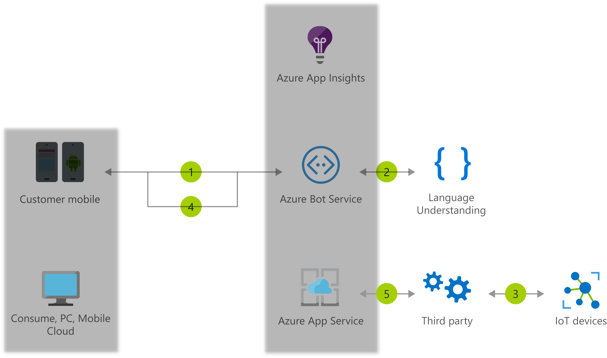

# IoT devices

[!INCLUDE [header_file](../header.md)]

Create seamless conversational interfaces with all of your internet-accessible devices—from your connected television or fridge to devices in a connected power plant. LUIS is able to integrate up to 500 intents to translate commands into smart actions.

## Architecture

*Download an [SVG](../media/iot-devices.svg) of this architecture.*

## Data Flow

1. User logs into Skype and accesses the IoT bot
1. Using voice, the user asks the bot to turn on the lights via the IoT device
1. The request is relayed to a third-party service that has access to the IoT device network
1. The results of the command are returned to the user
1. Application Insights gathers runtime telemetry to help development with bot performance and usage
