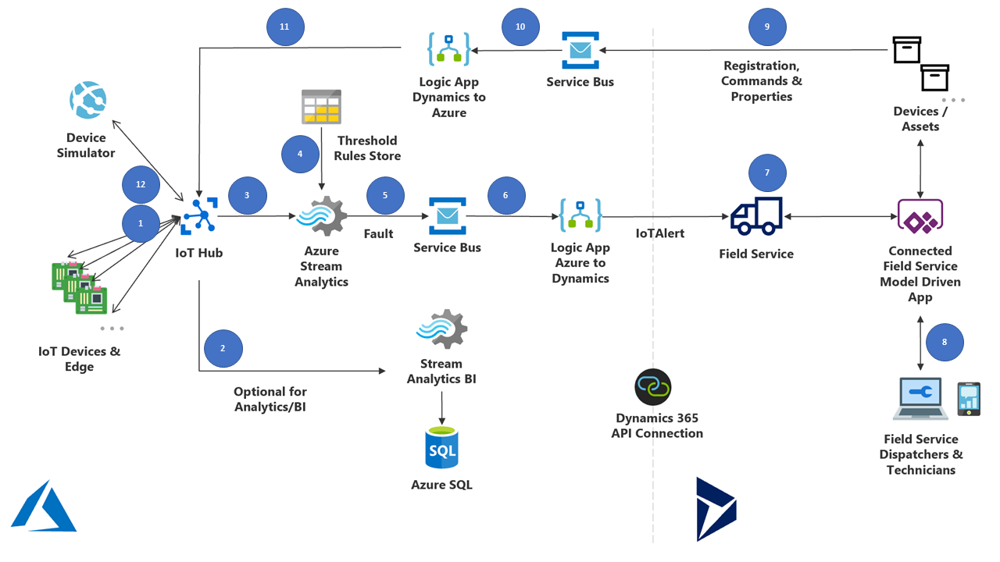

# Connecting IoT devices to Dynamics 365 Field Services

There are different ways to connect an IoT Device to Dynamics 365 Field Service in order to manage devices and its associated service orders.

One of them is the one documented in the [Architecture of Connected Field Service with IoTHub](https://docs.microsoft.com/en-us/dynamics365/field-service/developer/connected-field-service-architecture). Connected Field Service is flexible enough to allow adding services to it. Using it with IoT Hub, as in the documentation will do all the Azure Services deployment and basic configuration. After that it is possible to edit the parameters to allow using it with any IoT Device.

This example scenario demonstrates how it IoT providers can connect their assets do Dynamics 365 using Azure Services, add value by integrating additional services, and provide the required ARM templates to deploy and customize it.

## Architecture

The Connected Field Service architecture is this:



## Data flow

The proposal is to send data generated by **IoT Devices & Edge** to **Field Services** in Dynamics 365.

1. The data from the **IoT Devices** are sent to the **IotHub**
1. **IotHub** will dispatch data to different services. In this architecture it is showing a sample if **IoTHub** sending data to **Stream Analytics** to store in a **SQL Database**
1. In the main path **IoTHub** is sending data to the **Stream Analytics** that will filter the **Message**
1. The filter is done using the rules stored in the **Rules Threshold Storage**
1. If the device **Message** values are over the threshold defined in the **Rules Threshold Storage** the message is forwarded to **Service Bus**
1. From the **Service Bus** the **Message** is forwarded to a **Logic App** that will parse the message and connect to **Field Service** in Dynamics 365
1. A **Case/Work Order** is then created in **Field Service** in Dynamics 365
1. and an e-mail notification is sent to the **Field Service Dispatchers and Technicians**
1. A custom action (like a **Command** to the IoT Device) can also be triggered
1. If a **Command** is triggered then this message is sent via **Service Bus** to a **Logic App**
1. The **Logic App** parses to a format the **IoT Device** is able to handle
1. And send the message the the **IotHub**
1. The **Command** is sent back to the device

## Components

- **IoT Devices & Edge**: Internet-connected sensors on equipment send data to IoTHub typically via WiFi or cellular connectivity. A single piece of equipment can have multiple sensors each taking different measurements such as temperature and pressure. If a building or area has a collection of equipment each with multiple sensors, then an **Edge device** can be used to organize them and broker telemetry sent to IoTHub.

- **Device Simulator**: Administrators can simulate devices and telemetry for testing and development purposes before the hardware is set up. This lets them see how simulated alerts flow to Dynamics 365 Field Service and create work orders.

- **IoTHub**: The gateway to the cloud, capable of ingesting data on a large scale. IoTHub is a collection of applications and processes tailored to connected device scenarios that are also customizable. Deploying IoTHub will deploy a resource group with this collection of applications and processes.

- **Azure Stream Analytics**: Queries device data as it enters IoTHub. Data only passes through and is not stored.

- **Threshold Rules Store**: Helps decide if device data is abnormal and beyond acceptable boundaries. Abnormal data is characterized as a **Fault**.

- **Service Bus**: Takes faults and enters them into a queue to systematically keep track of them. The queue is helpful for scenarios where faults fail to get transferred to Dynamics 365 and should be attempted again after some time.

- **Stream Analytics & Azure SQL**: Used to store device data for longer time periods to perform data analysis. For example, this would be an option for organizations interested in analyzing large amounts of historical data to predict device failures in the future. This generally incurs a greater Azure cost.

- **Logic App Azure to Dynamics**: Connects Azure with Dynamics 365 (and other applications and platforms). Serves as a way to apply more logic, map entities, and trigger the appropriate actions in Dynamics 365, such as the creation of an **IoT Alert** record. Compare this to IoTCentral, which uses Power Automate.

- **IoT Alert**: Faults are passed from IoTHub to Dynamics 365 in the form of IoT alerts, which is an entity in Field Service. An IoT alert is the first part of the process inside Dynamics 365. An IoT alert is a subset of all device data that requires attention and potentially an action from the field service or customer service department.

- **Connected Field Service Model Driven App**: A set of entities and processes built on Dynamics 365 Field Service. Among other things, Connected Field Service allows you to connect IoT devices (sensors) with Field Service customer assets. As of Field Service v8.3+, Connected Field Service is built in and shipped with the Field Service app.

- **Field Service Dispatchers & Technicians**: The end users of Connected Field Service who interact with IoT alerts, cases, and work orders on their phones, tablets, and computers.

- **Devices and Assets**: Entities in Connected Field Service in Dynamics 365 that help you manage the sensors and equipment that your organization manages.

- **Registration, Commands & Properties**: Processes used in Connected Field Service to interact with and send data back to IoTHub and finally to the device, making CFS a bi-directional solution. For example, registration allows you to create a new device in CFS and register it in IoTHub. Commands allow you to execute actions on devices such as reboot. Another example is to display a message on the device for someone to view.

- **Logic App Dynamics to Azure**: The reverse of the previously explained Logic App, this adds detail to data and actions that need to be sent to IoTHub from Dynamics. IoTHub will then send the data or action to the connected device.

## Customizing components

### Blob Customization

When customizing Connected Field Services (CFS), there are three main points of customization: blob where the the default rules are defined, logic apps that create the alerts and stream analytics queries. This doc covers how to change the default rules written on the blob.

#### Manually edit rules on blob

The reference temperatures are located in the storage account that is deployed inside the CFS resource group. In this storage account, go to blob containers and **devicerules**, with a file called `devicerules.json`:

```json
[{"DeviceType":"Thermostat","Temperature":70.0,"Humidity":null,"TemperatureRuleOutput":"AlarmTemp","HumidityRuleOutput":null}]
```

In this case, the alert will be created when temperature hits 70. Its possible to update the values on Azure portal. Click on edit, change the value and save it.

#### Automated way of updating temperature value

Edit a local file called `devicerules.json` with the values from the device and the thresholds when an alert needs to be triggered:

```json
[{"DeviceType":"Thermostat","Temperature":70.0,"Humidity":null,"TemperatureRuleOutput":"AlarmTemp","HumidityRuleOutput":null}]
```

Copy and past the following code into `update-blob.sh`.

```bash
#!/bin/bash

ACCOUNT_NAME=$1
ACCOUNT_KEY=$2
CONTAINER_PATH="devicerules/$(date '+%Y-%m-%d/%H-%M')"

az storage blob upload --container-name $CONTAINER_PATH --file blob-customization/scripts/devicerules.json --name devicerules.json --account-name $ACCOUNT_NAME --account-key $ACCOUNT_KEY
```

To run the script do:

```bash
chmod +x update-blob.sh
./update-blob <DESIRED_TEMPERATURE> <STORAGE_ACCOUNT_NAME> <STORAGE_ACCOUNT_KEY>
```

### Stream Analytics Customization

When customizing Connected Field Services (CFS), there are three main points of customization: blob where the the default rules are defined, logic apps that create the alerts and stream analytics queries. This doc covers how to change the default query in Stream Analytics.

#### Manually edit rules in Azure Portal

The query is in the Stream Analytics Job. As soon as you open, you can see it. To update the query you need to follow the steps:

1. Stop the job
1. Click in `Edit query`, in the top left of the `Query` section
1. Edit the query and save in the query editor
1. Start the job

#### Automated way of updating the query

Edit the query in a local file and call this file `query.asaql`. Below an example:

```sql
WITH AlertData AS
(
     SELECT
          Stream.IoTHub.ConnectionDeviceId as DeviceID,
          'Generic' as ReadingType,
          Stream.RelatedValue1 as Reading,
          Stream.MessageId as EventToken,
          Ref.RelatedValue1Threshold as Threshold,
          'GenericAlarm' as RuleOutput,
          Stream.EventEnqueuedUtcTime AS [Time]
     FROM IoTStream Stream
     JOIN DeviceRulesBlob Ref
          ON (Stream.FaultName IS NULL OR Stream.FaultName = Ref.FaultName)
          AND (Stream.AssetPath IS NULL OR Stream.AssetPath like Ref.AssetPath + '%')
     WHERE
               (Ref.RelatedValue1Threshold IS NOT NULL AND cast(Stream.RelatedValue1 as bigint) > cast(Ref.RelatedValue1Threshold as bigint))
          AND   Stream.MessageSource = 'FDD'
)

SELECT data.DeviceId,
    data.ReadingType,
    data.Reading,
    data.EventToken,
    data.Threshold,
    data.RuleOutput,
    data.Time
INTO AlertsQueue
FROM AlertData data
WHERE LAG(data.DeviceID) OVER (PARTITION BY data.DeviceId, data.Reading, data.ReadingType LIMIT DURATION(minute, 1)) IS NULL
```

Copy and past the following code into `update-query.sh`.

```bash
#!/bin/bash

RESOURCE_GROUP=$1
JOB_NAME=$2
NAME=$3
LOCAL_PATH=$4

az config set extension.use_dynamic_install=yes_without_prompt
az extension add --upgrade -n stream-analytics

echo "Stopping the Stream Analytics Job"
az stream-analytics job stop --resource-group $RESOURCE_GROUP --name $JOB_NAME

echo "Updating the Query"
az stream-analytics transformation update --resource-group $RESOURCE_GROUP --job-name $JOB_NAME --name $NAME --transformation-query @$LOCAL_PATH/query.asaql

echo "Starting the Stream Analytics Job"
az stream-analytics job start --resource-group $RESOURCE_GROUP --name $JOB_NAME
```

To run the script do:

```bash
chmod +x update-query.sh
./update-query.sh <RESOURCE_GROUP> <JOB_NAME> <NAME>
```

## References

[IoT solution overview](https://docs.microsoft.com/en-us/azure/architecture/example-scenario/iot/introduction-to-solutions)
[Architecture of Connected Field Service with IoTHub](https://docs.microsoft.com/en-us/dynamics365/field-service/developer/connected-field-service-architecture)
