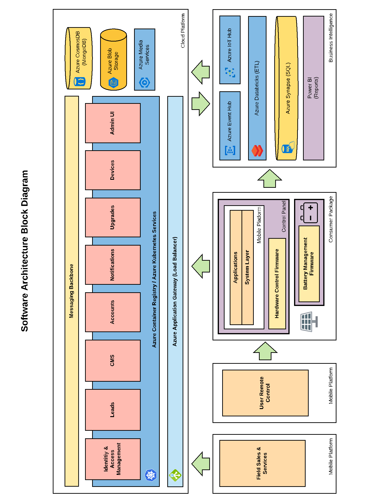
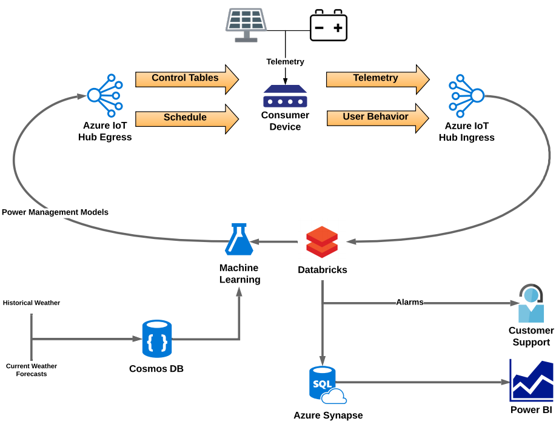

[!INCLUDE [header_file](../../../includes/sol-idea-header.md)]

This article describes an internet of things (IoT) solution that provides power, light, and internet services to remote locations.

## Architecture

### Application solution

*Download a [Visio file](https://arch-center.azureedge.net/iot-power-architecture.vsdx)* of this architecture.

#### Dataflow

This is a containerized microservices app with end-user interfaces:

1. Field sales and service agents use a mobile platform to interact with the cloud application via Azure Application Gateway. End users use a built-in interface or mobile app to access and control their devices.
1. Application Gateway uses messaging protocols to interact with users and operators.
1. The cloud app consists of containerized microservices that provide features and interfaces like identity and access management, device upgrades, notifications, and commerce services.
1. Depending on the features used, the app accesses Azure services and resources like [Azure Blob Storage](/azure/storage/blobs/storage-blobs-introduction) for unstructured data storage, [Azure Cosmos DB](/azure/cosmos-db/introduction) for large structured databases, and [Azure Media Services](https://azure.microsoft.com/services/media-services) for entertainment content.
1. The IoT gateway also sends streaming telemetry and user data to the cloud via Azure IoT Hub, to use for analytics and machine learning (ML).

### Analytics and machine learning solution

The business intelligence part of the process includes the following data analysis and control loop:

  
*Download a [Visio file](https://arch-center.azureedge.net/iot-power-analytics.vsdx)* of this architecture.

#### Dataflow

1. IoT Hub receives the streaming telemetry and user data from the IoT devices, and routes events to Azure Databricks via [Azure Functions](https://azure.microsoft.com/services/functions).
1. Azure Databricks [extracts, transforms, and loads (ETLs)](https://en.wikipedia.org/wiki/Extract,_transform,_load) the event data.
1. Azure Databricks uses Azure Functions to send some events, like alarms, directly to a customer support app for action.
1. Azure Databricks sends the ETL data to Azure Synapse, which performs analytics and stores the data.
1. Power BI reports use the analyzed data and insights. The service provider can use the data for system evaluation and future planning.
1. Azure Machine Learning uses a Databricks cluster to train and retrain ML models for power management. Model retraining combines current data with stored external data, like historical weather and forecasts, on Azure Cosmos DB.
1. The retrained model triggers a pipeline that packages the model and sends the retrained models to IoT Hub. IoT Hub sends the updated models to the IoT devices to use for device management.

### Components

- [Azure Application Gateway](https://azure.microsoft.com/services/application-gateway) manages and load balances traffic to and from cloud web apps.
- [Azure Kubernetes Service (AKS)](https://azure.microsoft.com/services/kubernetes-service) hosts and simplifies [Kubernetes](https://kubernetes.io) orchestration of [Docker](https://www.docker.com) containerized apps.
- [Azure Container Registry](https://azure.microsoft.com/services/container-registry) is a managed, private registry service that supports AKS applications at scale.
- [Azure IoT Hub](https://azure.microsoft.com/services/iot-hub) is a central cloud message hub for bi-directional communications between IoT applications and devices.
- [Azure Databricks](https://azure.microsoft.com/services/databricks) is a fast, easy, and collaborative [Apache Spark](https://spark.apache.org)-based analytics service for big data pipelines.
- [Azure Synapse Analytics](https://azure.microsoft.com/services/synapse-analytics), formerly SQL Data Warehouse, is an analytics service that brings together enterprise data warehousing and big data analytics.
- [Power BI](https://powerbi.microsoft.com) is a collection of software services, apps, and connectors that turn data into coherent, immersive, interactive visualizations and reports.
- [Azure Machine Learning](https://azure.microsoft.com/services/machine-learning) is a cloud-based ML environment that uses existing data to forecast future behaviors, outcomes, and trends.

## Scenario details

 A large-scale telecommunications company based the solution on IoT devices that can act as energy and internet hubs for homes and small businesses.

The IoT devices have an IoT gateway that acts as a hub for data transfer and customized service delivery. The devices use a rooftop solar panel to charge a battery, which delivers LED light, USB power, and cellular connectivity. The gateway collects and transmits telemetry data from the solar panel, battery, and output devices. The solution also includes an IoT device with an integrated SIM card and tablet to provide a user interface.

The basic IoT device provides LED light, USB device charging, internet connectivity, and user support through alerts and chatbots. Users can get more services and content on demand or by subscription.

The overall solution combines IoT connected devices with Azure platform-based mobile apps. The solution delivers clean, low-cost power and internet services with high reliability and minimal downtime.

Azure supports two major workstreams in this IoT solution:

- Real-time IoT device telemetry detects transient or long-running anomalies. The system can respond via real-time chatbots and take device actions. For example, in low-power conditions, a device can reduce power usage for background or inactive features. The user continues to get a good experience with the services they're actively using.

- Post-processing data analytics and machine learning evaluate usage and incidents to determine predictive maintenance and future needs. Alerts can notify customers about parts that are predicted to fail soon.

### Potential use cases

The following scenarios and industries could use this solution:

- Locations with limited centralized power and internet connectivity.
- News, entertainment, and educational organizations, to deliver content and programming.
- Financial institutions, to provide online commerce and banking services.
- Government and public health agencies, for emergency and support communications.

## Next steps

- [IoT concepts and Azure IoT Hub](/azure/iot-hub/iot-concepts-and-iot-hub)
- [Introduction to private Docker container registries in Azure](/azure/container-registry/container-registry-intro)
- [What is dedicated SQL pool (formerly SQL DW) in Azure Synapse Analytics?](/azure/synapse-analytics/sql-data-warehouse/sql-data-warehouse-overview-what-is)
- [MLOps: Model management, deployment, lineage, and monitoring with Azure Machine Learning](/azure/machine-learning/concept-model-management-and-deployment)
- [Set up a development environment with Azure Databricks and AutoML in Azure Machine Learning](/azure/machine-learning/how-to-configure-databricks-automl-environment)
- [A solar-powered device will bring online entertainment, education to villages](https://www.thehindubusinessline.com/info-tech/soon-a-solar-powered-device-will-bring-online-entertainment-education-to-villages/article26945331.ece)
- [Veriown case study](https://mdsglobal.com/veriown-case-study)

## Related resources

- [Choose an Internet of Things (IoT) solution in Azure](../../example-scenario/iot/iot-central-iot-hub-cheat-sheet.yml)
- [Extract actionable insights from IoT data](../../industries/manufacturing/extract-insights-iot-data.yml)
- [Task-based consumer mobile app](task-based-consumer-mobile-app.yml)
- [Ingestion, ETL, and stream processing pipelines with Azure Databricks](ingest-etl-stream-with-adb.yml)
