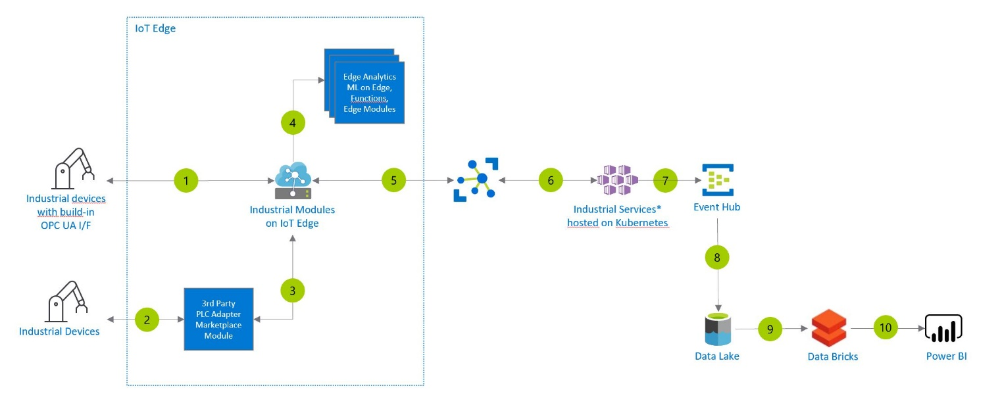

[!INCLUDE [header_file](../header.md)]

# Predictive Maintenance for Industrial IoT

This example scenario demonstrates how as and end manufacturers you can connect your assets to the cloud using OPC UA (Open Platform Communication Unified Architecture) and the Industrial Components. OPC UA is a platform-independent and service-oriented interoperability standard for a secure and reliable data exchange. OPC UA is used by various industrial systems and devices such as industry PCs, PLCs, and sensors. It's a standard that is driven by the OPC Foundation. This will enable the use of Predictive Maintenance to improve the efficiency of your machines, while reducing the costs by optimizing the production. Mitigate disruptions by applying advanced analytics and machine learning to your production to anticipate outages. Ensure production uptime with rich insights and automatic alerts triggered by manufacturing data.

## Architecture

## Data Flow

The data flows through the solution as follows:

1. Industrial devices that can natively communicate OPC UA can directly connect to IoT Edge. IoT Edge is the compute power that sits on your on-premises network. It’s the runtime environment of the Industrial Modules (OPC Publisher, OPC Twin, and Discovery Module). Modules are containers that run Azure services, 3rd party services, or your own code. The OPC Publisher module connects to OPC UA servers and publishes OPC UA telemetry data to Azure IoT Hub. OPC Twin creates a digital twin of an OPC UA server in the cloud and provides OPC UA browse/read/write/method call capabilities via a cloud-based REST (Representational State Transfer) interface. The Discovery module provides discovery services on the edge, which include OPC UA server discovery.
2. Industrial devices that can’t communicate through OPC UA need a 3rd party PLC adapter to connect to IoT Edge. Adapters are obtainable as modules in the [Azure Marketplace](https://azuremarketplace.microsoft.com/marketplace/).
3. The 3rd party PLC adapters enable a connectivity between the devices and IoT Edge.
4. For analytical capabilities closer to where the data originates, there are modules like Machine Learning on Edge or Functions obtainable from the Azure Marketplace, allowing low latency and operation in disconnected state.
5. Azure IoT Hub connects the devices virtually to the cloud for further data processing. It enables a security-enhanced bidirectional communication between IoT applications and devices.
6. The Industrial Services are made up of several microservices exposing a REST API. All Industrial Services are deployed to an Azure Kubernetes Service cluster. They implement business logic and functionality for discovery, registration, remote control, and post-processing telemetry of industrial devices. The REST APIs can be used in any programming language and framework that can call an HTTP endpoint. There are three predominant use cases in which the data provided by the Industrial Services is used.
7. Azure Event Hubs transforms and stores the data. It provides a distributed stream processing platform with low latency and seamless integration.
8. After the Event Hubs process the data, Azure Data Lake stores and analyzes the data further. Azure Data Lake is a massively scalable data lake with enterprise-grade security and auditing, which allows to run batch, stream and interactive analytic programs with simplicity. Azure Data Lake solves many of the productivity and scalability challenges that prevent you from maximizing the value of your data assets.
9. Azure Databricks provides the latest versions of Apache Spark as an Azure service offering and allows you to seamlessly integrate with open source libraries. It provides a one-click setup, streamlined workflows, and an interactive workspace that enables collaboration.
10. Explore your data with visual reports and collaborate, publish and share these reports with others. Power BI integrates with other tools, including Microsoft Excel, so you can get up to speed quickly and work seamlessly with your existing solutions.

## Components

Data is loaded from these different data sources using several Azure components:

The following modules are part of the platform:

- [IoT Edge](/azure/iot-edge/about-iot-edge) Azure IoT Edge moves cloud analytics and custom business logic to devices so that your organization can focus on business insights instead of data management. Scale out your IoT solution by packaging your business logic into standard containers, then you can deploy those containers to any of your devices and monitor it all from the cloud.
- Industrial Modules – The Azure Industrial IoT platform includes modules that run inside Azure IoT Edge to connect your shop floor. The [OPC Publisher](https://github.com/Azure/Industrial-IoT/blob/master/docs/modules/publisher.md) module connects to OPC UA servers and publishes OPC UA telemetry data from these servers to Azure IoT Hub. [OPC Twin](https://github.com/Azure/Industrial-IoT/blob/master/docs/modules/twin.md) provides discovery, registration, and remote control of industrial devices through REST APIs. The [Discovery Module](https://github.com/Azure/Industrial-IoT/blob/master/docs/modules/discovery.md) provides discovery services on the edge, which include OPC UA server discovery.
- [IoT Hub](https://docs.microsoft.com/de-de/azure/iot-hub/) IoT Hub is a managed service, hosted in the cloud, that acts as a central message hub for bi-directional communication between your IoT application and the devices it manages. You can use Azure IoT Hub to build IoT solutions with reliable and secure communications between millions of IoT devices and a cloud-hosted solution backend. You can connect virtually any device to IoT Hub.
- [Industrial Services](https://github.com/Azure/Industrial-IoT/tree/master/docs/services) hosted on Kubernetes – The platform is made up of several cloud components that divide into Microservices providing REST API and Agent services that can provide processing and daemon like functionality.
- [Azure Data Lake](/azure/storage/blobs/data-lake-storage-introduction) makes Azure Storage the foundation for building enterprise data lakes on Azure. Designed from the start to service multiple petabytes of information while sustaining hundreds of gigabits of throughput, it allows you to easily manage massive amounts of data.
- [Data Bricks](/azure/azure-databricks/) Azure Databricks is an Apache Spark-based analytics platform optimized for the Microsoft Azure cloud services platform. Designed with the founders of Apache Spark, Databricks is integrated with Azure to provide one-click setup, streamlined workflows, and an interactive workspace that enables collaboration between data scientists, data engineers, and business analysts.
- [Power BI](/power-bi) is a suite of business analytics tools to analyze data and share insights. Power BI can query a semantic model stored in Analysis Services, or it can query Azure Synapse directly.
- [Data Factory](/azure/data-factory) orchestrates the transformation of staged data into a common structure in Azure Synapse. Data Factory [uses Polybase when loading data into Azure Synapse](/azure/data-factory/connector-azure-sql-data-warehouse#use-polybase-to-load-data-into-azure-sql-data-warehouse) to maximize throughput.

## Next Steps

- For a detailed view of the Industrial Modules and Services, see the Azure Industrial IoT Platform [architecture](https://github.com/Azure/Industrial-IoT/blob/master/docs/architecture.md) and a detailed view of all the individual Microservices and Agent processes is shown [here](https://github.com/Azure/Industrial-IoT/blob/master/docs/architecture-details.md).
- You can find more information on how to get started with the Azure Industrial IoT Platform in the [Industrial IoT GitHub repository](https://github.com/Azure/Industrial-IoT/blob/master/docs/architecture-details.md).
