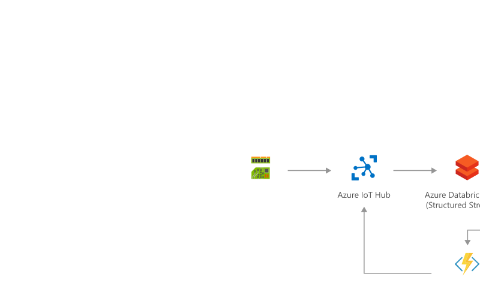

<!-- cSpell:ignore khilscher Etcd Jupyter eventhubs -->

Scale instantly and elastically to accommodate diverse and unpredictable IoT workloads without sacrificing ingestion or query performance.

Azure Cosmos DB is Microsoft's globally distributed, multi-model database. Azure Cosmos DB was built from the ground up with global distribution and horizontal scale at its core. It offers turnkey global distribution across any number of Azure regions by transparently scaling and replicating your data wherever your users are. You can elastically scale throughput and storage worldwide, and pay only for the throughput and storage you need.

Cosmos DB is ideally suited for IoT solutions. Cosmos DB can ingest device telemetry data at high rates and can serve indexed queries back with low latency and high availability.

Cosmos DB is a multi-model database with wire protocol–compatible API endpoints for Cassandra, MongoDB, SQL, Gremlin, Etcd, and Table along with built-in support for Jupyter Notebook files.

## Architecture

### Data flow

1. Events generated from IoT devices are sent to the analyze and transform layer through Azure IoT Hub as a stream of messages. Azure IoT Hub stores streams of data in partitions for a configurable amount of time.
2. Azure Databricks, running Apache Spark Streaming, picks up the messages in real time from IoT Hub, processes the data based on the business logic and sends the data to Serving layer for storage. Spark Streaming can provide real time analytics such as calculating moving averages, min and max values over time periods.
3. Device messages are stored in Cosmos DB as JSON documents. This is considered the **hot data store**. Different JSON schemas representing different device vendors can be stored in Cosmos DB or converted to a canonical JSON schema.
4. The storage layer consists of:
    - Azure Blob Storage - IoT Hub [message routing](/azure/iot-hub/tutorial-routing) can save the raw IoT device messages to Azure Blob storage, allowing blob storage to act as an inexpensive, long-term **cold data store**.
    - Azure SQL Database - Utilize Azure SQL for storing your transactional and relational data (for example, billing data, user roles).
    - Azure Synapse Analytics (Previously Azure SQL Data Warehouse) - For your solution data warehouse. Populated it using [Azure Data Factory](https://azure.microsoft.com/services/data-factory/) using aggregated data from Cosmos DB and Azure SQL.
5. Microsoft Power BI can be used by your users to analyze warehoused data.
6. Web, mobile and other applications can be built on the storage layer. For example, you can expose APIs based on the storage layer data for third-party uses.
7. Use Cosmos DB Change Feed to execute an Azure Function each time a device message is added or updated in Cosmos DB.
8. Some device messages (for example, a fault code) may require an action to be performed on the device. Using the Azure IoT Hub Service API, the Azure Function can connect to Azure IoT Hub and perform an action on the device (for example, reboot) using either:
    - Device Twins
    - Cloud to Device messages
    - Direct Methods

### Components

This architecture uses the following Azure components:

- [Azure IoT Hub](https://azure.microsoft.com/services/iot-hub) acts as the cloud gateway, ingesting device telemetry at-scale. IoT Hub also supports bi-directional communication back to devices, allowing actions to be sent from the cloud or [Azure IoT Edge](https://azure.microsoft.com/services/iot-edge/) to the device. Azure IoT Edge can be used to run applications at the edge, such as machine learning models.
- [Azure Databricks](https://azure.microsoft.com/services/databricks) with Apache Spark Streaming is located in the transformation and analytics layer. Databricks uses the azure-eventhubs-spark_2.11:2.3.6 Maven library to connect to IoT Hub's Event Hub compatible endpoint. Apache Spark Streaming is a scalable fault-tolerant streaming processing system that natively supports both batch and streaming workloads.
- [Azure Cosmos DB](https://azure.microsoft.com/services/cosmos-db) is a globally distributed, multi-model database.
  - Consistency Levels - Cosmos DB supports 5 consistency levels (Strong, Bounded Staleness, Session, Consistent Prefix, Eventual) allowing you to make the tradeoff between the read consistency vs. availability, latency, and throughput.
  - TTL - Azure Cosmos DB provides the ability to delete items automatically from a container after a certain time period. This allows Cosmos DB to act as a hot data store for recent data, with long-term data stored in Azure Blob cold storage.
  - Change Feed - Outputs a sorted list of documents that were changed in the order in which they were modified. You can create small reactive Azure Functions that will be automatically triggered on each new event in your Azure Cosmos container's change feed. Depending on the contents of the JSON document, the Azure Function can connect to Azure IoT Hub Service API and execute an action on the device using Device Twin, Cloud to Device messaging, or Direct Methods.
  - Request Unit (RU) - Is the measure of throughput in Azure Cosmos DB. RUs are compute units for both performance and cost. With RUs, you can dynamically scale up and down while maintaining availability, optimizing for cost, performance and availability at the same time.
  - Partitioning - The partition key is what will determine how data is routed in the various partitions by Cosmos DB and needs to make sense in the context of your specific scenario. The IoT Device ID is generally the "natural" partition key for IoT applications.
- [Azure SQL Database](/azure/sql-database/sql-database-technical-overview) is the relational database for transactional and other non-IoT data.
- [Azure Synapse Analytics](https://azure.microsoft.com/services/synapse-analytics) is the data warehouse and reporting platform, containing aggregated data from Azure SQL and Cosmos DB. For enterprise data warehousing and big data analytics.
- [Azure Synapse Link for Azure Cosmos DB](/azure/cosmos-db/synapse-link) enables you to run near real-time analytics over operational data in Azure Cosmos DB, **without any performance or cost impact on your transactional workload**, by using the two analytics engines available from your Azure Synapse workspace: [SQL Serverless](/azure/synapse-analytics/sql/on-demand-workspace-overview) and [Spark Pools](/azure/synapse-analytics/spark/apache-spark-overview).
- [Power BI](https://powerbi.microsoft.com) is a suite of business analytics tools to analyze data and share insights. Power BI can query a semantic model stored in Azure Analysis Services, or it can query Azure Synapse directly.
- [Azure App Services](/azure/app-service/app-service-web-overview) can be used to build web and mobile applications. [Azure API App](https://azure.microsoft.com/services/app-service/api) can be used to expose data to third parties, based on the data stored in the Serving Layer.
- [Azure Functions](https://azure.microsoft.com/services/functions) can be used to translate IoT message payloads (for example, from binary to JSON) or trigger actions when connected to Cosmos DB Change Feed. Azure Functions is an event-driven serverless compute platform. Build and debug locally without additional setup, deploy and operate at scale in the cloud, and integrate services using triggers and bindings.

### Alternatives

- In the transformation and analytics layer, we could use [HDInsight Storm](/azure/hdinsight/storm/apache-storm-overview), [HDInsight Spark](/azure/hdinsight/spark/apache-spark-overview) or [Azure Stream Analytics](https://azure.microsoft.com/services/stream-analytics) to perform streaming analytics, and [Azure Functions](https://azure.microsoft.com/services/functions) to perform message payload transformations.
- In the service storage layer, [Azure Data Explorer](https://azure.microsoft.com/services/data-explorer/) and [Time Series Insights](https://azure.microsoft.com/services/time-series-insights/) could be used for storing IoT messages. Both of these services also provide rich analytics capabilities.
- [Synapse Link](/azure/cosmos-db/synapse-link) is the Microsoft preferred solution for analytics on top of Cosmos DB data.

## Considerations

- Cosmos DB has a [20-GB limit](/azure/cosmos-db/partitioning-overview) (in the past it was 10GB) for a single logical partition. For most IoT solutions, this size is sufficient. If not, we recommend either:
  - Setting the partition key to an artificial field and assign a composite value (for example, Device ID + Current Month and Year). This will ensure an extremely high cardinality of values.
  - Tier old Cosmos DB data out to cold storage (for example, Azure Blob Storage) using a combination of TTL to automatically prune data from Cosmos DB and change feed to replicate data to cold storage.

## Next steps

Review the following articles on IoT and Cosmos DB.

- [Azure IoT reference architecture](../../reference-architectures/iot.yml)
- [IoT solutions and Cosmos DB](https://techcommunity.microsoft.com/t5/internet-of-things/iot-solutions-and-azure-cosmos-db/ba-p/1015605)
- [Change feed in Azure Cosmos DB](/azure/cosmos-db/change-feed)
- [Time to Live (TTL) in Azure Cosmos DB](/azure/cosmos-db/time-to-live)
- [Consistency levels in Azure Cosmos DB](/azure/cosmos-db/consistency-levels)
- [Request Units in Azure Cosmos DB](/azure/cosmos-db/request-units)
- [Partitioning and horizontal scaling in Azure Cosmos DB](/azure/cosmos-db/partition-data)
