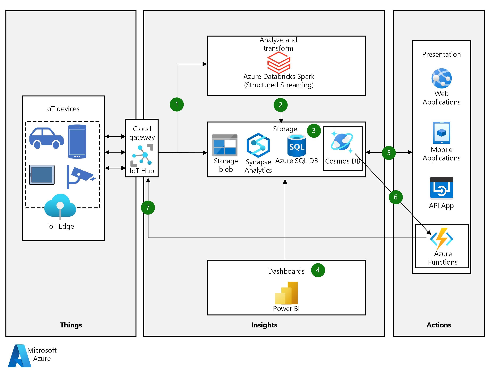

<!-- cSpell:ignore khilscher Etcd Jupyter eventhubs -->

This article describes an internet-of-things (IoT) workload that relies on several features of the Azure Cosmos DB database service. Azure Cosmos DB is a multi-model database built for global distribution and horizontal scale.

Global distribution transparently scales and replicates data across Azure regions. You can scale throughput and storage worldwide, and pay for only the amount you need. Instant elastic scaling accommodates diverse and unpredictable IoT workloads, without sacrificing ingestion or query performance.

Azure Cosmos DB is ideal for IoT workloads because it's capable of:

- Ingesting device telemetry data at high rates, and return indexed queries with low latency and high availability.
- Storing JSON format from different device vendors, which provides flexibility in payload schema.
- By using wire protocol–compatible API endpoints for Cassandra, MongoDB, SQL, Gremlin, etcd, and table databases, and built-in support for Jupyter Notebook files.

## Potential use cases

- Use built-in, globally distributed Azure Cosmos DB capabilities to enable low latency read-write for highly responsive IoT applications.
- Handle data from a wide variety of device vendors and data types.

## Architecture

*Download a [Visio file](https://archcenter.blob.core.windows.net/cdn/iot-using-cosmos-db.vsdx) of this architecture.*

### Dataflow

1. IoT sensors and Edge devices send events as message streams through Azure IoT Hub to the analyze and transform layer. IoT Hub can store data streams in partitions for a specified duration.

1. Azure Databricks with Apache Spark Structured Streaming picks up messages from IoT Hub in real time, processes the data based on business logic, and sends the data to storage. Structured Streaming can provide real time analytics, such as calculating moving averages or minimum and maximum values over time periods.

1. Azure Cosmos DB stores device messages as JSON documents in the *hot data store*. Azure Cosmos DB can validate against JSON schemas from different device vendors.

   The storage layer also consists of:
   - Azure Blob Storage. IoT Hub [message routing](/azure/iot-hub/tutorial-routing) saves raw device messages to Blob storage, providing an inexpensive, long-term *cold data store*.
   - Azure SQL Database, to store transactional and relational data, such as billing data and user roles.
   - Azure Synapse Analytics data warehouse, populated by [Azure Data Factory](https://azure.microsoft.com/services/data-factory), which aggregates data from Azure Cosmos DB and Azure SQL DB.

1. Microsoft Power BI analyzes the data warehouse.

1. The presentation layer uses data from the storage layer to build web, mobile, and API apps.

1. Whenever a new or updated device message arrives, Azure Cosmos DB change feed triggers an Azure Functions function.

1. The function determines whether the message requires a device action, like a reboot. If so, the function connects to IoT Hub by using the IoT Hub Service API, and initiates the device action. The function can initiate the action by using device twins, cloud to device messages, or direct methods.

### Components

This workload uses the following Azure components:

#### Azure Cosmos DB

This IoT workload spotlights [Azure Cosmos DB](https://azure.microsoft.com/services/cosmos-db), a globally distributed, multi-model database. The workload uses the following Azure Cosmos DB features:

- [Consistency levels](/azure/cosmos-db/consistency-levels). Azure Cosmos DB supports five read consistency levels, from strongest to weakest: Strong, bounded staleness, session, consistent prefix, and eventual. In general, stronger consistency leads to lower availability, longer latency, and lower throughput. You can choose a consistency level based on your workload requirements.

- [Time to live (TTL)](/azure/cosmos-db/time-to-live). Azure Cosmos DB can delete items automatically from a container after a certain time period. This capability lets Azure Cosmos DB act as a hot data store for recent data, with long-term data stored in Azure Blob cold storage.

- [Change feed](/azure/cosmos-db/change-feed). The change feed feature outputs a sorted list of changed documents, in the order in which they were modified. Each new event in the Azure Cosmos DB container's change feed automatically triggers a small reactive Azure Functions function. Depending on the contents of the JSON document, the function can connect to Azure IoT Hub Service API and execute an action on the device.

- [Request units (RUs)](/azure/cosmos-db/request-units). RUs are compute units that measure Azure Cosmos DB throughput. You can use RUs to dynamically scale Azure Cosmos DB up and down, while maintaining availability and optimizing for cost and performance.

- [Partitioning](/azure/cosmos-db/partition-data). The partition key determines how Azure Cosmos DB routes data in partitions. The IoT Device ID is the usual partition key for IoT applications.

#### Other Azure components

The solution also uses the following Azure components:

- [Azure IoT Edge](https://azure.microsoft.com/services/iot-edge) runs applications at the edge, such as machine learning models.

- [Azure IoT Hub](https://azure.microsoft.com/services/iot-hub) acts as the cloud gateway, ingesting device telemetry at scale. IoT Hub supports communication back to devices, allowing actions to be sent from the cloud to IoT Edge to the device.

- [Azure Databricks](https://azure.microsoft.com/services/databricks) with Spark Structured Streaming is a scalable, fault-tolerant stream processing system that natively supports batch and streaming workloads. Azure Databricks is the transformation and analytics layer, and connects to the IoT Hub event hub-compatible endpoint by using the *azure-eventhubs-spark_2.11:2.3.6* Maven library.

- [Azure Blob Storage](https://azure.microsoft.com/services/storage/blobs) provides scalable, inexpensive, long-term cold data storage for unstructured data.

- [Azure SQL Database](https://azure.microsoft.com/products/azure-sql/database) is the relational database for transactional and other non-IoT data.

- [Azure Synapse Analytics](https://azure.microsoft.com/services/synapse-analytics) is a data warehouse and reporting platform for enterprise data warehousing and big data analytics. Synapse Analytics contains aggregated data from Azure SQL Database and Azure Cosmos DB.

  [Azure Synapse Link for Azure Cosmos DB](/azure/cosmos-db/synapse-link) enables near real-time analytics on Azure Cosmos DB operational data, without any performance or cost impact on transactional workloads. Synapse Link uses the two analytics engines in the Azure Synapse workspace: [SQL Serverless](/azure/synapse-analytics/sql/on-demand-workspace-overview) and [Spark Pools](/azure/synapse-analytics/spark/apache-spark-overview).

- [Power BI](https://powerbi.microsoft.com) is a suite of business analytics tools for analyzing data and sharing insights. Power BI can query a semantic model stored in Azure Analysis Services, or can query Synapse Analytics directly.

- [Azure App Service](https://azure.microsoft.com/services/app-service) builds web and mobile applications. [Azure API App](https://azure.microsoft.com/services/app-service/api) lets third-party apps consume APIs based on data from the serving layer.

- [Azure Functions](https://azure.microsoft.com/services/functions) is an event-driven, serverless compute platform that can operate at scale in the cloud, and integrate services by using triggers and bindings. Azure Functions can translate IoT message formats, or trigger actions when connected to Azure Cosmos DB change feed.

### Alternatives

- Instead of Azure Databricks, the transformation and analytics layer could use [HDInsight Storm](/azure/hdinsight/storm/apache-storm-overview), [HDInsight Spark](/azure/hdinsight/spark/apache-spark-overview) or [Azure Stream Analytics](https://azure.microsoft.com/services/stream-analytics) to do streaming analytics, and use Azure Functions to transform the message payloads.

- The service storage layer could use [Azure Data Explorer](https://azure.microsoft.com/services/data-explorer) for storing IoT messages. This service also has rich analytics capabilities.

## Considerations

Azure Cosmos DB has a [20-GB limit](/azure/cosmos-db/partitioning-overview) for a single logical partition. For most IoT solutions, this size is sufficient. If not, you can:

  - Set the partition key to an artificial field, and assign the field a composite value, such as **Device ID + Current Month and Year**. This strategy assures high value cardinality for a good partition design. For more information, see [Choose a partition key](/azure/cosmos-db/partitioning-overview#choose-partitionkey).
  
  - Based on data lifecycle, you can move older Azure Cosmos DB data to cold storage, such as Azure Blob Storage. You can use a combination of change feed to replicate the data to cold storage, and TTL to delete data automatically from a container after a certain time period.

## Next steps

- [IoT solutions and Azure Cosmos DB](https://techcommunity.microsoft.com/t5/internet-of-things/iot-solutions-and-azure-cosmos-db/ba-p/1015605)
- [Partitioning and horizontal scaling in Azure Cosmos DB](/azure/cosmos-db/partition-data)
- [Order device connection events from Azure IoT Hub using Azure Cosmos DB](/azure/iot-hub/iot-hub-how-to-order-connection-state-events)

## Related resources

- [Azure IoT reference architecture](../../reference-architectures/iot.yml)
- [IoT and data analytics](../../example-scenario/data/big-data-with-iot.yml)
- [IoT analytics with Azure Data Explorer](iot-azure-data-explorer.yml)
