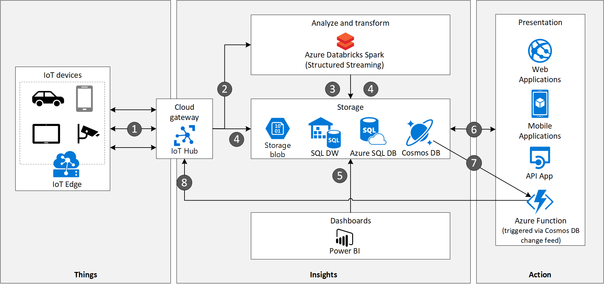

<!-- cSpell:ignore khilscher Etcd Jupyter eventhubs -->

This article describes an internet-of-things (IoT) workload that features the Azure Cosmos DB database service. Azure Cosmos DB is ideally suited for IoT solutions, because it:

- Can ingest device telemetry data at high rates, and return indexed queries with low latency and high availability.
- Has wire protocol–compatible API endpoints for Cassandra, MongoDB, SQL, Gremlin, Etcd, and Table databases, and built-in support for Jupyter Notebook files.

Azure Cosmos DB is a multi-model database with global distribution and horizontal scale at its core. With Azure Cosmos DB, global distribution across Azure regions transparently scales and replicates data. You can elastically scale throughput and storage worldwide, and pay only for the throughput and storage you need to use.

Azure Cosmos DB can scale instantly and elastically to accommodate diverse and unpredictable IoT workloads, without sacrificing ingestion or query performance.

## Architecture

### Data flow

1. IoT sensors and Edge devices send events as message streams through Azure IoT Hub to the analyze and transform layer. IoT Hub can store data streams in partitions for a specified length of time.

1. Azure Databricks with Apache Spark Structured Streaming picks up messages from IoT Hub in real time, processes the data based on business logic, and sends the data to the storage server. Structured Streaming can provide real time analytics, such as calculating moving averages or minimum and maximum values over time periods.

1. The Azure Cosmos DB *hot data store* stores device messages as JSON documents. Azure Cosmos DB can store JSON schemas from different device vendors, or convert messages to a canonical JSON schema.

   The storage layer also consists of:
   - Azure Blob Storage. IoT Hub [message routing](/azure/iot-hub/tutorial-routing) saves raw device messages to Blob storage, providing an inexpensive, long-term *cold data store*.
   - Azure SQL Database, to store transactional and relational data, such as billing data and user roles.
   - Azure Synapse Analytics data warehouse, populated by [Azure Data Factory](https://azure.microsoft.com/services/data-factory) with aggregated data from Azure Cosmos DB and Azure SQL DB.

1. Microsoft Power BI analyzes the warehoused data.

1. The presentation layer uses data from the storage layer to build web, mobile, and API apps for third-party users.

1. Azure Cosmos DB change feed triggers an Azure Function whenever a device message is added or updated.

1. Some messages, like fault codes, require a device action like a reboot. The Azure Function connects to IoT Hub by using the IoT Hub Service API, and initiates the device action by using device twins, cloud to device messages, or direct methods.

### Components

This solution idea uses the following Azure components:

- [Azure Cosmos DB](https://azure.microsoft.com/services/cosmos-db) is a globally distributed, multi-model database. This solution highlights the following Azure Cosmos DB features:

  - Consistency levels. Azure Cosmos DB supports five consistency levels: Strong, Bounded Staleness, Session, Consistent Prefix, and Eventual. This feature lets you determine the tradeoff between read consistency and availability, latency, and throughput.
  - Time to live (TTL). Azure Cosmos DB can delete items automatically from a container after a certain time period. This capability lets Azure Cosmos DB act as a hot data store for recent data, with long-term data stored in Azure Blob cold storage.
  - Change feed. The change feed feature outputs a sorted list of documents that were changed, in the order in which they were modified. Small reactive Azure Functions are automatically triggered on each new event in the Azure Cosmos DB container's change feed. Depending on the contents of the JSON document, the Azure Function can connect to Azure IoT Hub Service API and execute an action on the device.
  - Request unit (RU). RUs are compute units that measure Azure Cosmos DB throughput. You can use RUs to dynamically scale up and down, while maintaining availability and optimizing for cost and performance.
  - Partitioning. The partition key determines how Azure Cosmos DB routes data in partitions. In IoT scenarios, the IoT Device ID is usually the partition key for IoT applications.

- [Azure IoT Edge](https://azure.microsoft.com/services/iot-edge) runs applications at the edge, such as machine learning models.

- [Azure IoT Hub](https://azure.microsoft.com/services/iot-hub) acts as the cloud gateway, ingesting device telemetry at scale. IoT Hub supports communication back to devices, allowing actions to be sent from the cloud to IoT Edge to the device.

- [Azure Databricks](https://azure.microsoft.com/services/databricks) with Spark Structured Streaming is a scalable, fault-tolerant stream processing system that natively supports batch and streaming workloads. Azure Databricks in the transformation and analytics layer, and connects to the IoT Hub event hub-compatible endpoint by using the azure-eventhubs-spark_2.11:2.3.6 Maven library.

- [Azure Blob Storage](https://azure.microsoft.com/services/storage/blobs) provides scalable, inexpensive, long-term cold data storage for unstructured data.

- [Azure SQL Database](/azure/sql-database/sql-database-technical-overview) is the relational database for transactional and other non-IoT data.

- [Azure Synapse Analytics](https://azure.microsoft.com/services/synapse-analytics) is a data warehouse and reporting platform for enterprise data warehousing and big data analytics. Synapse Analytics contains aggregated data from Azure SQL Database and Azure Cosmos DB.

  [Azure Synapse Link for Azure Cosmos DB](/azure/cosmos-db/synapse-link) enables near real-time analytics on Azure Cosmos DB operational data, without any performance or cost impact on transactional workloads. Synapse Link uses the two analytics engines in the Azure Synapse workspace: [SQL Serverless](/azure/synapse-analytics/sql/on-demand-workspace-overview) and [Spark Pools](/azure/synapse-analytics/spark/apache-spark-overview).

- [Power BI](https://powerbi.microsoft.com) is a suite of business analytics tools to analyze data and share insights. Power BI can query a semantic model stored in Azure Analysis Services, or can query Synapse Analytics directly.

- [Azure App Services](/azure/app-service/app-service-web-overview) builds web and mobile applications. [Azure API App](https://azure.microsoft.com/services/app-service/api) lets third-party apps use data from the serving layer.

- [Azure Functions](https://azure.microsoft.com/services/functions) is an event-driven, serverless compute platform. Azure Functions can operate at scale in the cloud, and integrate services by using triggers and bindings. Azure Functions can translate IoT message formats, or trigger actions when connected to Azure Cosmos DB change feed.

### Alternatives

- Instead of Azure Databricks, the transformation and analytics layer could use [HDInsight Storm](/azure/hdinsight/storm/apache-storm-overview), [HDInsight Spark](/azure/hdinsight/spark/apache-spark-overview) or [Azure Stream Analytics](https://azure.microsoft.com/services/stream-analytics) to do streaming analytics, and use Azure Functions to transform the message payloads.

- The service storage layer could use [Azure Data Explorer](https://azure.microsoft.com/services/data-explorer) and [Time Series Insights](https://azure.microsoft.com/services/time-series-insights) for storing IoT messages. Both of these services also have rich analytics capabilities.

## Considerations

Azure Cosmos DB has a [20GB limit](/azure/cosmos-db/partitioning-overview) for a single logical partition. For most IoT solutions, this size is sufficient. If not, you can:

  - Set the partition key to an artificial field, and assign the field a composite value, such as Device ID + Current Month and Year. This strategy assures high value cardinality.
  
  - Move old Azure Cosmos DB data to cold storage, such as Azure Blob Storage, by using a combination of TTL to automatically prune data, and change feed to replicate the data to cold storage.

## Next steps

Review the following articles on IoT and Azure Cosmos DB.

- [Azure IoT reference architecture](../../reference-architectures/iot.yml)

- [IoT solutions and Cosmos DB](https://techcommunity.microsoft.com/t5/internet-of-things/iot-solutions-and-azure-cosmos-db/ba-p/1015605)
- [Change feed in Azure Cosmos DB](/azure/cosmos-db/change-feed)
- [Time to Live (TTL) in Azure Cosmos DB](/azure/cosmos-db/time-to-live)
- [Consistency levels in Azure Cosmos DB](/azure/cosmos-db/consistency-levels)
- [Request Units in Azure Cosmos DB](/azure/cosmos-db/request-units)
- [Partitioning and horizontal scaling in Azure Cosmos DB](/azure/cosmos-db/partition-data)
