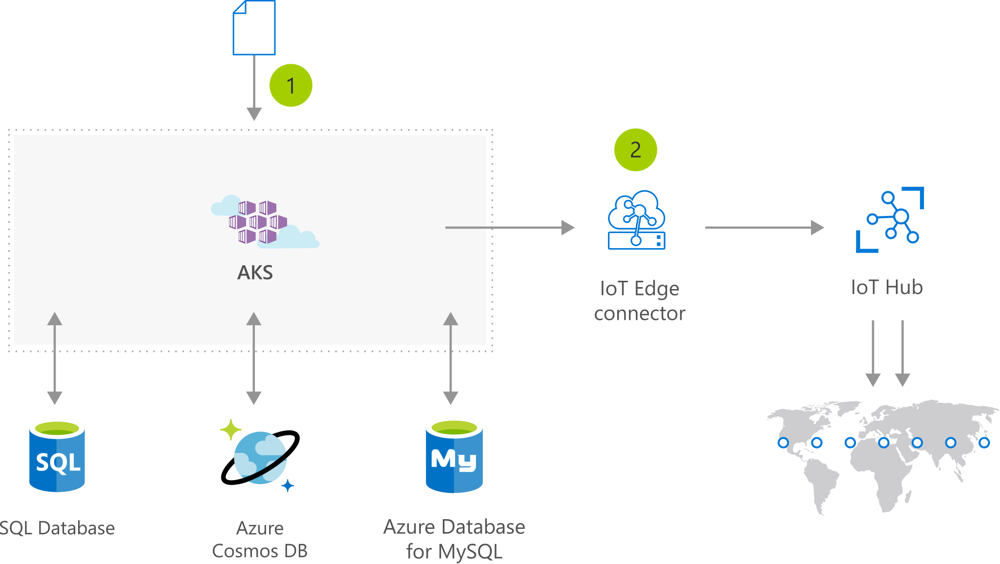

# IoT device deployment and management on demand

[!INCLUDE [header_file](../../../includes/sol-idea-header.md)]

IoT scenarios can potentially involve hundreds to thousands of IoT devices. AKS provides scalable compute resources on demand for IoT solutions, running in the cloud or on-premises.

## Architecture

*Download an [SVG](../media/iot-with-aks.svg) of this architecture.*

## Data Flow

1. User initiates AKS deployment using a Helm Chart
1. IoT Edge Connector virtual node deploys to Edge devices via the IoT Hub.
1. Deployment is updated on Edge devices
