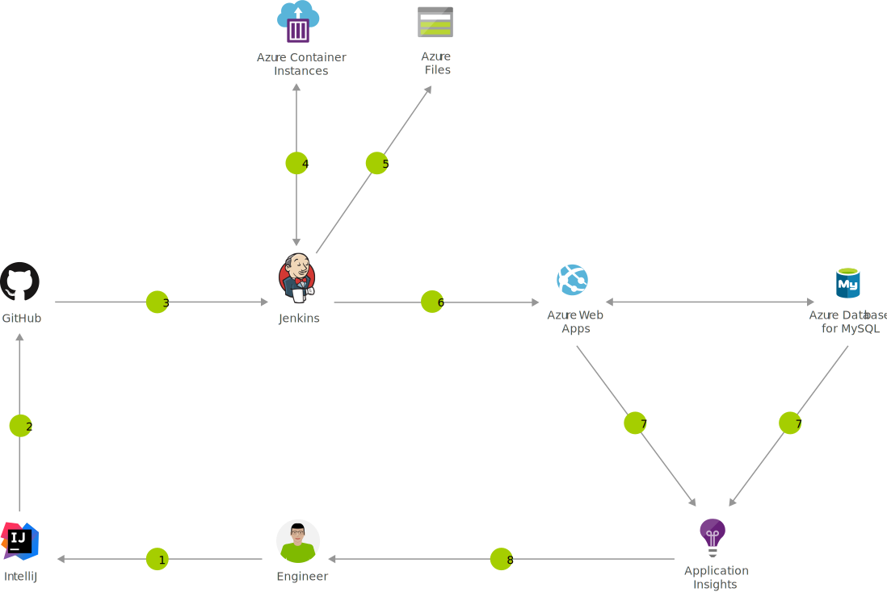

---
ms.custom:
  - devx-track-extended-java
  - devx-track-jenkins
---
[!INCLUDE [header_file](../../../includes/sol-idea-header.md)]

Azure App Service is a fast and simple way to create web apps using Java, Node, PHP or ASP.NET, as well as support for custom language runtimes using Docker.

## Potential use cases

This solution provides a continuous integration and continuous deployment (CI/CD) pipeline that pushes each of your changes automatically to Azure app services, which allows you to deliver value faster to your customers.

## Architecture

*Download a [Visio file](https://arch-center.azureedge.net/java-cicd-using-jenkins-and-azure-web-apps.vsdx) of this architecture.*

### Dataflow

1. Change application source code
1. Commit code to GitHub
1. Continuous Integration Trigger to Jenkins
1. Jenkins triggers a build job using Azure Container Instances for a dynamic build agent
1. Jenkins builds and stores artifact in Azure Storage
1. Jenkins deploys Java application to Azure Web Apps backed by Azure Database for MySQL
1. Azure App Insights provides metrics on application performance
1. Monitor application and make improvements

### Components

* [Azure Web Apps](https://azure.microsoft.com/services/app-service/web): Quickly create and deploy mission critical Web apps at scale
* [Container Instances](https://azure.microsoft.com/services/container-instances): Easily run containers on Azure without managing servers
* [Azure Database for MySQL](https://azure.microsoft.com/services/mysql): Managed MySQL database service for app developers
* Application Insights: Detect, triage, and diagnose issues in your web apps and services
* [Azure DevOps](https://azure.microsoft.com/services/devops): Build and deploy multi-platform apps to get the most from Azure services

## Deploy this scenario

* [Deploy to Azure](https://azure.microsoft.com/resources/templates/jenkins-cicd-webapp)

## Next steps

* [Set up continuous integration and deployment to Azure Web Apps with Jenkins](/azure/jenkins/java-deploy-webapp-tutorial)
* [Use the Azure Container Agents plug-in for Jenkins for dynamic build agents](/azure/jenkins/azure-container-agents-plugin-run-container-as-an-agent)
* [Build a Java and MySQL web app in Azure](/azure/app-service/app-service-web-tutorial-java-mysql)
* [Performance monitoring with Application Insights](/azure/application-insights/app-insights-detect-triage-diagnose)
* [Get the Azure Extension Pack for Visual Studio Code](https://marketplace.visualstudio.com/items?itemName=ms-vscode.vscode-node-azure-pack)
