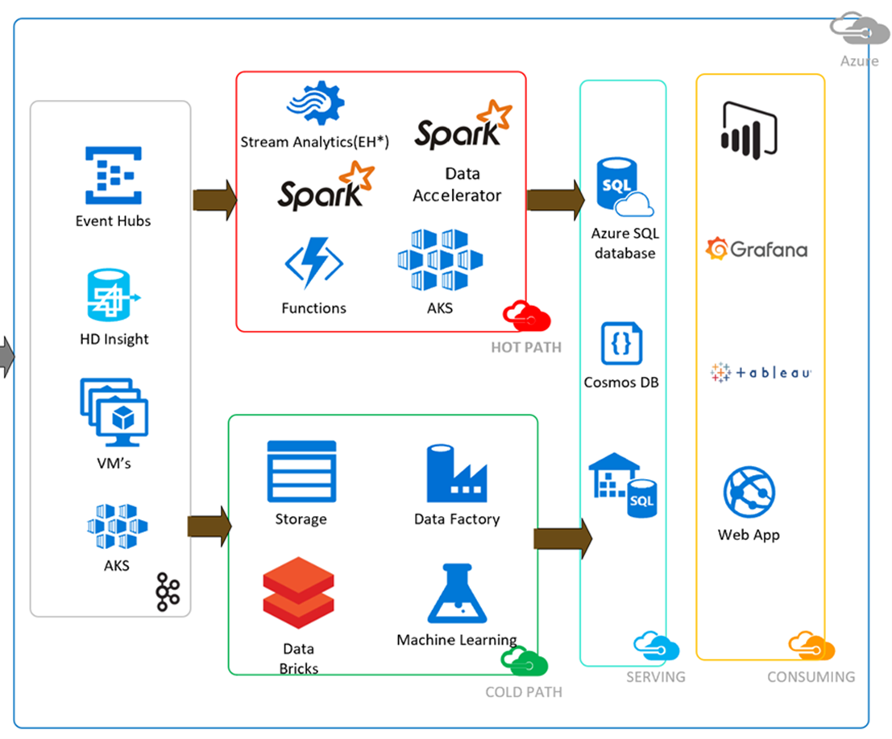
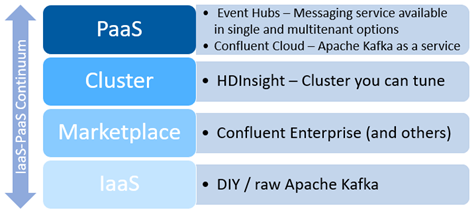

# Kafka on Azure

[Apache Kafka](https://kafka.apache.org/intro) is an open-source distributed event streaming platform with the capabilities of publishing, subscribing,
storing, and processing streams of events in a distributed and highly scalable manner. Kafka is deployed on hardware, virtual machines, containers,
and on-premises as well as in the cloud.

While evaluating solutions for implementing Kafka on Azure, let's consider these two basic use cases:

1. You are already using Apache Kafka and want to know ways to either deploy it on Azure Cloud or emulate the experience in Azure with minimal changes to your current setup.
2. You are interested in implementing solutions with Apache Kafka for [greenfield projects](https://wikipedia.org/wiki/Greenfield_project) and want to use Azure.

This article presents options for implementing Apache Kafka on Azure, evaluates their pros and cons, provides a feature comparison, and offers a decision guidance matrix to help you select between the options.

## Architecture

The following diagram shows what a typical [Lambda architecture](https://wikipedia.org/wiki/Lambda_architecture) looks like with different Kafka on Azure options for the ingestion phase and an exhaustive list of services from the Azure ecosystem supporting them.

## Options for using Kafka on Azure

To evaluate the options for Kafka on Azure, place them on a continuum between Infrastructure-as-a-Service (IaaS) and Platform-as-a-Service (PaaS).

To evaluate the options, use a PaaS-first approach. First, consider whether your design requirements are met using the PaaS offering, and if you come across a limitation, move on to the next offering in the list.

The following diagram summarizes Kafka on Azure options using the IaaS-PaaS continuum.

The following sections present pros and cons for each Kafka on Azure option.

### Confluent Cloud - PaaS

Confluent provides a fully managed Apache Kafka on Azure. The [Confluent Cloud](https://www.confluent.io/confluent-cloud/) implementation of Kafka, abstracts the user from all the deployment, implementation, and management details while providing pure service. For more detailed information, see [Supported features for Confluent Cloud](https://docs.confluent.io/current/cloud/features.html).

Here are some of the advantages and limitations of using the Confluent Cloud solution:

Pros

- The managed PaaS offering ensures easy usage with support.
- A rich feature set is available through the Confluent ecosystem.
- The ability to purchase through the Azure Marketplace instead of entering a billing arrangement with a third party.

Cons

- Available in a limited set of Azure regions.
- Missing Geo-replication.
- Limited network peering options available.
- Tied in with Confluent licensing agreements.
- Requires Enterprise pricing for an extensive feature set at additional cost.
- Kafka version support and compatibility will always lag behind the published version.

### Azure Event Hubs with Kafka - PaaS

[Azure Event Hubs](https://docs.microsoft.com/azure/event-hubs/event-hubs-for-kafka-ecosystem-overview) provides a fully managed, cloud-native service that does not require you to configure servers, disks, or networks. Azure Event Hubs is compatible with Apache Kafka client applications that use producer and consumer APIs for Apache Kafka. This means that you can use Azure Event Hubs like Apache Kafka topics and can send and receive messages by applying minor changes to the client configuration.

Azure Event Hubs includes features such as:

- The ability to publish and consume events using HTTPS, AMQP 1.0, or Kafka 1.0+.
- The Event Hubs Capture feature that saves streaming data into a Blob storage account or Azure Data Lake Service account.
- Clients using Event Hub SDKs act as intelligent consumer agents simplifying checkpointing, leasing, and managing readers.

Here are some of the advantages and limitations of using the Azure Event Hubs solution:

Pros

- Fully managed cloud-native service with ease of deployment, management, and monitoring.
- Opens up the ability to integrate with different Azure services like:

  - [Azure Stream Analytics](https://docs.microsoft.com/azure/stream-analytics/stream-analytics-introduction)
  - [Azure Synapse Analytics](https://docs.microsoft.com/azure/event-grid/event-grid-event-hubs-integration)
  - [Azure Cosmos DB](https://docs.microsoft.com/azure/cosmos-db/introduction)
  - [Azure Data Lake Storage](https://docs.microsoft.com/azure/data-lake-store/data-lake-store-overview)
  - [Azure Machine Learning](https://docs.microsoft.com/azure/machine-learning/overview-what-is-azure-ml)
  - [Azure Functions](https://docs.microsoft.com/azure/azure-functions/functions-overview)
  - [Azure Databricks](https://docs.microsoft.com/azure/databricks/scenarios/what-is-azure-databricks)

- Integrated [Geo-disaster recovery and Geo-replication](https://docs.microsoft.com/azure/event-hubs/event-hubs-geo-dr) with data replication coming soon. This integrated geo-disaster recovery is not available in most other offerings.
- Available across Azure regions.

Cons

- Feature parity with Apache Kafka. Native Kafka features like Transactions, Compression, Log Compaction, Kafka Streams, Kafka Connect (currently in Preview) are not yet available in production.
- Schema Registry, which is one of the most sought after offerings from Confluent, is recently announced to be in Public Preview.
- [Quotas and limits](https://docs.microsoft.com/azure/event-hubs/event-hubs-quotas) for Azure Event Hubs are restrictive.
- The single tenant Dedicated Tier offering of Event Hubs with more quota and relaxed limits comes at a [higher price](https://azure.microsoft.com/pricing/details/event-hubs/).

### Apache Kafka on HDInsight – Managed Cluster

[Kafka on HDInsight](https://docs.microsoft.com/azure/hdinsight/kafka/apache-kafka-introduction) is a managed platform that provides a simplified configuration process that is tested and supported by Microsoft. HDInsight uses native Kafka APIs, which means that client application code does not need to change.

Kafka on HDInsight includes features such as:

- Azure Managed Disks as the backing store for Kafka providing up to 16 TB of storage per Kafka broker.
- Rebalancing of Kafka partitions and replicas across Update Domains and Fault Domains.
- The number of worker nodes which host the Kafka broker can be easily changed after cluster creation.
- Virtual Machine (VM) level monitoring with disk and NIC metrics, and JMX metrics from Kafka is possible with Azure Monitoring.
- Offers extended throughput options at the cost of increased complexity and management.

Here are some of the advantages and limitations of using Apache Kafka on HDInsight:

Pros

- Managed cluster offering that is customizable.
- No license requirements, unless going for Confluent features
- Complete Kafka feature set and APIs are available.
- [High availability](https://docs.microsoft.com/azure/hdinsight/kafka/apache-kafka-high-availability) is ensured with the configuration of fault domains and update domains and [multi-region support](https://docs.microsoft.com/azure/hdinsight/kafka/apache-kafka-mirroring) for replication.
- Data retention is more configurable than the managed services mentioned above.

Cons

- Kafka version support and compatibility will always lag behind the published version.
- Workload migration is required for upgrading a cluster.
- To add more disk space, more cluster nodes must be added. Adding more disks to an existing cluster is not supported.
- No public endpoint available, which makes Virtual network (VNET) integration mandatory requiring advanced networking configurations.

### Confluent Platform on Azure Marketplace – IaaS

[Confluent Platform](https://azuremarketplace.microsoft.com/marketplace/apps/confluentinc.confluent-enterprise) is available as a bring-your-own-license offering in Azure Marketplace. It includes all components from the Apache Kafka Core along with some Apache-licensed open-source additions (client tools, pre-built connectors, and cluster-side services such as Schema Registry and REST Proxy).

Here are some of the advantages and limitations of using Confluent Platform on Azure Marketplace:

Pros

- Automated cluster provisioning, management, and elastic scaling.
- Complete support for all Confluent Platform components like Kafka Connect Workers, Kafka Streams Apps, Schema Registry, REST Proxy, and Control Center.

Cons

- The deployment available on Azure Marketplace is designed only for Development and Proof of concept (POC) environments. Production deployment must be processed via email exchanges with [azureteam@confluent.io](mailto:azureteam@confluent.io).
- Kafka version support and compatibility will always lag behind the published version.
- Deployment inside VNET requires peering to work with clients requiring advanced network configurations.
- Bring Your Own License agreement. Free trial for 30 days only.

### Kafka on Azure Kubernetes Service – IaaS

[Azure Kubernetes Service (AKS)](https://docs.microsoft.com/azure/aks/intro-kubernetes) reduces the complexity and overhead of managing Kubernetes by offloading much of that responsibility to Azure. Apache Kafka clusters can be deployed on AKS in various configurations using best practices offered by Kubernetes operators like [Strimzi](https://strimzi.io/documentation/) or [Confluent Kafka Operator](https://docs.confluent.io/current/installation/operator/index.html).

Here are some of the advantages and limitations of using Kafka on AKS:

Pros

- Provides portable infrastructure as code, which is cloud agnostic.
- Complete Kafka feature set and APIs are available.
- Optional additional features can be supported.

Cons

- High availability and disaster recovery must be planned and configured tediously.
- A custom configuration to achieve the desired scale and throughput with an apt number of resources requires much work.
- Upgrades could be disruptive.
- Lack of documentation and support for implementation in production.

### Kafka on Azure Virtual Machines – IaaS

The Apache Kafka software can be deployed on a group of Azure VMs to represent a Kafka cluster. The configuration of the cluster is completely up to the user but there are some [recommended approaches](https://docs.confluent.io/2.0.1/kafka/deployment.html).

Here are some of the advantages and limitations of using Kafka on Azure Virtual Machines:

Pros

- Complete autonomy and control to configure and scale the Kafka cluster.
- Numerous options to extend the deployment.

Cons

- Selecting the right size of VMs can be tedious.
- You must implement your own scaling logic. User configurations determine efficacy.
- Management and monitoring overhead.
- Achieving the best performance demands knowledge of the ins and outs of Azure networking and Apache Kafka.

## Considerations

The following table of feature comparisons and the decision guidance matrix, compares and contrasts the options for using Kafka on Azure while presenting the considerations for each.

### Feature comparisons

The following table shows a comparison of features for each of the Kafka on Azure solutions discussed in this article:

| Features | Confluent Cloud | Event Hubs + Kafka Head | HDInsight Kafka | Confluent Platform on Marketplace | Kafka on AKS | Azure VMs |
|:--------:|:---------------:|:-----------------------:|:---------------:|:-----------------------------------:|:------------:|:---------:|
|          | PaaS offering from external vendor | Fully managed PaaS offering that supports Kafka protocol | Managed Hortonworks cluster offering | Azure Marketplace offering | Open Source Apache Kafka implementation on your own compute platform | Open Source Apache Kafka implementation on your own compute platform |
| **Model** | PaaS (external vendor) | PaaS | Managed IaaS | IaaS |IaaS |IaaS |
| **Third-Party Licensing** | Purchase from Confluent	| Not needed | Not mandatory | BYOL | Not mandatory | Not mandatory |  
| **Compute Platform** | PaaS – Not applicable | PaaS – Not applicable | Managed disks and VMs | VMs | AKS cluster | VMs |  
| **Feature Set** | Work in progress | Work in progress with Kafka | Complete for available versions and extendable | Complete for available versions + Schema Registry, Connectors, KSQL | Complete and extendable	| Complete and extendable |  
| **Data Retention** | 5 TB | Max 90 days, 10 TB included per CU | Customizable | Customizable | Customizable | Customizable | 
| **Schema Registry** | Yes | Public Preview | Yes | Yes | Yes | Yes | 
| **Kafka Connectors API** | Yes | Preview | Yes | Yes | Yes | Yes | 
| **Azure Stack Options** | N/A | Preview | Not Available | Yes | Preview | Yes |  
| **VNET/Public deployment** | Virtual Private Cloud | Public endpoint always exposed | VNET availability in Preview | VNET deployment recommended | VNET deployment | VNET deployment available |
| **Configurable Message Retention beyond 7 days** | Yes | Yes | Yes | Yes | Yes | Yes |
| **Idempotency** | Yes | Yes | Yes | Yes | Yes | Yes |
| **Transaction** | Yes | In preview | Yes | Yes | Yes | Yes |
| **Kafka Streams** | Yes | In preview | Yes | Yes | Yes | Yes |
| **Scaling** | Yes | Yes | Yes | Yes | Tested on Small to Medium Loads | Yes |
| **Integrated Logging and Monitoring** | Yes | Yes | Can be added | Yes | Can be added | Can be added |
| **Kafka Version Support** | Yes | 1.0+ | 2.1, 1.1, 1.0, 0.10.1, 0.9.0 | 2.2.0, 2.0.1 | Yes | Yes |
| **Java Client** | Yes | Yes | Yes | Yes | Yes | Yes |
| **.NET/Python/C++ Client** | Yes | Yes | Yes | Yes | Yes | Yes |
| **Declarative Stream Processing** | Yes | Can be added using another Azure service | Yes | Yes | Yes | Yes |
| **Log Compaction** | Yes | In preview | Yes | Yes | Yes | Yes |
| **REST Proxy** | Yes | Yes | Yes | Yes | Yes | Yes |
| **Geo-Replication** | Must be configured | Integrated | Integrated | Must be configured | Must be configured | Must be configured |
| **Authentication** | SSL or SASL | SSL, SASL Plain | SSL | SSL or SASL | SSL or SASL | SSL or SASL |
| **Authorization** | ACL based |	RBAC |	RBAC (Preview) |	ACL based |	ACL based |	ACL based |
| **Encryption** | SSL/TLS | SSL, BYOK (Preview) | SSE/TLS, Customer-managed disk encryption | SSL/TLS | SSL/TLS | SSL/TLS |
| **Automatic Data Balancer** | N/A - PaaS | N/A - PaaS | Yes | Configure Self-Balancing feature | User must configure | User must configure |
| **Monitoring Metrics** | Yes | Yes | Can be added | Yes | Can be added | Can be added |
| **Monitoring Tools** | Confluent Control Center | Azure Monitoring | Azure Monitoring and open-source tools | Confluent Control Center | Azure Monitoring and open-source tools | Can be added |
| **Managed Service** | Yes | Yes | Managed clusters | Managed deployment | No – IaaS | No - IaaS |
| **Non-disruptive upgrades** | Yes | Yes | No | No | No | No |
| **Availability SLA** | 99.95% | 99.9% | 99.9% | N/A | 99.95% with paid Uptime SLA | 95% - 99.9% based on topology |
| **Data Replication** | Confluent Replicator | MirrorMaker or similar (Integrated option coming soon) | Managed disk export / MirrorMaker  or similar | Confluent Replicator | MirrorMaker or similar | MirrorMaker or similar |

### Kafka on Azure decision guidance matrix

The decision guidance matrix uses the following key:

| Symbol                                                 | Feature Support      |
|--------------------------------------------------------|--------------------|
|:::image type="icon" source="../media/empty-star.png":::| Not supported natively or Not applicable
|:::image type="icon" source="../media/half-star.png"::: | Support with limitations or via extensions or via custom code
|:::image type="icon" source="../media/full-star.png"::: | Full native support
|:::image type="icon" source="../media/green-background.png":::| Common decision factor

| Feature | Confluent Cloud | Event Hubs + Kafka Head | HDInsight Kafka | Confluent Platform on Marketplace | Kafka on AKS | Azure VMs |
|------------------------------------|:--------------------:|:--------------------:|:--------------------:|:--------------------:|:--------------------:|:--------------------:|
| Ease of configuration/deployment   | :::image type="icon" source="../media/full-star.png"::: | :::image type="icon" source="../media/full-star-green-background.png"::: | :::image type="icon" source="../media/half-star.png"::: | :::image type="icon" source="../media/half-star.png"::: | :::image type="icon" source="../media/empty-star.png"::: | :::image type="icon" source="../media/empty-star.png"::: | 
| Simplicity of maintenance          | :::image type="icon" source="../media/full-star.png"::: | :::image type="icon" source="../media/full-star-green-background.png"::: | :::image type="icon" source="../media/half-star.png"::: | :::image type="icon" source="../media/empty-star.png"::: | :::image type="icon" source="../media/empty-star.png"::: | :::image type="icon" source="../media/empty-star.png"::: | 
| Kafka native support               | :::image type="icon" source="../media/full-star.png"::: | :::image type="icon" source="../media/half-star.png"::: | :::image type="icon" source="../media/full-star.png"::: | :::image type="icon" source="../media/full-star.png"::: | :::image type="icon" source="../media/full-star.png"::: | :::image type="icon" source="../media/full-star.png"::: |  
| Java, .NET, Python clients         | :::image type="icon" source="../media/full-star.png"::: | :::image type="icon" source="../media/full-star.png"::: | :::image type="icon" source="../media/full-star.png"::: | :::image type="icon" source="../media/full-star.png"::: | :::image type="icon" source="../media/full-star.png"::: | :::image type="icon" source="../media/full-star.png"::: |  
| 100% managed solution              | :::image type="icon" source="../media/full-star-green-background.png"::: | :::image type="icon" source="../media/full-star-green-background.png"::: | :::image type="icon" source="../media/half-star.png"::: | :::image type="icon" source="../media/half-star.png"::: | :::image type="icon" source="../media/half-star.png"::: | :::image type="icon" source="../media/empty-star.png"::: |
| Stream processing support          | :::image type="icon" source="../media/full-star.png"::: | :::image type="icon" source="../media/half-star.png"::: | :::image type="icon" source="../media/full-star-green-background.png"::: | :::image type="icon" source="../media/full-star.png"::: | :::image type="icon" source="../media/full-star.png"::: | :::image type="icon" source="../media/full-star.png"::: | 
| Portability to other clouds        | :::image type="icon" source="../media/empty-star.png"::: | :::image type="icon" source="../media/empty-star.png"::: | :::image type="icon" source="../media/full-star.png"::: | :::image type="icon" source="../media/empty-star.png"::: | :::image type="icon" source="../media/full-star-green-background.png"::: | :::image type="icon" source="../media/full-star-green-background.png"::: |
| Failure recovery                   | :::image type="icon" source="../media/full-star.png"::: | :::image type="icon" source="../media/full-star.png"::: | :::image type="icon" source="../media/empty-star.png"::: | :::image type="icon" source="../media/empty-star.png"::: | :::image type="icon" source="../media/empty-star.png"::: | :::image type="icon" source="../media/empty-star.png"::: | 
| Meets low latency requirements     | :::image type="icon" source="../media/full-star.png"::: | :::image type="icon" source="../media/full-star.png"::: | :::image type="icon" source="../media/full-star.png"::: | :::image type="icon" source="../media/half-star.png"::: | :::image type="icon" source="../media/half-star.png"::: | :::image type="icon" source="../media/half-star.png"::: |
| Meets high throughput requirements | :::image type="icon" source="../media/full-star.png"::: | :::image type="icon" source="../media/full-star.png"::: | :::image type="icon" source="../media/full-star-green-background.png"::: | :::image type="icon" source="../media/half-star.png"::: | :::image type="icon" source="../media/half-star.png"::: | :::image type="icon" source="../media/half-star.png"::: | 
| Ecosystem support                  | :::image type="icon" source="../media/full-star-green-background.png"::: | :::image type="icon" source="../media/half-star.png"::: | :::image type="icon" source="../media/full-star.png"::: | :::image type="icon" source="../media/full-star.png"::: | :::image type="icon" source="../media/full-star.png"::: | :::image type="icon" source="../media/full-star.png"::: |
| Extensibility and Flexibility      | :::image type="icon" source="../media/half-star.png"::: | :::image type="icon" source="../media/half-star.png"::: | :::image type="icon" source="../media/half-star.png"::: | :::image type="icon" source="../media/half-star.png"::: | :::image type="icon" source="../media/full-star-green-background.png"::: | :::image type="icon" source="../media/full-star-green-background.png"::: |
| Supportability                     | :::image type="icon" source="../media/full-star.png"::: | :::image type="icon" source="../media/full-star.png"::: | :::image type="icon" source="../media/full-star.png"::: | :::image type="icon" source="../media/full-star.png"::: | :::image type="icon" source="../media/half-star.png"::: | :::image type="icon" source="../media/half-star.png"::: | 
| Full feature parity                | :::image type="icon" source="../media/half-star.png"::: | :::image type="icon" source="../media/half-star.png"::: | :::image type="icon" source="../media/full-star-green-background.png"::: | :::image type="icon" source="../media/full-star-green-background.png"::: | :::image type="icon" source="../media/full-star.png"::: | :::image type="icon" source="../media/full-star-green-background.png"::: | 
| Geo-replication                    | :::image type="icon" source="../media/half-star.png"::: | :::image type="icon" source="../media/full-star-green-background.png"::: | :::image type="icon" source="../media/full-star-green-background.png"::: | :::image type="icon" source="../media/half-star.png"::: | :::image type="icon" source="../media/half-star.png"::: | :::image type="icon" source="../media/half-star.png"::: | 
| Data replication                   | :::image type="icon" source="../media/half-star.png"::: | :::image type="icon" source="../media/half-star.png"::: | :::image type="icon" source="../media/half-star.png"::: | :::image type="icon" source="../media/half-star.png"::: | :::image type="icon" source="../media/half-star.png"::: | :::image type="icon" source="../media/half-star.png"::: | 
| Kafka version support              | :::image type="icon" source="../media/half-star.png"::: | :::image type="icon" source="../media/half-star.png"::: | :::image type="icon" source="../media/half-star.png"::: | :::image type="icon" source="../media/half-star.png"::: | :::image type="icon" source="../media/full-star-green-background.png"::: | :::image type="icon" source="../media/full-star-green-background.png"::: | 
| Integrated logging and monitoring  | :::image type="icon" source="../media/full-star.png"::: | :::image type="icon" source="../media/full-star.png"::: | :::image type="icon" source="../media/full-star.png"::: | :::image type="icon" source="../media/full-star.png"::: | :::image type="icon" source="../media/half-star.png"::: | :::image type="icon" source="../media/half-star.png"::: | 
| Confluent schema registry          | :::image type="icon" source="../media/full-star.png"::: | :::image type="icon" source="../media/half-star.png"::: | :::image type="icon" source="../media/half-star.png"::: | :::image type="icon" source="../media/full-star-green-background.png"::: | :::image type="icon" source="../media/half-star.png"::: | :::image type="icon" source="../media/half-star-green-background.png"::: | 
| Configurable message retention     | :::image type="icon" source="../media/full-star.png"::: | :::image type="icon" source="../media/half-star.png"::: | :::image type="icon" source="../media/half-star.png"::: | :::image type="icon" source="../media/full-star.png"::: | :::image type="icon" source="../media/full-star.png"::: | :::image type="icon" source="../media/full-star.png"::: |
| Non-disruptive upgrades            | :::image type="icon" source="../media/full-star.png"::: | :::image type="icon" source="../media/full-star-green-background.png"::: | :::image type="icon" source="../media/half-star.png"::: | :::image type="icon" source="../media/empty-star.png"::: | :::image type="icon" source="../media/empty-star.png"::: | :::image type="icon" source="../media/empty-star.png"::: | 

## Next steps

- [Azure Event Grid documentation](https://docs.microsoft.com/azure/event-grid/)
- [What is Apache Kafka in Azure HDInsight](https://docs.microsoft.com/azure/hdinsight/kafka/apache-kafka-introduction)
- [Confluent Cloud](https://azuremarketplace.microsoft.com/marketplace/apps/confluentinc.confluent-cloud-kafka-service-azure)
- [Confluent Platform](https://azuremarketplace.microsoft.com/marketplace/apps/confluentinc.confluent-enterprise)

## Related resources

- [Partitioning in Event Hubs and Kafka](../../reference-architectures/event-hubs/partitioning-in-event-hubs-and-kafka.md)
