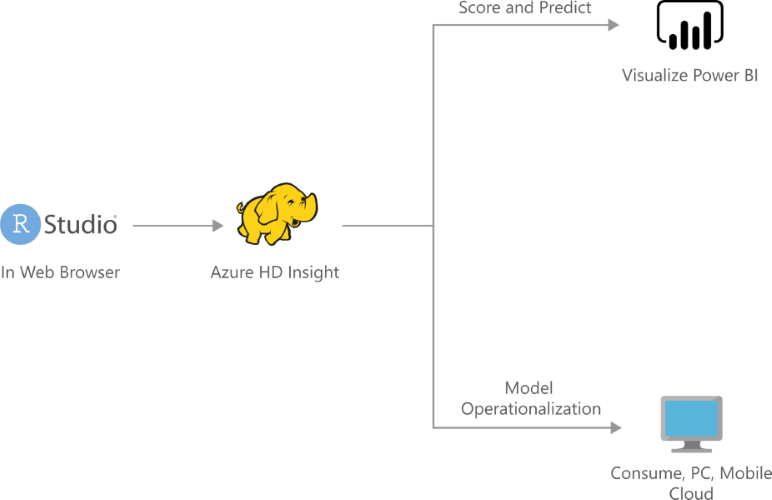

[!INCLUDE [header_file](../../../includes/sol-idea-header.md)]

A charged off loan is a loan that is declared by a creditor (usually a lending institution) that an amount of debt is unlikely to be collected, usually when the loan repayment is severely delinquent by the debtor. Given that high chargeoff has negative impact on lending institutions' year end financials, lending institutions often monitor loan chargeoff risk very closely to prevent loans from getting charged-off. Using ML Services on Azure HDInsight, a lending institution can use machine learning predictive analytics to predict the likelihood of loans getting charged off and run a report on the analytics result stored in HDFS and Hive tables.

## Architecture

Download an [SVG](../media/loan-chargeoff-prediction-with-azure-hdinsight-spark-clusters.svg) of this architecture.

### Dataflow

1. Create some data and define data sources for the ML prediction
1. Run a logistic regression over the data using the local compute (or spark) context to predict loan charge off variable
1. Use Azure HDInsights spark connector to connect to the table
1. Use Power BI to interpret this data and create new visualizations
1. (Optional) Deploy the model as a web service that can be consumed on popular devices such as PC and mobile

### Components

* [Azure HDInsight](/azure/hdinsight/hdinsight-overview): Azure HDInsight is a managed, full-spectrum, open-source analytics service in the cloud for enterprises. You can use open-source frameworks such as Hadoop, Apache Spark, Apache Hive, LLAP, Apache Kafka, Apache Storm, R, and more.
* [Power BI](https://powerbi.microsoft.com) provides an interactive dashboard with visualization that uses data stored in SQL Server to drive decisions on the predictions.

## Solution details

This solution creates a cluster of type ML Services on Azure HDInsight. This cluster contains 2 head nodes, 2 worker nodes, and 1 edge node with a total of 32 cores. The approximate cost for this HDInsight Spark cluster is $8.29/hour. Billing starts once a cluster is created and stops when the cluster is deleted. Billing is pro-rated per minute, so you should always delete your cluster when it is no longer in use. Use the Deployments page to delete the entire solution once you are done.

### Benefits

There are multiple benefits for lending institutions to equip with loan chargeoff prediction data. Charging off a loan is the last resort that the bank will do on a severely delinquent loan, with the prediction data at hand, the loan officer could offer personalized incentives like lower interest rate or longer repayment period to help customers to keep making loan payments and thus prevent the loan of getting charged off. To get to this type of prediction data, often credit unions or banks manually handcraft the data based on customers' past payment history and performed simple statistical regression analysis. This method is highly subject to data compilation error and not statistically sound.

This solution template demonstrates a solution end to end to run predictive analytics on loan data and produce scoring on chargeoff probability. A Power BI report will also walk through the analysis and trend of credit loans and prediction of chargeoff probability.

### Business perspective

This loan chargeoff prediction uses a simulated loan history data to predict probability of loan chargeoff in the immediate future (next three months). The higher the score, the higher is the probability of the loan getting charged-off in the future.

With the analytics data, loan manager is also presented with the trends and analytics of the chargeoff loans by branch locations. Characteristics of the high chargeoff risk loans will help loan managers to make business plan for loan offering in that specific geographical area.

Power BI also presents visual summaries of the loan payments and chargeoff predictions (shown here with simulated data). You can try out this dashboard by clicking the "Try it Now" button to the right.

### Data scientist perspective

This solution template walks through the end-to-end process of how to develop predict analytics using a set of simulated loan history data to predict loan chargeoff risk. The data contains information like loan holder demographic data, loan amount, contractual loan duration and loan payment history. The solution template also includes a set of R scripts that perform data processing, feature engineering, and several different algorithms to train the data, and finally select the best performant model to score the data to produce probability score for each loan.

Data scientists who are testing this solution can work with the provided R code from the browser-based Open Source Edition of RStudio Server that runs on the Edge Node of the ML Services on Azure HDInsight cluster. By [setting the compute context](/azure/hdinsight/hdinsight-hadoop-r-server-compute-contexts), the user can decide where the computation will be performed: locally on the edge node, or distributed across the nodes in the Spark cluster. All the R code can also be found in public GitHub repository. Have fun!

## Next steps

* [Analyze Apache Spark data using Power BI in HDInsight](/azure/hdinsight/spark/apache-spark-use-bi-tools): How to use Microsoft Power BI to visualize data in an Apache Spark cluster in Azure HDInsight.
* [Operationalize ML Services cluster on Azure HDInsight](/azure/hdinsight/r-server/r-server-operationalize): Operationalize the model to make predictions using an ML Services cluster on Azure HDInsight.

## Related resources

* [R developer's guide to Azure](../../data-guide/technology-choices/r-developers-guide.md): This article provides an overview of the various ways that data scientists can use their existing skills with the R programming language in Azure.
