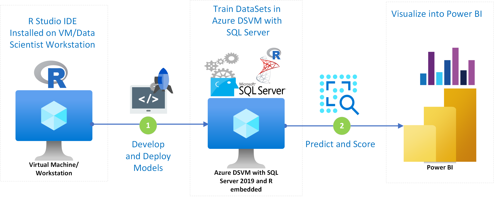

[!INCLUDE [header_file](../../../includes/sol-idea-header.md)]

This solution demonstrates how to build and deploy a machine learning model with SQL Server 2016 with R Services to predict if a Bank loan will need to be charged off within next 3 months.

## Architecture

*Download an [SVG](../media/loan-chargeoff-prediction-with-sql-server.svg) of this architecture.*

## Overview

There are multiple benefits for lending institutions to equip with loan chargeoff prediction data. Charging off a loan is the last resort that the bank will do on a severely delinquent loan, with the prediction data at hand, the loan officer could offer personalized incentives like lower interest rate or longer repayment period to help customers to keep making loan payments and thus prevent the loan of getting charged off. To get to this type of prediction data, often credit unions or banks manually handcraft the data based on customers' past payment history and performed simple statistical regression analysis. This method is highly subject to data compilation error and not statistically sound.

This solution template demonstrates a solution end to end to run predictive analytics on loan data and produce scoring on chargeoff probability. A PowerBI report will also walk through the analysis and trend of credit loans and prediction of chargeoff probability.

## Business Manager Perspective

This loan chargeoff prediction uses a simulated loan history data to predict probability of loan chargeoff in the immediate future (next three months). The higher the score, the higher is the probability of the loan getting charged-off in the future.

With the analytics data, loan manager is also presented with the trends and analytics of the chargeoff loans by branch locations. Characteristics of the high chargeoff risk loans will help loan managers to make business plan for loan offering in that specific geographical area.

SQL Server R Services brings the compute to the data by allowing R to run on the same computer as the database. It includes a database service that runs outside the SQL Server process and communicates securely with the R runtime.

This solution template walks through how to create and clean up a set of simulated data, use various algorithms to train the R models, select the best performant model and perform chargeoff predictions and save the prediction results back to SQL Server. A PowerBI report connects to the prediction result table and show interactive reports with the user on the predictive analytics.

## Data Scientist Perspective

SQL Server R Services brings the compute to the data by running R on the computer that hosts the database. It includes a database service that runs outside the SQL Server process and communicates securely with the R runtime.

This solution walks through the steps to create and refine data, train R models, and perform scoring on the SQL Server machine. The final prediction results will be stored in SQL Server . This data is then visualized in PowerBI, which also contains a summary of the loan chargeoff analysis and chargeoff prediction for the next three months. (Simulated data is shown in this template to illustrate the feature)

Data scientists who are testing and developing solutions can work from the convenience of their R IDE on their client machine, while [pushing the compute to the SQL Server machine](/sql/advanced-analytics/r/getting-started-with-sql-server-r-services). The completed solutions are deployed to SQL Server 2016 by embedding calls to R in stored procedures. These solutions can then be further automated with SQL Server Integration Services and SQL Server agent.

Click on the Deploy button to test the automation and the entire solution will be made available in your Azure subscription.

## Pricing

Your Azure subscription used for the deployment will incur consumption charges on the services used in this solution, approximately $1.15/hour for the default VM.

Please ensure that you stop your VM instance when not actively using the solution. Running the VM will incur higher costs.

Please delete the solution if you are not using it.