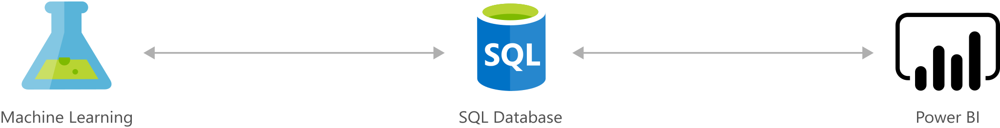

[!INCLUDE [header_file](../../../includes/sol-idea-header.md)]

Scoring credit risk is a complex process. Lenders carefully weigh a variety of quantitative indicators to determine the probability of default and approve the best candidates based on the information available to them.

This solution acts as a credit-risk analyzer, helping you score credit risk and manage exposure using advanced analytics models. Azure Machine Learning equips you with predictive analytics that help assess credit or loan applications and accept only those that fall above certain criteria. For example, you might use the predicted scores to help determine whether to grant a loan, then easily visualize the guidance in a Power BI Dashboard.

## Potential use cases

Data-driven credit-risk modeling reduces the number of loans offered to borrowers who are likely to default, increasing the profitability of your loan portfolio.

## Architecture

*Download an [SVG](../media/loan-credit-risk-analyzer-and-default-modeling.svg) of this architecture.*

### Components

* [Azure Machine Learning](https://azure.microsoft.com/services/machine-learning): Machine Learning helps you design, test, operationalize, and manage predictive analytics solutions in the cloud.
* [Power BI](https://powerbi.microsoft.com) provides an interactive dashboard with visualization that uses data stored in SQL Server to drive decisions on the predictions.

## Next steps

* [Learn more about Machine Learning](/azure/machine-learning/overview-what-is-azure-ml)
* [Learn more about Power BI](https://powerbi.microsoft.com/documentation/powerbi-service-get-started)
