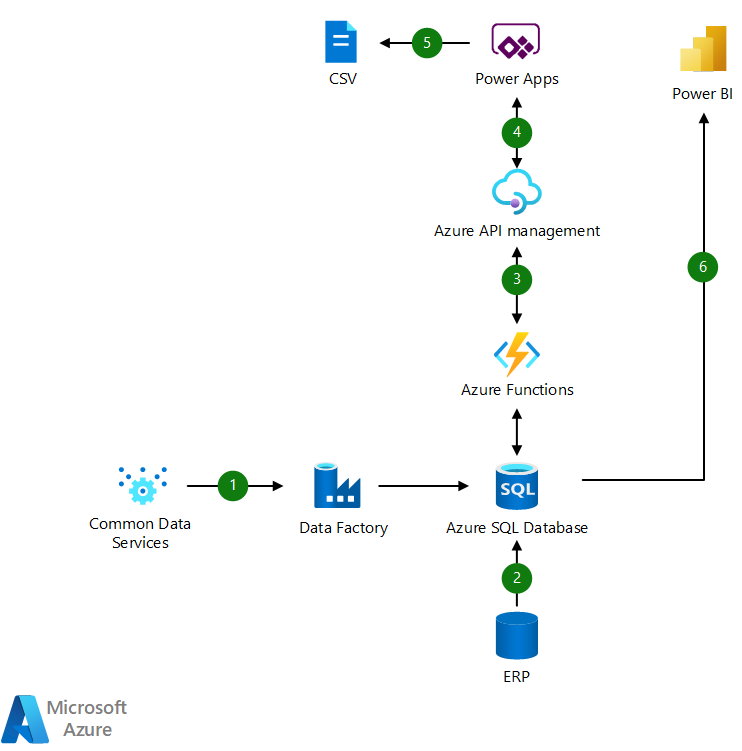

[!INCLUDE [header_file](../../../includes/sol-idea-header.md)]

This example shows how you can modernize your legacy systems that can't support new processes, therefore providing a better user experience.

## Architecture

*Download a [Visio file](https://arch-center.azureedge.net/lob.vsdx) of this architecture.*

### Dataflow

The data flows through the solution as follows:

1. Supplier data stored in CDS is moved to SQL via Data Factory.
1. Purchase order (PO) data stored in ERP system is sent to Azure SQL database.
1. Azure Functions uses API to surface PO data monthly and creates a task for users to review.
1. Power Apps retrieves data from Azure SQL Database through API.
1. User reviews and updates POs in Power Apps and sends this data to suppliers through CSV export.
1. Power BI reports trends in supplier status.

### Components

Data is loaded from these different data sources using several Azure components:

- [Power Apps](https://powerapps.microsoft.com): Increase agility across your organization by rapidly building low-code apps that modernize processes and solve tough challenges.
- [Azure Functions](https://azure.microsoft.com/services/functions): Accelerate and simplify application development with serverless compute
- [Azure API management](https://azure.microsoft.com/services/api-management): Hybrid, multicloud management platform for APIs across all environments
- [Azure SQL Database](https://azure.microsoft.com/services/sql-database): Build apps that scale with the pace of your business with managed and intelligent SQL in the cloud
- [Azure Data Factory](https://azure.microsoft.com/services/data-factory): Hybrid data integration service that simplifies ETL at scale
- [Power BI](/power-bi): a suite of business analytics tools to analyze data and share insights. Power BI can query a semantic model stored in Analysis Services, or it can query Azure Synapse directly.

## Scenario details

Out-of-the-box or custom connectors can help simplify process automation and connect to third party data sources or legacy systems. Azure Functions can then schedule calculations on a scheduled basis to simplify your business processes. You can use Power Apps to process and share data with third parties via standard exports.

## Potential use cases

You can use this solution in scenarios like the following:

- You have legacy systems that can't be modernized or can't support new processes
- You need to automate connecting third-party data sources to Azure

## Contributors

*This article is maintained by Microsoft. It was originally written by the following contributors.*

Principal author:

- [Martin Ekuan](https://www.linkedin.com/in/martinekuan/) | Director of Content Development

*To see non-public LinkedIn profiles, sign in to LinkedIn.*

## Next steps

- Learn more: [https://aka.ms/learnpowerapps](/training/browse/?products=power-apps)

## Related resources

- [Custom business processes](../../solution-ideas/articles/custom-business-processes.yaml)
