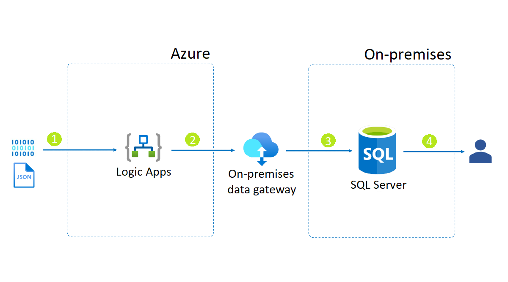

With Azure Logic Apps it is possible to integrate data from an HTTP request and store it in an on-premises database using Microsoft SQL Server. This gives us the benefits of using a Logic App, such as being able to securely acess it as an endpoint using [Azure API Management][Azure API Management], or allowing you to automate tasks related to the data, such as sending a Teams message or an Email. 

## Architecture

## Data Flow

1. Data is consumed in Azure Logic Apps through an HTTP request.
2. A connection with an on-premises data gateway is established (which is configured on both Azure and the local machine).
3. Data is stored in a SQL database through Microsoft SQL Server.

## Components

The architecture has the following components:

- [Azure Logic Apps][Azure Logic Apps]
- [On-premises data gateway][On-premises data gateway]
- [SQL Server][SQL Server]

## Next Steps
- [Import a Logic App as an API][Import a Logic App as an API]
- [On-premises data gateways documentation][On-premises data gateways documentation]
- [Install on-premises data gateway for Azure Logic Apps][Install on-premises data gateway for Azure Logic Apps]
- [Connect to on-premises data sources from Azure Logic Apps][Connect to on-premises data sources from Azure Logic Apps]

[Azure API Management]: https://azure.microsoft.com/services/api-management/
[Azure Logic Apps]: https://docs.microsoft.com/azure/logic-apps/quickstart-create-first-logic-app-workflow
[Connect to on-premises data sources from Azure Logic Apps]: https://docs.microsoft.com/azure/logic-apps/logic-apps-gateway-connection
[Import a Logic App as an API]: https://docs.microsoft.com/azure/api-management/import-logic-app-as-api
[Install on-premises data gateway for Azure Logic Apps]: https://docs.microsoft.com/azure/logic-apps/logic-apps-gateway-install
[On-premises data gateway]: https://docs.microsoft.com/power-bi/connect-data/service-gateway-onprem
[On-premises data gateways documentation]: https://docs.microsoft.com/data-integration/gateway/
[SQL Server]: https://docs.microsoft.com/sql/?view=sql-server-ver15