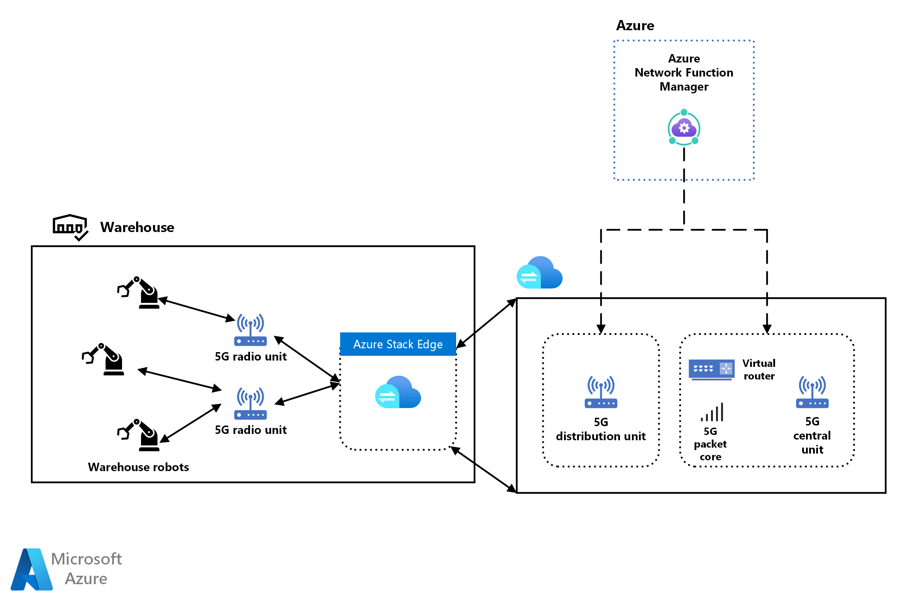

[!INCLUDE [header_file](../../../includes/sol-idea-header.md)]

This solution describes how manufacturers can use high-performance, low-latency 5G Standalone networks to scale up industrial automation and productivity. 5G Standalone networks reliably connect machines to other machines or controllers. 5G-enabled Internet of Things (IoT) devices like robots can communicate and operate autonomously on the factory or warehouse floors.

The 5G Standalone network is deployed as a Non-Public Network (NPN), with all data remaining on premises. The NPN configuration offers security, privacy, and reliability. Azure deploys and manages the network and devices.

## Potential use cases

Use this approach for scenarios like:

- Picking shipments efficiently in a warehouse.
- Dispersing seeds from an autonomous seed sprayer machines on a farm, based on information from soil sensors.
- Conserving energy in commercial buildings by shutting off lights when no motion is detected in a room.

## Architecture

1. Embedded 5G-enabled internet protocol (IP) modules connect warehouse robots to 5G Open Radio Access Network (ORAN) radio units. RAN is a common wireless network infrastructure for mobile networks.
1. The 5G radio units connect over a wired switching network to the 5G Distribution Unit software, which runs on private multi-access edge compute (MEC) on Azure Stack Edge.
1. The 5G Distribution Unit connects with the the virtual router, 5G Central Unit, and the 5G Packet Core, which run on a separate Azure private MEC instance on Azure Stack Edge.
1. The 5G packet core provides device authentication, an IP address, and connectivity based on a preconfigured profile.
1. Azure Network Function Manager controls both MEC instances.
1. Optimizing the 5G network and keeping traffic confined to Azure private MEC provides the low latency these connection scenarios require.

## Components

This solution uses the following components:

- [Azure Stack Edge](https://azure.microsoft.com/products/azure-stack/edge/) is a portfolio of devices that bring compute, storage, and intelligence to the IoT edge.
- [7P Private 5G Network (Stand Alone)](https://azuremarketplace.microsoft.com/marketplace/apps/sevenprinciplesag1603729177296.7p-pmn-5g-sa-hybrid?tab=Overview) is a powerful and secure private, on-premises mobile network.
- [Metaswitch Fusion Core 5G Packet Core](https://azuremarketplace.microsoft.com/marketplace/apps/metaswitch.fusioncore_0-1-0?tab=Overview) creates a low-footprint enterprise private network experience in the cloud for 4G and 5G access.
- [Azure Network Function Manager](https://azure.microsoft.com/search/?q=network+function+manager) deploys network functions to the IoT edge.

## Next steps

- [Connect an on-premises network to Azure](/azure/architecture/reference-architectures/hybrid-networking/)
- [Condition monitoring for Industial IoT](/azure/architecture/solution-ideas/articles/condition-monitoring)

## Related resources

- [Azure Private Edge Zones](/azure/networking/edge-zones-overview#private-edge-zones)
- [Azure Industrial IoT](https://azure.microsoft.com/solutions/industry/manufacturing/iot/)
