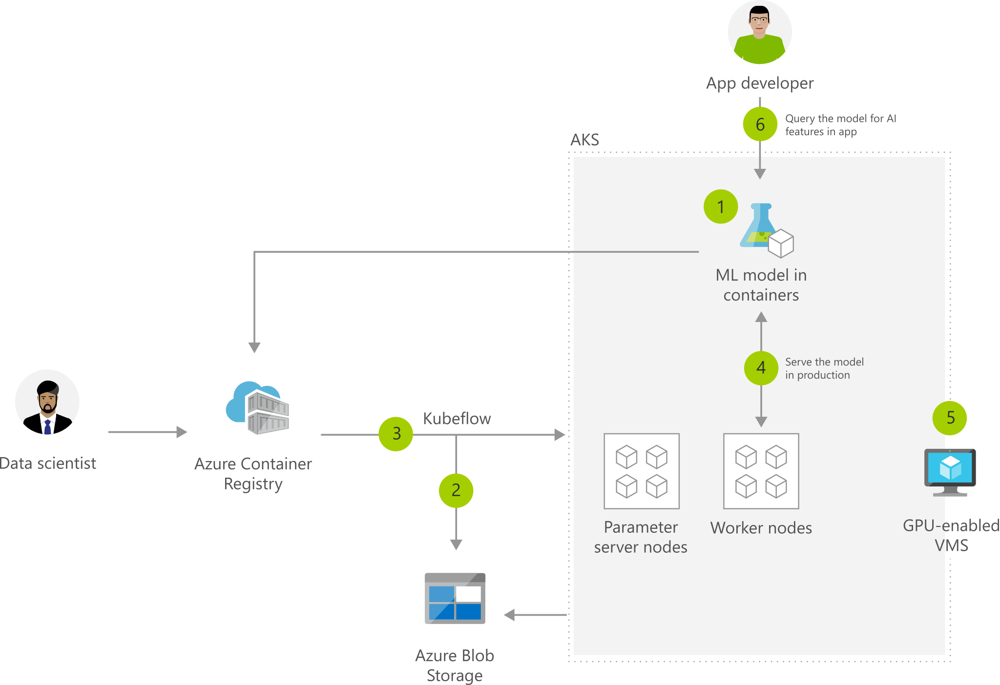

[!INCLUDE [header_file](../../../includes/sol-idea-header.md)]

This solution idea is about real-time inference on [Azure Kubernetes Service (AKS)](/azure/aks/intro-kubernetes).

## Potential use cases

Use AKS when you need high-scale production deployments of your machine learning models. High-scale means capabilities such as fast response time, autoscaling of the deployed service, and logging. For more information, see [Deploy a model to an Azure Kubernetes Service cluster](/azure/machine-learning/how-to-deploy-azure-kubernetes-service).

In this solution, [Kubeflow](https://www.kubeflow.org/docs/about/kubeflow) is used to manage the deployment to AKS. Your ML models run on AKS clusters backed by GPU enabled VMs.

## Architecture

*Download an [SVG](../media/machine-learning-model-deployment-to-aks.svg) of this architecture.*

### Dataflow

1. Package machine learning (ML) model into a container and publish to Azure Container Registry (ACR).
1. Azure Blob storage hosts training data sets and trained model.
1. Use Kubeflow to deploy training job to Azure Kubernetes Services (AKS); distributed training jobs to AKS include Parameter servers and Worker nodes.
1. Serve production model using Kubeflow, promoting a consistent environment across test, control, and production.
1. AKS supports GPU enabled VM.
1. Developers build features to query the model running in AKS cluster.

### Components

* [Azure Blob Storage](/azure/storage/blobs/)
* [Azure Container Registry](/azure/container-registry/)
* [Azure Kubernetes Service](https://azure.microsoft.com/services/container-registry/)
* [Azure Machine Learning](https://azure.microsoft.com/services/machine-learning/)

## Next steps

Read product documentation:

* [What is Azure Machine Learning?](/azure/machine-learning/overview-what-is-azure-ml)
* [Azure Kubernetes Service (AKS)](/azure/aks/intro-kubernetes)
* [Deploy a model to an Azure Kubernetes Service cluster](/azure/machine-learning/how-to-deploy-azure-kubernetes-service)
* [Kubeflow on Azure](https://www.kubeflow.org/docs/distributions/azure)

## Related resources

See other Architecture Center articles:

* [Artificial intelligence (AI) - Architectural overview](../../data-guide/big-data/ai-overview.md)
* [Distributed training of deep learning models on Azure](../../reference-architectures/ai/training-deep-learning.yml)
* [Training Python models on Azure](../../reference-architectures/ai/training-python-models.yml)
